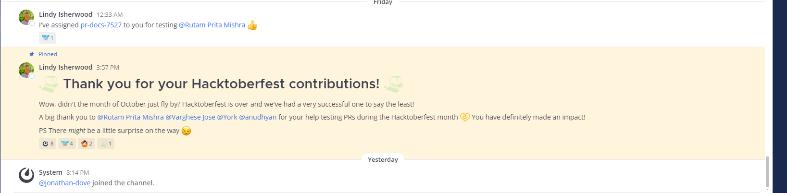

.. _pinning-messages:

Pinning Messages
================

All members of a channel can pin important or useful messages to that channel. The list of pinned messages is visible to all channel members.

Pinned messages are marked with the pinned icon, |pinned-icon|. For example:

**To view the list of pinned messages:**

To view the complete list of pinned messages, click the pin icon |pin-icon|, located at the top of the channel. The right hand sidebar opens to show the list of pinned messages. For example:

.. image:: ../../images/pinned-example-rhs.png

.. |pinned-icon| image:: ../../images/pinned-icon.png
.. |pin-icon| image:: ../../images/pin-icon-black.png

**To pin a message:**

1. Mouse over the message that you want to pin. The [...] link appears.
2. Click **[...] > Pin to channel**

**To un-pin a message:**

1. Mouse over the message that you want to un pin. The [...] link appears.
2. Click **[...] > Un-pin from channel**
