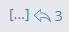

.. _sending-messages:

Messages
================
 
Sending messages and replying to messages are important ways to keep conversations active with your team. You can edit and delete messages after you have sent them. You can also share links to any message in Mattermost.

Sending Messages
-----------------

Write a message by typing into the text input box, then press ENTER to send it. Use SHIFT+ENTER to create a new line without sending a message. To send messages by pressing CTRL+ENTER, go to **Main Menu > Account Settings > Advanced > Send messages on Ctrl + Enter > Edit**.

.. tip::
  Mattermost can automatically detect and display messages written using right-to-left scripts, such as Arabic, Hebrew, or Persian. Your System Admin must install the `RTL Plugin <https://github.com/QueraTeam/mattermost-rtl>`__ to enable this functionality.

Replying to Messages
---------------------

When replying to a message you should do so by hovering over message and clicking the reply link (arrow icon |replyarrow|). This organizes the conversation into a thread, makes it easier to follow, and enables multiple parallel conversations to occur at the same time without confusion. Replies are indented slightly in the center pane to indicate that they are child messages of a parent message.

Clicking the reply link will open a sidebar on the right-hand side. To expand the right-hand sidebar to its full width, click the expand/shrink icon with two arrows at the top of the sidebar. To shrink the right-hand sidebar to its original width, click the same expand/shrink icon.

Editing Messages
-----------------

Click the **[...]** link next to a message that you have sent, then click **Edit**.

.. note::
  Message edits do not trigger new @mention notifications, desktop notifications, or notification sounds.

Your System Admin `can disable the Edit feature or set a time limit <https://docs.mattermost.com/administration/config-settings.html?highlight=config%20settings#allow-users-to-edit-their-messages>`__ before messages become uneditable, available in Mattermost Enterprise Edition E10 and E20.

Deleting Messages
------------------

Select  the **[...]** link next to a message that you've sent, then select **Delete**.

Your System Admin can `disable the Delete feature <https://docs.mattermost.com/administration/config-settings.html?highlight=config%20settings#allow-which-users-to-delete-messages>`__, available in Mattermost Enterprise Edition E10 and E20.

Linking to Messages
--------------------

Click the **[...]** link next to a message, then click **Permalink > Copy Link**.

If the link is to a message in a Public Channel, any member of the team can see the message. If the link is to a message in a Private Group, only members in that group can see the message.

.. tip::
  The timestamp that appears beside the username of any message is also a permalink.

Marking Messages as Unread
--------------------------

Marking a message as unread will bold the channel in your sidebar and add the new messages line above the marked message. This can be a useful reminder to follow-up on the message later if you don't have time to address it when the message was read.

Click the **[...]** menu next to a message, then click **Mark as Unread**.
