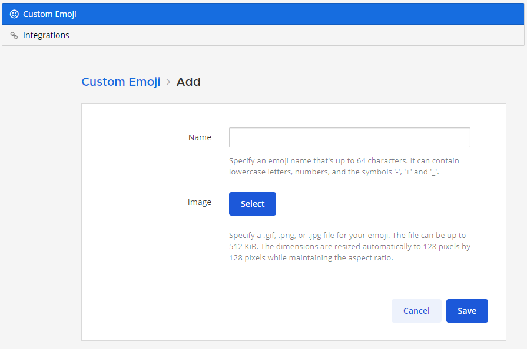

Custom Emoji
-------------

You can create Custom Emojis which are available to everyone on your Mattermost server. 

To create and find Custom Emojis, open the **Main Menu** at the top right of the channels sidebar and select **Custom Emoji**.

  .. note::
    If you cannot see the **Custom Emoji** option in the menu, then your Mattermost System Admin may have restricted access to certain users. Contact your Mattermost System Admin for help.
    
    For further assistance, review the `Troubleshooting forum <https://forum.mattermost.org/c/trouble-shoot>`__ for previously reported errors, or `join the Mattermost user community for troubleshooting help <https://mattermost.com/pl/default-ask-mattermost-community/>`_.

Creating Custom Emojis
^^^^^^^^^^^^^^^^^^^^^^

Small, square pictures work best when selecting an image. The file can be any JPG, GIF, or PNG and up to 1 MB in size.

1. Open the **Main Menu** at the top-right of the channels sidebar.
2. Select **Custom Emoji**.
3. Choose **Add Custom Emoji**.
4. Enter a name for your Custom Emoji. This is the name that will show up in the emoji autocomplete.
5. Choose **Select**, and choose what image to use for the emoji. 
6. Choose **Save**.

Once saved, your emoji will be added to the list of Custom Emoji. 

To use your Custom Emoji in a message, simply type ":" followed by your emoji name to bring it up in the emoji autocomplete. Other users on the site will also be able to see your emoji in the autocomplete, and will be able to use it in their own messages.

Deleting Custom Emojis
^^^^^^^^^^^^^^^^^^^^^^^

You can delete Custom Emojis that you created. 

1. Open the **Main Menu** at the top-right of the channels sidebar.
2. Select **Custom Emoji**.
3. If required, use the Search Bar to find your Custom Emoji in the list.
4. Under **Actions** select **Delete**. 
5. Choose **Delete** to confirm. 

.. image:: ../../images/delete_custom_emoji.png
