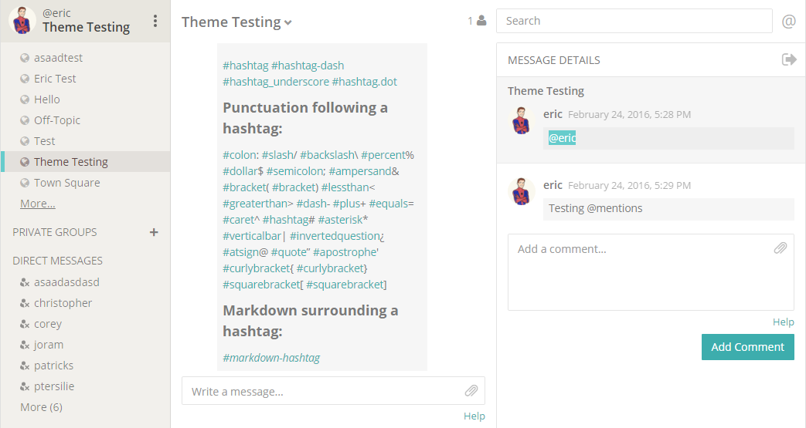
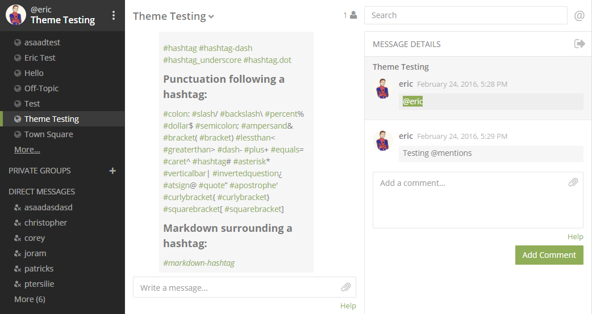
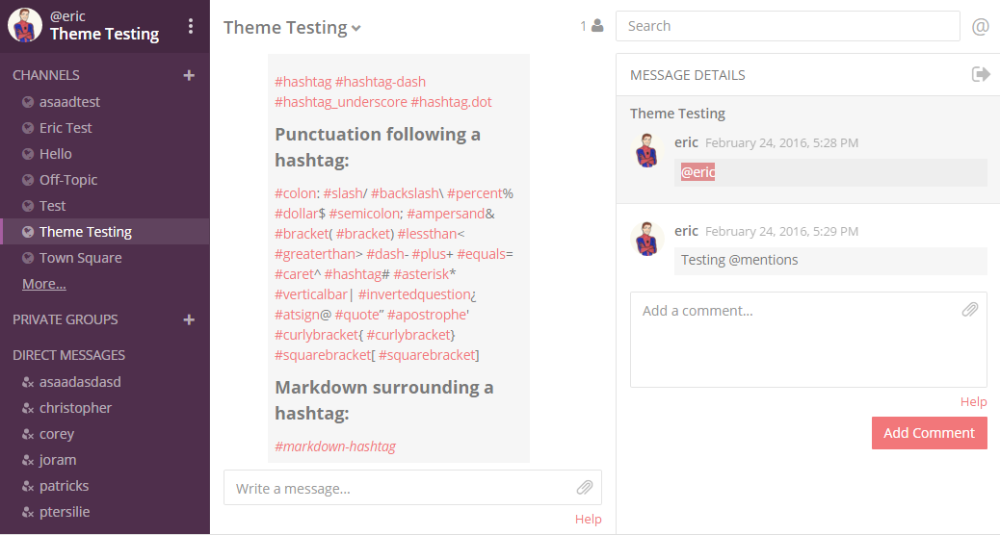
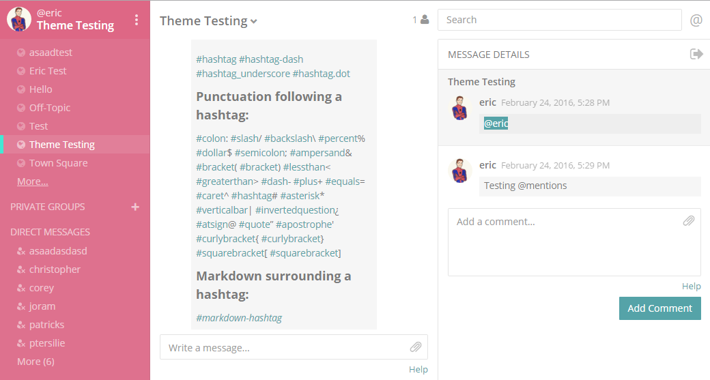

# Theme Colors
_____
The colors of the Mattermost user interface are customizable in **Account Settings** > **Display** > **Theme**. You can import your theme colors from Slack, customize the colors yourself, or choose from four standard themes designed by the Mattermost team.

In Enterprise Edition, if you belong to multiple teams, you can choose to apply any changes across teams by selecting "Apply New Theme to All Teams" before saving. If this is not selected, any changes are only applied to the current team. 

## Standard Themes
Select **Theme Colors** to choose from four standard themes designed by the Mattermost team. To make custom adjustments on the four standard theme colours, click a standard theme and then select **Custom Theme** to load the standard theme into the custom theme color selectors.

## Import Theme from Slack
To import a theme, go to **Preferences > Sidebar Theme** from within Slack, open the custom theme option, copy the theme color vector and then paste it into the *Input Slack Theme* input box in Mattermost. Any theme settings that are not customizable in Slack will default to the “Mattermost” standard theme settings.

## Custom Themes
Observe a live preview as you customize theme colors and then click **Save** to confirm your changes. Discard your changes by exiting the settings modal and clicking **Yes, Discard**.  

#### Sidebar Styles  
- **Sidebar BG:** Background color of the Channels pane, and Account and Team settings navigation sidebars.
- **Sidebar Text:** Text colour of read channels in the Channels pane, and tabs in the Account and Team settings navigation sidebar.
- **Sidebar Header BG:** Background color of the header above the Channels pane and all modal headers.
- **Sidebar Header Text:** Text colour of the header above the Channels pane and all modal headers.
- **Sidebar Unread Text:** Text color of unread channels in the Channels pane.
- **Sidebar Text Hover BG:** Background color behind channel names and settings tabs as you hover over them.
- **Sidebar Text Active Border:** Color of the rectangular marker on the left side of the Channels pane or Settings sidebar indicating the active channel or tab.
- **Sidebar Text Active Color:** Text color of the active active channel or tab in the Channels pane or Settings sidebar.
- **Online Indicator:** Color of the online indicator appearing next to team members names in the Direct Messages list.
- **Away Indicator:** Color of the away indicator appearing next to team members names in the Direct Messages list when they have had no browser activity for 5 minutes.
- **Mention Jewel BG:** Background color of the jewel indicating unread mentions that appears to the right of the channel name. This is also the background color of the “Unread Posts Below/Above” indicator appearing at the top or bottom of the Channels pane on shorter browser windows.
- **Mention Jewel Text:** Text color on the mention jewel indicating the number of unread mentions. This is also the text color on the “Unread Posts Below/Above” indicator.  

#### Center Channel Styles  
- **Center Channel BG:** Color of the center pane, RHS and all modal backgrounds.
- **Center Channel Text:** Color of all the text - with the exception of mentions, links, hashtags and code blocks - in the center pane, RHS and modals.
- **New Message Separator:** The new massage separator appears below the last read message when you click into a channel with unread messages.
- **Mention Highlight BG:** Highlight color behind your words that trigger mentions in the center pane and RHS.
- **Mention Highlight Link:** Text color of your words that trigger mentions in the center pane and RHS.
- **Code Theme:** Background and syntax colors for all code blocks.

#### Link and Button Styles  
- **Link Color:** Text color of all links, hashtags, teammate mentions, and low priority UI buttons.
- **Button BG:** Color of the rectangular background behind all high priority UI buttons.
- **Button Text:** Text colour appearing on the rectangular background for all high priority UI buttons.

#### Exporting a Custom Theme

You can export a theme by copying the "Theme Code" from the Custom Theme menu.

Go to **Account Settings** > **Display** > **Custom Theme** > **Copy and paste to share theme colors** and copy the theme code to export it.

#### Importing a Custom Theme

You can import a theme by pasting a "Theme Code" into the Custom Theme menu. 

Go to **Account Settings** > **Display** > **Custom Theme** > **Copy and paste to share theme colors** and paste a theme code to import it, then click **Save**.

You can find sample themes below. You can also find [theme codes shared by the community from the Mattermost community forum.](https://forum.mattermost.org/t/share-your-favorite-mattermost-theme-colors/1330). 


#### Custom Theme Examples
Customize your theme colors and share them with others by copying and pasting theme vectors into the input box. Below are some example themes with their corresponding theme vectors.


```
#f2f0ec,#2e2e2e,#e8e6df,#424242,#515151,#e0e0e0,#66cccc,#594545,#52adad,#d4b579,#66cccc,#ffffff,#ffffff,#444444,#f2777a,#3dadad,#3dadad,#ffffff,#66cccc,#ffffff,github
```
___


```
#262626,#ffffff,#363636,#ffffff,#cccccc,#525252,#7e9949,#ffffff,#99cb3f,#b8b884,#7e9949,#ffffff,#ffffff,#444444,#90ad58,#54850c,#90ad58,#ffffff,#90ad58,#ffffff,monokai
```
___


```
#4f2f4c,#ffffff,#452842,#ffffff,#e5e5e5,#452842,#a65ea0,#ffffff,#52adad,#d4b579,#f2777a,#ffffff,#ffffff,#444444,#f2777a,#f2777a,#f2777a,#ffffff,#e08d8f,#ffffff,solarized_dark
```
___


```
#de718e,#ffffff,#de6785,#ffffff,#ffffff,#cc6983,#43e8d4,#ffffff,#88e0e5,#ccdb91,#55a3a8,#ffffff,#ffffff,#444444,#55a3a8,#55a3a8,#55a3a8,#ffffff,#55a3a8,#ffffff,solarized_light
```
___

