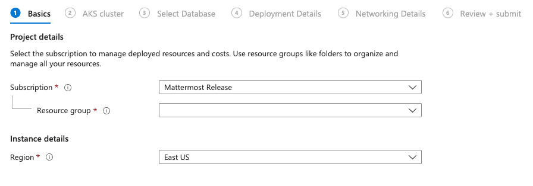
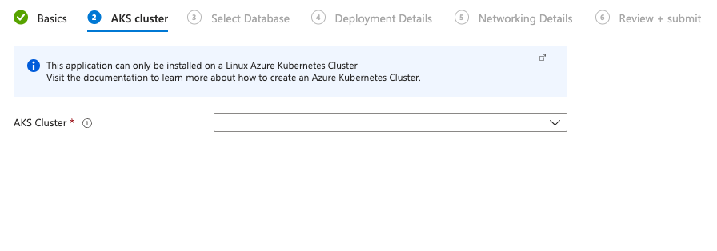
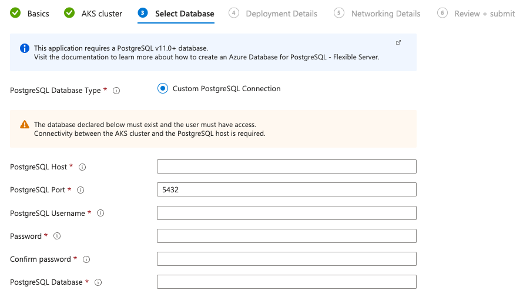
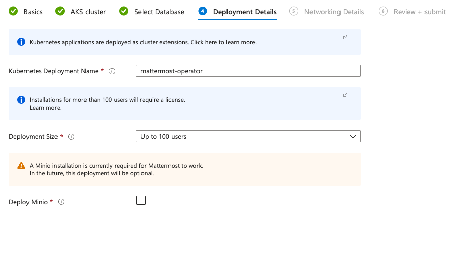
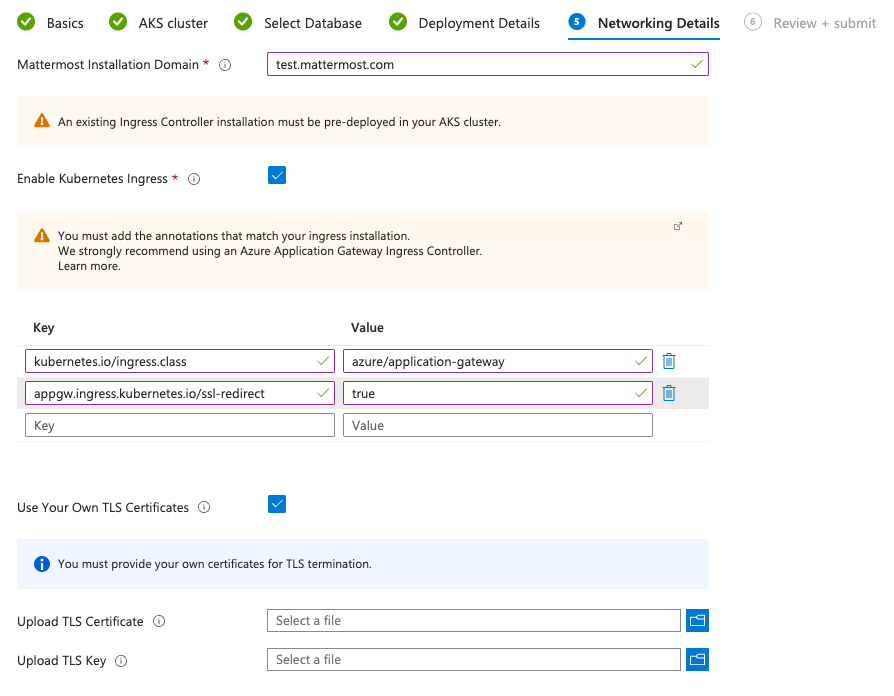

Install Mattermost on Azure AKS
================================

.. include:: ../_static/badges/allplans-selfhosted.rst
  :start-after: :nosearch:

You can use are supported `Azure Marketplace Container Offer <https://azuremarketplace.microsoft.com/en-us/marketplace/apps/mattermost.mattermost-operator>`__ to install Mattermost on your existing Azure Infrastructure.  

Infrastructure Pre-requisites
-----------------------------

PostgreSQL v11.0+ Database
~~~~~~~~~~~~~~~~~~~~~~~~~~~

Mattermost requires a pre-existing PostgreSQL database within your infrastructure. 
We recommend using `Azure Database for PostgreSQL flexible server <https://learn.microsoft.com/en-us/azure/postgresql/>`__. You can easily deploy one following `this guide <https://learn.microsoft.com/en-us/azure/postgresql/flexible-server/quickstart-create-server-portal>`__ from Microsoft.

.. tip::
  We suggest that you use Private Access for your database. 

Running AKS Cluster
~~~~~~~~~~~~~~~~~~~

Mattermost Azure Container Offer requires a pre-existing Kubernetes Cluster with an Ingress Controller pre-installed.  
We recommend creating a new AKS cluster with the AGIC add-on enabled. You can follow `this guide <https://learn.microsoft.com/en-us/azure/application-gateway/tutorial-ingress-controller-add-on-new>`__.

You can read more information around AGIC add-on `here <https://learn.microsoft.com/en-us/azure/application-gateway/ingress-controller-overview>`__.

.. tip::

  - Connectivity should be already in place between the AKS cluster and the PostgreSQL database
  - Any pre-installed ingress controller within the cluster that supports the Ingress Kubernetes resource and TLS termination should work out of the box

Deployment Pre-requisites
-------------------------
Valid DNS name and TLS certificates 
~~~~~~~~~~~~~~~~~~~~~~~~~~~~~~~~~~~

Mattermost depends on strong TLS certification in order to provide all the features to our users. 

You need to have access to a DNS zone and be able to provide a valid TLS key and certificate for the Ingress Controller.

Mattermost License & AKS Capacity  
~~~~~~~~~~~~~~~~~~~~~~~~~~~~~~~~~

.. include:: ../_static/badges/ent-only.rst
  :start-after: :nosearch:

If your deployment option is for more than `100users` you need to have more than 2 nodes on your AKS cluster to support High Availability and provide a valid Mattermost License file.  

.. note:: Providing a license is optional at this point. You can enable the **30 days** trial period at your own time once you deploy

Deploy Mattermost
-----------------
  
1. Navigate to our `Azure Marketplace Container Offer <https://azuremarketplace.microsoft.com/en-us/marketplace/apps/mattermost.mattermost-operator>`__ and get the offer.   
   
 .. note:: 
    Alternatively you can navigate to the `Extensions + Applications` section of your AKS cluster and install our offering from there.
    More information `here <https://learn.microsoft.com/en-gb/azure/aks/cluster-extensions?tabs=azure-cli>`__.

2. Choose the *Resource Group* and the *Region* of your installed AKS and PostgreSQL database
  

3. Choose your AKS cluster

4. Fill in the details for your PostgreSQL database.

.. note::
 - Connectivity should be already in place between the AKS cluster and the database
 - Database should already exist and user provided must have full access

5. Adjust deployment details.

  
.. note:: You can choose the Deployment size to automatically adjust the installation. Keep in mind that you will need a license after the 30 days trial for deployments of 100 users and more.

6. Configure Mattermost installation hostname and Ingress details.
  
 .. note:: In our example below we are using the AGIC add-on. These are the ingress annotations that are required.

  .. code-block:: yaml

      kubernetes.io/ingress.class: azure/application-gateway
      appgw.ingress.kubernetes.io/ssl-redirect: "true"
  
You will have to also upload yor own TLS certificates at this stage to get advantage or all Mattermost features.  

7. Ensure that everything is running. You should be able to check the installed plugin from the AKS Extensions + Applications page under the Settings menu.

a. When the deployment is complete, obtain the hostname or IP address of your Mattermost deployment using the following command:

 .. code-block:: sh

   kubectl -n mattermost-operator get ingress

b. Get the resulting IP address from the ``ADDRESS`` column and use your domain registration service to create a DNS record.
c. You should be good to go.

You can read more information about `Managing Mattermost </guides/self-hosted-administration.html>`__ on the related documentation.
