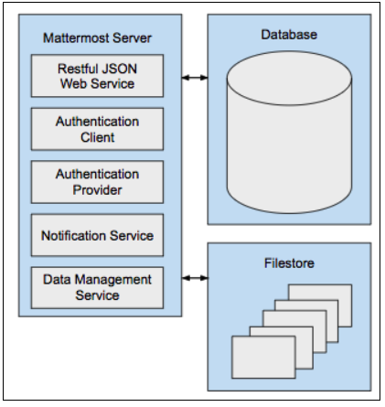
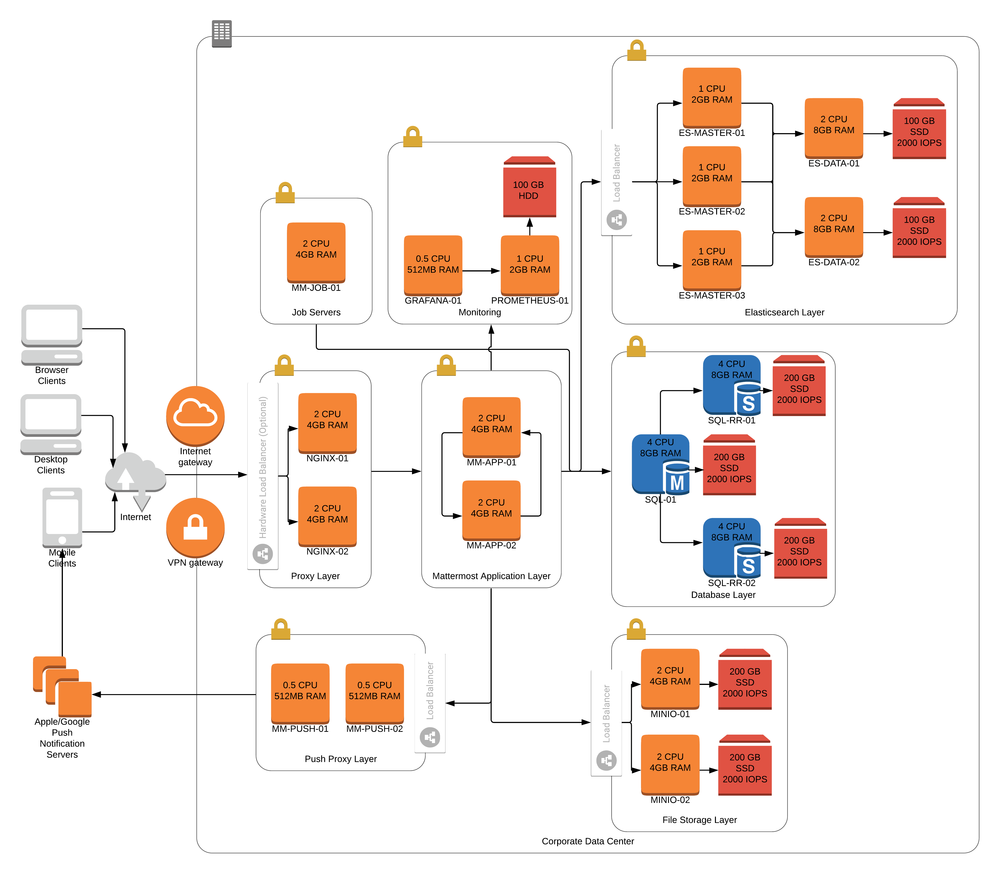
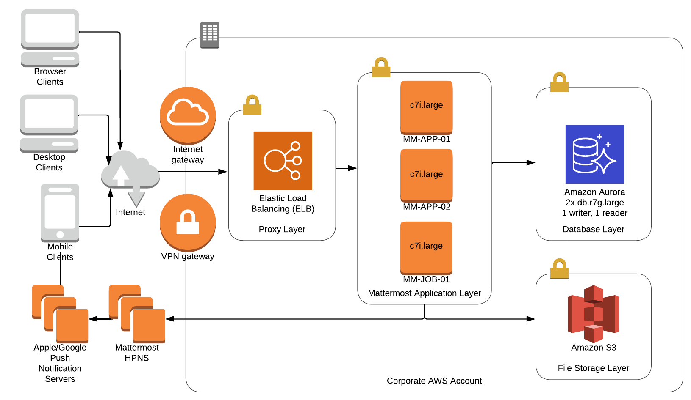
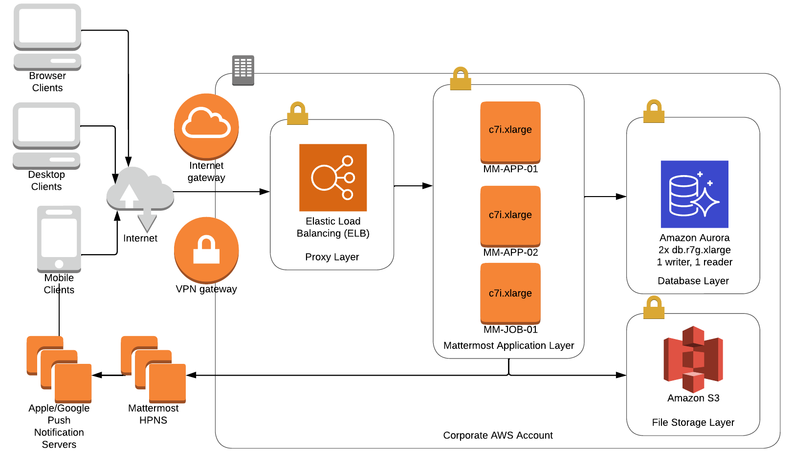
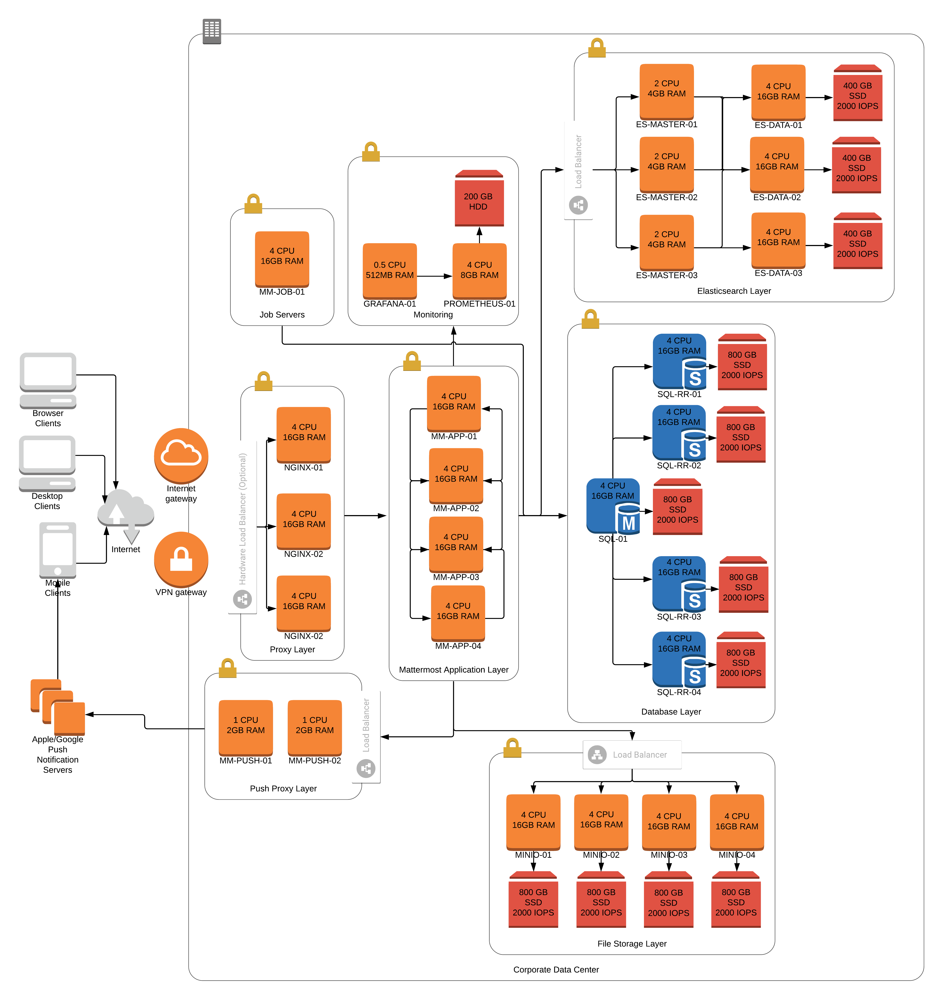
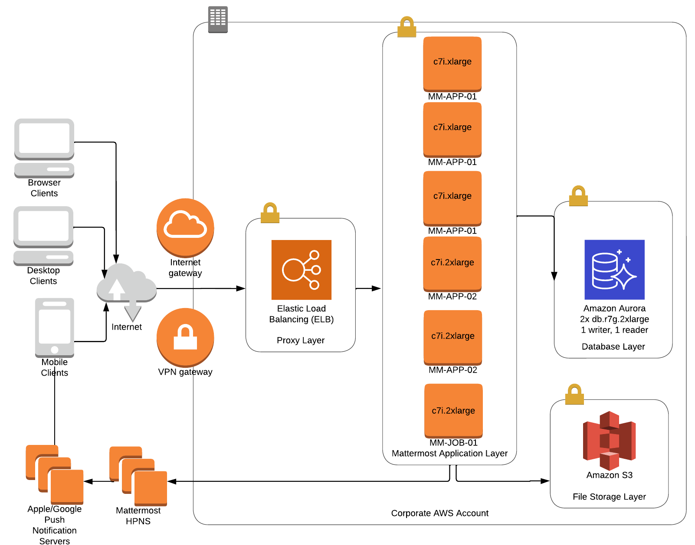

Mattermost Server requirements
==============================

.. include:: ../_static/badges/allplans-selfhosted.rst
  :start-after: :nosearch:

This guide outlines the minimum software and hardware requirements for deploying a self-hosted instance of Mattermost Server.  See the `deployment overview <#deployment-overview>`__ and `architecture overview <#architecture-overview>`__ sections for details on what's included in a Mattermost self-hosted deployment.

.. note::

  Requirements may vary based on utilization, and we strongly recommend running a pilot project prior to a production scale out.

.. contents:: Learn more about:
  :backlinks: top
  :depth: 1
  :local:

Browser requirements
--------------------

Mattermost admins and users can access Mattermost using a browser, a `desktop app </install/desktop-app-requirements>`__, or a `mobile app </install/mobile-app-requirements>`__.

.. tabs::

    .. tab:: PC web requirements

        Admins and users can securely share messages and files in a self-hosted or Cloud Mattermost deployment using the following web browsers:

        - Chrome: v106+
        - Firefox: v91+
        - Safari: v14.1+
        - Edge: v.106+
        - Internet Explorer (IE11): Support was removed in Mattermost v5.16. We recommend using the `Mattermost desktop app <https://mattermost.com/apps/>`_ or another supported browser. See `this forum post <https://forum.mattermost.com/t/mattermost-is-dropping-support-for-internet-explorer-ie11-in-v5-16/7575>`__ to learn more.

    .. tab:: Mobile web experience

        Admins and users can securely share messages and files in a self-hosted or Cloud Mattermost deployment using the follwing mobile web browsers on iOS and Android devices:

        - iOS: iOS 12.1+ with Safari 14.1+ or Chrome 106+
        - Android: Android 7+ with Chrome 106+

Email client requirement
-------------------------

For notifications and account verification, Mattermost connects to your existing email service over SMTP, including Microsoft Exchange, Amazon SES, SendGrid, and self-hosted email solutions. 

Mattermost admins and users can receive emails on desktop and mobile from the Mattermost server using the following web-based clients: Office 365, Outlook, Gmail, Yahoo, or AOL.

Platform requirements
---------------------

Mattermost Server can be installed on the following platforms:

- Ubuntu 18.04, Debian Buster, CentOS 6+, CentOS 7+, RedHat Enterprise Linux 7+, Oracle Linux 6+, Oracle Linux 7+.
- Using the Mattermost `Docker deployment <https://github.com/mattermost/docker>`__ on a Docker-compatible operating system (Linux-based OS) is still recommended.

While community support exists for Fedora, FreeBSD, and Arch Linux, Mattermost does not currently include production support for these platforms.

Database requirements
---------------------

Mattermost uses a MySQL or PostgreSQL database to store and retrieve system data and to execute full text search. Solid State Drives (SSDs) can be used for faster read times to increase performance.

.. note::

    - Amazon Aurora equivalents of both MySQL and PostgreSQL are also supported.
    - MariaDB v10+ no longer functions as a MySQL drop-in replacement, and it's not supported for Mattermost due to the requirement of MySQL 5.7.12. Prior versions of MariaDB were not officially supported but may have functioned in older Mattermost releases. If you are running MariaDB now, migrating from MariaDB to the MySQL equivalent is recommended.
    - Deployments requiring searching in Chinese, Japanese, and Korean languages require MySQL 5.7.6+ and the configuration of `ngram Full-Text parser <https://dev.mysql.com/doc/refman/5.7/en/fulltext-search-ngram.html>`__. For searching two characters, you will also need to set ``ft_min_word_len`` and ``innodb_ft_min_token_size`` to ``2`` and restart MySQL. See `CJK discussion <https://github.com/mattermost/mattermost-server/issues/2033#issuecomment-183872616>`__ for details.

.. tabs::

    .. tab:: Mattermost v6.0 and later

        -  MySQL 5.7.12, 8.0.12+ (see note below on `MySQL 8 support <#mysql-8-support>`__)
        -  PostgreSQL 10.0+

    .. tab:: Mattermost v5.39 and earlier

        - MySQL 5.6, 5.7, 8.0.12+ (see note below on `MySQL 8 support <#mysql-8-support>`__)
        - PostgreSQL 10.0+

Multiple read replicas 
~~~~~~~~~~~~~~~~~~~~~~

.. include:: ../_static/badges/ent-only.rst
  :start-after: :nosearch:

*Available in legacy Mattermost Enterprise Edition E20*

For enterprise deployments, the Mattermost database can be configured with a master and multiple read replicas. The read replicas can be configured as a redundant backup to the active server, so that during hardware failures operation can be diverted to the read replica server without interrupting service. 

The safest configuration is to size the disk space on the read replica used for failover two to three times larger than storage available on master, so that if the master fails because it runs out of disk space it will fail over to a read replica with enough extra space to run smoothly until the master is corrected.

Search replicas
~~~~~~~~~~~~~~~

.. include:: ../_static/badges/ent-only.rst
  :start-after: :nosearch:

*Available in legacy Mattermost Enterprise Edition E20*

You can configure one or more search replicas to isolate search queries. A search replica is similar to a read replica, but is used only for handling search queries.

Database search limitations
~~~~~~~~~~~~~~~~~~~~~~~~~~~~

.. tabs::

    .. tab:: PostgreSQL

        - Email addresses do not return results.
        - Hashtags or recent mentions of usernames containing a dash do not return search results.
        - Terms containing a dash return incorrect results as dashes are ignored in the search query.
        - If any of the above is an issue, you can either enable the `Elasticsearch feature </scale/elasticsearch.html>`__ or install MySQL instead.

    .. tab:: MySQL

        - Hashtags or recent mentions of usernames containing a dot do not return search results.
        - From Mattermost v6.4, the new migration system requires the MySQL database user to have additional `EXECUTE`, `CREATE ROUTINE`, `ALTER ROUTINE` and `REFERENCES` privileges to run schema migrations.

MySQL 8 Support
~~~~~~~~~~~~~~~

In MySQL 8.0.4, the default authentication plugin was changed from ``mysql_native_password`` to ``caching_sha2_password`` (https://mysqlserverteam.com/mysql-8-0-4-new-default-authentication-plugin-caching_sha2_password/). Therefore, you will need to enable ``mysql_native_password`` by adding the following entry in your MySQL configuration file:

  .. code-block:: text

   [mysqld]
   default-authentication-plugin=mysql_native_password

In MySQL 8, the default collation changed to ``utf8mb4_0900_ai_ci`` (https://dev.mysql.com/doc/mysqld-version-reference/en/optvar-changes-8-0.html). Therefore, if you update your MySQL installation to version 8, you'll need to convert your database tables to use the new default collation:

.. code-block:: sql

   ALTER TABLE table_name CONVERT TO CHARACTER SET utf8mb4 COLLATE utf8mb4_0900_ai_ci;

If this change isn't made, tables in the database may end up having different collations which will cause errors when executing queries.

In MySQL versions 8.0.0 - 8.0.11 ``ADMIN`` is a `reserved keyword <https://dev.mysql.com/doc/refman/8.0/en/keywords.html>`_, which is why our requirement for MySQL is version 8.0.12.

MySQL 8.0.22 contains an `issue with JSON column types <https://bugs.mysql.com/bug.php?id=101284>`__ changing string values to integers which is preventing Mattermost from working properly. Users are advised to avoid this database version.

Hardware requirements
---------------------

Mattermost supports any 64-bit x86 processor architecture.

Usage of CPU, RAM, and storage space can vary significantly based on user behavior. These hardware recommendations are based on traditional deployments and may grow or shrink depending on how active your users are.

Moreover, memory requirements can be driven by peak file sharing activity. Recommendation is based on default 50 MB maximum file size, which can be `adjusted from the System Console </configure/configuration-settings.html#maximum-file-size>`__. Changing this number may change memory requirements.

For deployments larger than 2,000 users, it is recommended to use the Mattermost open source load testing framework to simulate usage of your system at full scale: `https://github.com/mattermost/mattermost-load-test <https://github.com/mattermost/mattermost-load-test>`__.

Hardware requirements for team deployments
~~~~~~~~~~~~~~~~~~~~~~~~~~~~~~~~~~~~~~~~~~

Most small to medium Mattermost team deployments can be supported on a single server with the following specifications based on registered users:

-  1 - 1,000 users - 1 vCPU/cores, 2 GB RAM
-  1,000 - 2,000 users - 2 vCPUs/cores, 4 GB RAM

.. _hardware-sizing-for-enterprise:

Hardware requirements for enterprise deployments (multi-server)
~~~~~~~~~~~~~~~~~~~~~~~~~~~~~~~~~~~~~~~~~~~~~~~~~~~~~~~~~~~~~~~

Scale requirements
^^^^^^^^^^^^^^^^^^

For Enterprise Edition deployments with a multi-server setup, see `our scaling guide </scale/scaling-for-enterprise.html>`__.

It is highly recommended that pilots are run before enterprise-wide deployments in order to estimate full scale usage based on your specific organizational needs. You can use the Mattermost open source load testing framework to simulate usage of your system: `https://github.com/mattermost/mattermost-load-test <https://github.com/mattermost/mattermost-load-test>`__.

Mattermost's `performance monitoring </scale/performance-monitoring.html>`__ tools can be used for detailed performance measurements and to inspect the running system to ensure sizing and installation is correct.

System requirements
^^^^^^^^^^^^^^^^^^^

For Enterprise Edition deployments with a multi-server setup, we highly recommend the following systems to support your Mattermost deployment:

- Prometheus to track system health of your Mattermost deployment, through `performance monitoring feature </scale/performance-monitoring.html>`__ available in Mattermost Enterprise.
- Grafana to visualize the system health metrics collected by Prometheus with the `performance monitoring feature </scale/performance-monitoring.html>`__. Grafana 5.0.0 and later is recommended.
- Elasticsearch to support highly efficient database searches in a cluster environment. Elasticsearch 7.x is supported in Mattermost v6.0. Previous Mattermost versions of Mattermost, including v5.39 and earlier releases, support Elasticsearch v5.x, v6.x, and v7.x. `Learn more here </scale/elasticsearch.html>`__.
- MinIO or AWS S3. Mattermost is compatible with object storage systems which implement the S3 API. Other S3-compatible systems may work, but are not officially supported. Learn more about file storage configuration options `in our documentation </configure/configuration-settings.html#file-storage>`__.

Alternate storage calculations
~~~~~~~~~~~~~~~~~~~~~~~~~~~~~~

As an alternative to recommended storage sizing above, you can forecast your own storage usage. Begin with a Mattermost server approximately 600 MB to 800 MB in size including operating system and database, then add the multiplied product of:

-  Estimated storage per user per month (see below), multiplied by 12 months in a year
-  Estimated mean average number of users in a year
-  A 1-2x safety factor

**Estimated storage per user per month**

File usage per user varies significantly across industries. The below benchmarks are recommended:

-  **Low usage teams** (1-5 MB/user/month)
	- Primarily use text messages and links to communicate. Examples would include software development teams that heavily use web-based document creation and management tools, and therefore rarely upload files to the server.

-  **Medium usage teams** (5-25 MB/user/month)
	- Use a mix of text messages as well as shared documents and images to communicate. Examples might include business teams that may commonly drag and drop screenshots, PDFs and Microsoft Office documents into Mattermost for sharing and review.

-  **High usage teams** (25-100 MB/user/month)
	- Heaviest utilization comes from teams uploading a high number of large files into Mattermost on a regular basis. Examples include creative teams who share and store artwork and media with tags and commentary in a pipeline production process.

For example: A 30-person team with medium usage (5-25 MB/user/month) with a safety factor of 2x would require between 3.5 GB (30 users \* 5 MB \* 12 months \* 2x safety factor) and 17.6 GB (30 users \* 25 MB \* 12 months \* 2x safety factor) of free space in the next year.

It's recommended that you review storage utilization at least quarterly to ensure adequate free space is available.

Deployment overview
-------------------

At its core, Mattermost is a single-compiled Go binary that is exposed as a Restful JSON web server with Javascript and Go clients. See the Restful API docs `here <https://api.mattermost.com>`__. All server settings are stored in a configuration file, ``config/config.json``, which can be updated directly, or managed via the web-based System Console user interface. Configuration options include the following:

- **Authentication client:** The functionality for users to log into Mattermost via email address and password in Team Edition. Mattermost Professional adds the ability for users to authenticate using Active Directory or LDAP, and Mattermost Enterprise adds the ability to authenticate using SAML SSO providers like ADFS, OneLogin, and Okta.
- **Authentication provider:** Enables the Mattermost server to authenticate to other services like GitLab and Zapier using OAuth 2.0.
- **Notification service:** Sends notifications via SMTP or a Push Notification Service for mobile applications.
- **Data management service:** Connects to supported databases and file storage solutions (local, network-attached storage, Amazon S3, etc), and manages the reading and writing of data between them.

The binary talks to a database, typically MySQL or PostgreSQL, and a filestore.

The following Mattermost network diagram illustrates a private cloud deployment of Mattermost with optional configurations for scaling to performance from teams to large organizations.

.. image:: ../images/network_diagram.png
   :alt: Mattermost network diagram shows how the components can be deployed. Includes optional configurations for scaling for larger enterprise organizations.

Deployment components
~~~~~~~~~~~~~~~~~~~~~

See the following table for details on the components of a Mattermost deployment:

+------------------------------------------------+-----------------------------------------------------------------------------------------------------------------------------------------------------------------------------------------------------------------------------------------------------------------+
| **Component**                                  | **Description**                                                                                                                                                                                                                                                 |
+------------------------------------------------+-----------------------------------------------------------------------------------------------------------------------------------------------------------------------------------------------------------------------------------------------------------------+
| RESTful JSON web service                       | The entirety of the Mattermost server is accessible through a RESTful web service API. The API can be completely accessed by developers creating custom applications for Mattermost either directly or via Javascript and Golang drivers.                       |
+------------------------------------------------+-----------------------------------------------------------------------------------------------------------------------------------------------------------------------------------------------------------------------------------------------------------------+
| Authentication client                          | Authenticates users by email or username plus password.                                                                                                                                                                                                         |
+------------------------------------------------+-----------------------------------------------------------------------------------------------------------------------------------------------------------------------------------------------------------------------------------------------------------------+
| Authentication provider                        | Enables authentication of Mattermost server to other services with authentication client interface using OAuth2.                                                                                                                                                |
+------------------------------------------------+-----------------------------------------------------------------------------------------------------------------------------------------------------------------------------------------------------------------------------------------------------------------+
| Notification service                           | Sends notifications via SMTP email and mobile push notifications via Mattermost Push Notification Service.                                                                                                                                                      |
+------------------------------------------------+-----------------------------------------------------------------------------------------------------------------------------------------------------------------------------------------------------------------------------------------------------------------+
| Data management service                        | Connects to and manages supported databases.                                                                                                                                                                                                                    |
+------------------------------------------------+-----------------------------------------------------------------------------------------------------------------------------------------------------------------------------------------------------------------------------------------------------------------+
| File store                                     | Images and files shared by users are stored and retrieved in one of three ways:                                                                                                                                                                                 |
|                                                |                                                                                                                                                                                                                                                                 |
|                                                | - For teams sharing only modest amounts of file data, local storage on the same physical machine as the Mattermost server may be sufficient.                                                                                                                    |
|                                                | - For enterprises sharing very large amounts of data, a Network Attached Storage (NAS) server may be used, which can scale to petabytes if necessary.                                                                                                           |
|                                                | - Alternatively, for both ease-of-use and scale, a third option is to use Amazon's S3 file storage service.                                                                                                                                                     |
+------------------------------------------------+-----------------------------------------------------------------------------------------------------------------------------------------------------------------------------------------------------------------------------------------------------------------+
| Push notification service                      | The                                                                                                                                                                                                                                                             |
|                                                | `Mattermost Push Notification Service (MPNS) </deploy/mobile-hpns.html#enable-mpns>`__ routes push notifications to both:                                                                                                                                       |
|                                                |                                                                                                                                                                                                                                                                 |
|                                                | - Apple Push Notification Service to send notifications to the Mattermost iOS app.                                                                                                                                                                              |
|                                                | - Google Push Notification Service to send notifications to the Mattermost Android app.                                                                                                                                                                         |
|                                                |                                                                                                                                                                                                                                                                 |
|                                                | If you're deploying mobile applications to an Enterprise App Store, your MPNS should be behind your firewall on your private network.                                                                                                                           |
|                                                |                                                                                                                                                                                                                                                                 |
|                                                | If you're using mobile apps in the App Store and Google Play, you can relay notifications to mobile apps using the `Hosted Push Notification Service (HPNS) </deploy/mobile-hpns.html#hosted-push-notifications-service-hpns>`__.                               |
|                                                | HPNS doesn't connect to your mobile apps directly. It sends messages over an encrypted channel to Apple or Google which are relayed to the app users downloaded from the App Store or Google Play.                                                              |
+------------------------------------------------+-----------------------------------------------------------------------------------------------------------------------------------------------------------------------------------------------------------------------------------------------------------------+
| Proxy                                          | The proxy manages Secure Socket Layer (SSL) encryption and sets the policy on how network traffic will be routed to the Mattermost server.                                                                                                                      |
|                                                | Mattermost install guides include setup instructions for the NGNIX software proxy by default.                                                                                                                                                                   |
|                                                |                                                                                                                                                                                                                                                                 |
|                                                | For large scale deployments, a hardware proxy with dedicated devices for processing SSL encryption and decryption could potentially increase efficiencies.                                                                                                      |
|                                                |                                                                                                                                                                                                                                                                 |
|                                                | In a High Availability configuration, Enterprise customers can use the proxy to balance network load across multiple Mattermost servers.                                                                                                                        |
+------------------------------------------------+-----------------------------------------------------------------------------------------------------------------------------------------------------------------------------------------------------------------------------------------------------------------+
| Private Cloud integrations                     | Mattermost offers complete access to its Web Service APIs, along with incoming and outgoing webhooks, and slash command options for integrating with your self-managed systems.                                                                                 |
|                                                |                                                                                                                                                                                                                                                                 |
|                                                | `Visit the Mattermost Marketplace <https://mattermost.com/marketplace/#privateApps>`__ for integrations to common tools, interactive bot applications, and other communication tools that are freely available for use and customization.                       |
+------------------------------------------------+-----------------------------------------------------------------------------------------------------------------------------------------------------------------------------------------------------------------------------------------------------------------+
| Communication protocols                        | **HTTPS**                                                                                                                                                                                                                                                       |
|                                                |                                                                                                                                                                                                                                                                 |
|                                                | - An unencrypted HTTP connection may be used in initial testing and configuration but it is not recommended for production.                                                                                                                                     |
|                                                | - An HTTPS connection is a secure, encrypted protocol that renders pages and provides core functionality.                                                                                                                                                       |
|                                                | - We highly recommend HTTPS for production.                                                                                                                                                                                                                     |
|                                                | - HTTPS doesn't include real-time interactivity, which is enabled by the WSS connection.                                                                                                                                                                        |
|                                                | - If the HTTPS connection isn't available, the Mattermost service won't work.                                                                                                                                                                                   |
|                                                |                                                                                                                                                                                                                                                                 |
|                                                | **WSS**                                                                                                                                                                                                                                                         |
|                                                |                                                                                                                                                                                                                                                                 |
|                                                | - An unencrypted WSS connection may be used in initial testing and configuration but it is not recommended for productio                                                                                                                                        |
|                                                | - A WSS connection is a secure, encrypted connection that enables real-time updates and notifications.                                                                                                                                                          |
|                                                | - We highly recommended WSS for production.                                                                                                                                                                                                                     |
|                                                | - If the WSS connection is not available, but HTTPS is available, the system will appear to work, but real-time updates and notifications will not work. Updates will only appear on a page refresh.                                                            |
|                                                |                                                                                                                                                                                                                                                                 |
|                                                | WSS will be a persistent connection to the Mattermost server while you are connected, while HTTPS will be intermittent depending on when you load a page or a file.                                                                                             |
|                                                | Typically a "Mattermost unreachable" error message will be displayed warning users that the Mattermost server is either unreachable or the WebSocket connection is not properly configured.                                                                     |
+------------------------------------------------+-----------------------------------------------------------------------------------------------------------------------------------------------------------------------------------------------------------------------------------------------------------------+
| Network access and multi-factor authentication | **Behind a VPN**                                                                                                                                                                                                                                                |
|                                                |                                                                                                                                                                                                                                                                 |
|                                                | - Mattermost is intended to be installed within a private network which can offer multiple factors of authentication, including secure access to computing devices and physical locations.                                                                      |
|                                                | - If outside access is required, we recommend a virtual private network client (VPN), such as `OpenVPN <https://openvpn.net/>`__, with additional authentication is used to connect to Mattermost for web, desktop, and mobile experiences.                     |
|                                                |                                                                                                                                                                                                                                                                 |
|                                                | **Non-VPN setup**                                                                                                                                                                                                                                               |
|                                                |                                                                                                                                                                                                                                                                 |
|                                                | If Mattermost is accessible from the open internet, we recommend the following:                                                                                                                                                                                 |
|                                                |                                                                                                                                                                                                                                                                 |
|                                                | 1. An IT admin should be assigned to set up appropriate network security, subscribe to `the Mattermost security bulletin <https://mattermost.com/security-updates/#sign-up>`__, and `apply new security updates </upgrade/upgrading-mattermost-server.html>`__. |
|                                                | 2. The organization enables `SAML Single Sign-on </onboard/sso-saml.html>`__, or enables `MFA </onboard/multi-factor-authentication.html>`__ using Google Authenticator.                                                                                        |
|                                                |                                                                                                                                                                                                                                                                 |
|                                                | If Mattermost is accessible from the open internet with no VPN or MFA set up, we recommended using it only for non-confidential, unimportant conversations where impact of a compromised system is not essential.                                               |
+------------------------------------------------+-----------------------------------------------------------------------------------------------------------------------------------------------------------------------------------------------------------------------------------------------------------------+
| Deployment options                             | Mattermost Enterprise Edition customers can `contact Mattermost <https://mattermost.com/contact-us/>`__ for advice on deployment options for their specific environments. The following section describes common deployment configurations.                     |
|                                                |                                                                                                                                                                                                                                                                 |
|                                                | **Mobile devices with VPN clients (recommended)**                                                                                                                                                                                                               |
|                                                |                                                                                                                                                                                                                                                                 |
|                                                | - Mattermost can be deployed behind your company firewall on a private network with access from the outside via a Virtual Private Network (VPN).                                                                                                                |
|                                                | - This means running a VPN client on the mobile devices and desktop computers that need to access Mattermost.                                                                                                                                                   |
|                                                | - The `Mattermost Push Notification Service </deploy/deployment-overview.html#push-notification-service>`__ (MPNS) should be behind your firewall on your private network.                                                                                      |
|                                                | - MPNS does not connect with mobile apps directly, it forwards push notifications from the Mattermost server to a relay service for the App Store or Google Play, or to mobile apps within an Enterprise App Store.                                             |
|                                                |                                                                                                                                                                                                                                                                 |
|                                                | **Mobile devices without VPN clients**                                                                                                                                                                                                                          |
|                                                |                                                                                                                                                                                                                                                                 |
|                                                | - If Mattermost is available on the internet, we recommend using `SAML Single Sign-on </onboard/sso-saml.html>`__, or enabling `MFA </onboard/multi-factor-authentication.html>`__ using Google Authenticator.                                                  |
|                                                | - The `Mattermost Push Notification Service </deploy/deployment-overview.html#push-notification-service>`__ (MPNS) should be behind your firewall inside your private network.                                                                                  |
|                                                | - MPNS does not connect with mobile apps directly, it forwards push notifications from the Mattermost server to a relay service for App Store or Google Play, or directly to mobile apps within an Enterprise App Store behind your firewall.                   |
|                                                | - For support for certificate-based authentication for mobile devices, contact us for more information.                                                                                                                                                         |
|                                                |                                                                                                                                                                                                                                                                 |
|                                                | **Mobile devices with an EMM provider**                                                                                                                                                                                                                         |
|                                                |                                                                                                                                                                                                                                                                 |
|                                                | - Mattermost mobile applications can also be deployed via `EMM providers who support AppConfig </deploy/mobile-appconfig.html>`__.                                                                                                                              |
|                                                | - EMM solutions typically offer per-app VPN capabilities that can be used to connect to mobile apps behind a VPN.                                                                                                                                               |
+------------------------------------------------+-----------------------------------------------------------------------------------------------------------------------------------------------------------------------------------------------------------------------------------------------------------------+
| High Availability                              | Mattermost Enterprise supports customers with large organizations needing sophisticated, large scale, High Availability configurations with a `highly available, horizontally scaleable </scale/high-availability-cluster.html>`__ deployment.                  |
|                                                |                                                                                                                                                                                                                                                                 |
|                                                | `Contact us  <https://mattermost.com/contact-us/>`__ for guidance on configuring and sizing Mattermost to support your specific needs.                                                                                                                          |
+------------------------------------------------+-----------------------------------------------------------------------------------------------------------------------------------------------------------------------------------------------------------------------------------------------------------------+
| Global deployments                             | Enterprise customers with deployments spanning many time zones can `contact us <https://mattermost.com/contact-us/>`__ for advanced configurations to minimize latency by:                                                                                      |
|                                                |                                                                                                                                                                                                                                                                 |
|                                                | - Storing static assets over a global CDN.                                                                                                                                                                                                                      |
|                                                | - Deploying multiple Mattermost servers to host API communication closer to the location of end users.                                                                                                                                                          |
|                                                | - Deploying multiple database read replicas closer to the location of end users.                                                                                                                                                                                |
+------------------------------------------------+-----------------------------------------------------------------------------------------------------------------------------------------------------------------------------------------------------------------------------------------------------------------+
| Microsoft Active Directory Single Sign-On      | Mattermost Enterprise and Professional supports Microsoft Active Directory and LDAP Single Sign-on with secure transport over TLS or stunnel.                                                                                                                   |
+------------------------------------------------+-----------------------------------------------------------------------------------------------------------------------------------------------------------------------------------------------------------------------------------------------------------------+

Architecture overview
---------------------

This page provides an overview of the Mattermost architecture with reference architecture. For a more detailed deployment overview, `check out our deployment wiki </deploy/deployment-overview.html>`__.

Proxy
~~~~~

A proxy server is a server (a computer system or an application) that acts as an intermediary for requests from clients seeking resources from other servers. Mattermost recommends using a proxy in front of Mattermost to increase security, performance and the ability to monitor and shape traffic connecting to Mattermost:

- **Security:** A proxy server can manage Secure Socket Layer (TLS/SSL) encryption and set policy on how network traffic will be routed to the Mattermost server.
- **Performance:** In a High Availability configuration, the proxy server balances the network load across multiple Mattermost servers for optimized performance. A hardware proxy with dedicated devices for processing SSL encryption and decryption can also be used to increase performance.
- **Monitoring**: A proxy server can monitor connection traffic and record traffic in standard audit logs that common monitoring tools like Kibana and Splunk can consume and report on. Some of the events that can be captured include file uploads and downloads, which are not tracked by the Mattermost server logging process.

Mattermost provides documentation and support for the `NGINX proxy <https://www.nginx.com/>`__. For information on how to install and configure NGINX for your environment, see `our guide </guides/administrator.html#installing-mattermost>`__. Mattermost also unofficially supports other proxies including `Apache 2 <https://forum.mattermost.com/t/configuring-apache2-as-a-proxy-for-mattermost-server/11938/3>`__.

.. image:: ../images/architecture_with_proxy.png

Communication protocols
~~~~~~~~~~~~~~~~~~~~~~~

There are also communication protocols (HTTPS and WS) that define the type of connection the user makes with the Mattermost server.

.. image:: ../images/architecture_with_protocol.png

Mattermost services ports
~~~~~~~~~~~~~~~~~~~~~~~~~

The following table lists the Mattermost services ports for Mattermost Server, push proxy, and mobile app clients. System Admins with clients that need to speak to the Mattermost server without a proxy can open specific firewall ports as needed.

**Mattermost Server**

+-------------------------------------------------------------+---------------------------------------+-----------------------------------+-----------+------------+---------------------------------------------------------------+
| Service Name                                                | Config Setting                        | Port (default)                    | Protocol  | Direction  | Info                                                          |
+=============================================================+=======================================+===================================+===========+============+===============================================================+
| HTTP/Websocket                                              | ServiceSettings.ListenAddress         | 8065/80/443 (TLS)                 | TCP       | Inbound    | External (no proxy) / Internal (with proxy)                   |
+-------------------------------------------------------------+---------------------------------------+-----------------------------------+-----------+------------+ Usually this requires port 80 and 443 when running HTTPS.     |
|                                                             |                                       |                                   |           |            |                                                               |
+-------------------------------------------------------------+---------------------------------------+-----------------------------------+-----------+------------+---------------------------------------------------------------+
| Cluster (Gossip)                                            | ClusterSettings.GossipPort            | 8074                              | TCP/UDP   | Inbound    | Internal                                                      |
+-------------------------------------------------------------+---------------------------------------+-----------------------------------+-----------+------------+---------------------------------------------------------------+
| Cluster (Streaming)                                         | ClusterSettings.StreamingPort         | 8075                              | TCP/UDP   | Inbound    | Internal                                                      |
+-------------------------------------------------------------+---------------------------------------+-----------------------------------+-----------+------------+---------------------------------------------------------------+
| Metrics                                                     | MetricsSettings.ListenAddress         | 8067                              | TCP       | Inbound    | External (no proxy) / Internal (with proxy)                   |
+-------------------------------------------------------------+---------------------------------------+-----------------------------------+-----------+------------+---------------------------------------------------------------+
| Database                                                    | SqlSettings.DataSource                | 3306 (MySQL) / 5432 (PostgreSQL)  | TCP       | Outbound   | Usually internal (recommended)                                |
+-------------------------------------------------------------+---------------------------------------+-----------------------------------+-----------+------------+---------------------------------------------------------------+
| LDAP                                                        | LdapSettings.LdapPort                 | 389                               | TCP/UDP   | Outbound   |                                                               |
+-------------------------------------------------------------+---------------------------------------+-----------------------------------+-----------+------------+---------------------------------------------------------------+
| S3 Storage                                                  | FileSettings.AmazonS3Endpoint         | 443 (TLS)                         | TCP       | Outbound   |                                                               |
+-------------------------------------------------------------+---------------------------------------+-----------------------------------+-----------+------------+---------------------------------------------------------------+
| SMTP                                                        | EmailSettings.SMTPPort                | 10025                             | TCP/UDP   | Outbound   |                                                               |
+-------------------------------------------------------------+---------------------------------------+-----------------------------------+-----------+------------+---------------------------------------------------------------+
| Push Notifications                                          | EmailSettings.PushNotificationServer  | 443 (TLS)                         | TCP       | Outbound   |                                                               |
+-------------------------------------------------------------+---------------------------------------+-----------------------------------+-----------+------------+---------------------------------------------------------------+

**Push Proxy**

+---------------+-----------------+-----------------+-----------+------------+----------------------------------------------+
| Service Name  | Config Setting  | Port (default)  | Protocol  | Direction  | Info                                         |
+===============+=================+=================+===========+============+==============================================+
| Push Proxy    | ListenAddress   | 8066            | TCP       | Inbound    | External (no proxy) / Internal (with proxy)  |
+---------------+-----------------+-----------------+-----------+------------+----------------------------------------------+

**Mobile Clients**

In order to receive push notifications, your network must allow traffic on `port 5223 for iOS devices <https://support.apple.com/en-us/HT203609>`__ and `ports 5228-5230 for Android <https://firebase.google.com/docs/cloud-messaging/concept-options#messaging-ports-and-your-firewall>`__.

High Availability and scalability
~~~~~~~~~~~~~~~~~~~~~~~~~~~~~~~~~

Mattermost Enterprise supports:

1. Clustered Mattermost servers, which minimize latency by:

- Storing static assets over a global CDN.
- Deploying multiple Mattermost servers to host API communication closer to the location of end users.

They can also be used to handle scale and failure handoffs in disaster recovery scenarios.

2. Database read replicas, where replicas can be:

- Configured as a redundant backup to the active database server.
- Used to scale up the number of concurrent users.
- Deployed closer to the location of end users, reducing latency.

Moreover, search replicas are also supported to handle search queries.

.. image:: ../images/architecture_high_availability.png

Reference architectures
~~~~~~~~~~~~~~~~~~~~~~~

The following diagrams show the suggested architecture configurations enterprise deployments of Mattermost at different scales. These diagrams are meant as guidelines for typical Mattermost deployments. Hardware and infrastructure requirements can vary significantly based on usage and policies.

There are two versions of each diagram. One is generalized while the other focuses on AWS.

Each generalized diagram represents a full High Availability deployment across all critical components. The proxy, database, file storage, and Elasticsearch layers can be replaced by cloud services. Push proxy can be replaced by the Mattermost `HPNS </mobile/mobile-hpns.html>`__.

Each AWS diagram represents a full High Availability deployment on Amazon Web Services making full use of the available services. Push proxy can optionally be deployed manually in place of HPNS.

5,000 users on Enterprise - General
^^^^^^^^^^^^^^^^^^^^^^^^^^^^^^^^^^^^

5,000 users on Enterprise - AWS
^^^^^^^^^^^^^^^^^^^^^^^^^^^^^^^^

10,000 users on Enterprise - General
^^^^^^^^^^^^^^^^^^^^^^^^^^^^^^^^^^^^

.. image:: ../images/MattermostDeployment10kUsers.png

10,000 users on Enterprise - AWS
^^^^^^^^^^^^^^^^^^^^^^^^^^^^^^^^

25,000 users on Enterprise - General
^^^^^^^^^^^^^^^^^^^^^^^^^^^^^^^^^^^^^

25,000 users on Enterprise - AWS
^^^^^^^^^^^^^^^^^^^^^^^^^^^^^^^^

.. image:: ../images/MattermostDeployment25kaws.png

50,000 users on Enterprise - AWS
^^^^^^^^^^^^^^^^^^^^^^^^^^^^^^^^

Database with VIPs
~~~~~~~~~~~~~~~~~~

The following diagram is a suggested configuration for Highly-Available databases through virtual IPs.

.. image:: ../images/DatabasewithVIPs.png

Load testing
~~~~~~~~~~~~

Mattermost Enterprise Edition was `load tested <https://github.com/mattermost/mattermost-load-test>`__ with 60,000 concurrent active users with:

- Six Mattermost servers: m4.2xlarge (8 vCPU, 32 GB RAM)
- One MySQL database server with five read replicas: db.r4.2xlarge (8 vCPU, 61 GB RAM)
- Three load test runners (for running the loadtest)
- Three NGINX proxies