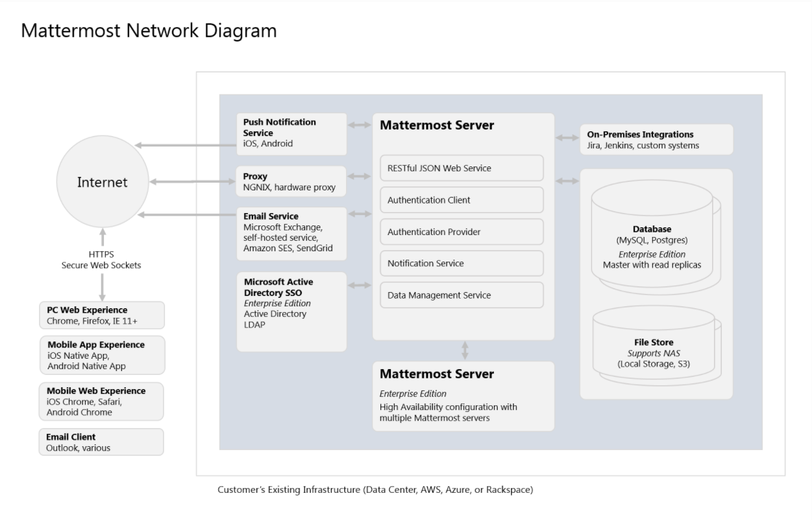

..  _requirements:

Software and Hardware Requirements
==================================

This guide outlines minimum software and hardware requirements for deploying Mattermost. Requirements may vary based on utilization and observing performance of pilot projects is recommended prior to scale out.

.. contents::
    :backlinks: top

Deployment Overview
-------------------

Please see the `Mattermost Deployment Overview <https://docs.mattermost.com/deploy/deployment-overview.html>`__ documentation for a summary of software systems whose requirements are described in this document.

Software Requirements
---------------------

Client Software
~~~~~~~~~~~~~~~

Desktop Apps
^^^^^^^^^^^^

.. csv-table::
    :header: "Operating System", "Technical Requirement"

    "Windows", "Windows 8.1 and 10"
    "Mac", "MacOS 10.12+"
    "Linux", "Ubuntu LTS releases 18.04 or later"

Though not officially supported, the Linux desktop app also runs on RHEL/CentOS 7+.

`*` Integrated Windows Authentication is not supported by Mattermost desktop apps. If you use ADFS we recommend `configuring intranet forms-based authentication for devices that do not support WIA <https://docs.microsoft.com/en-us/windows-server/identity/ad-fs/operations/configure-intranet-forms-based-authentication-for-devices-that-do-not-support-wia>`_.

PC Web
^^^^^^

.. csv-table::
    :header: "Browser", "Technical Requirement"

    "Chrome", "v89+"
    "Firefox", "v78+"
    "Safari", "v12+"
    "Edge", "v44+"

`*` Support for Internet Explorer (IE11) has been removed in Mattermost v5.16. We recommend using the `Mattermost Desktop App <https://mattermost.com/download/#mattermostApps>`_ or another supported browser. See `this forum post <https://forum.mattermost.org/t/mattermost-is-dropping-support-for-internet-explorer-ie11-in-v5-16/7575>`_ to learn more.

Mobile Apps
^^^^^^^^^^^

.. csv-table::
    :header: "Operating System", "Technical Requirement"

    "iOS", "iPhone 5s devices and later with iOS 11+"
    "Android", "Android devices with Android 7+"

`*` Integrated Windows Authentication is not supported by Mattermost mobile apps. If you use ADFS we recommend `configuring intranet forms-based authentication for devices that do not support WIA <https://docs.microsoft.com/en-us/windows-server/identity/ad-fs/operations/configure-intranet-forms-based-authentication-for-devices-that-do-not-support-wia>`_.

Mobile Web
^^^^^^^^^^

.. csv-table::
    :header: "Browser", "Technical Requirement"

    "iOS", "iOS 11+ with Safari 12+ or Chrome 77+"
    "Android", "Android 7+ with Chrome 77+"

Email Client
^^^^^^^^^^^^

-  *Desktop clients:* Outlook 2010+, Apple Mail version 7+, Thunderbird 38.2+
-  *Web based clients:* Office 365, Outlook, Gmail, Yahoo, AOL
-  *Mobile clients:* iOS Mail App (iOS 7+), Gmail Mobile App (Android, iOS)

Server Software
~~~~~~~~~~~~~~~

Mattermost Server Operating System
^^^^^^^^^^^^^^^^^^^^^^^^^^^^^^^^^^

- Ubuntu 18.04, Debian Buster, CentOS 6+, CentOS 7+, RedHat Enterprise Linux 7+, Oracle Linux 6+, Oracle Linux 7+.
- Using the Mattermost `Docker deployment <https://github.com/mattermost/docker>`__ on a Docker-compatible operating system (Linux-based OS) is still recommended.

While community support exists for Fedora, FreeBSD, and Arch Linux, Mattermost does not currently include production support for these platforms.

Database Software
^^^^^^^^^^^^^^^^^

For Mattermost v6.0:

-  MySQL 5.7.12, 8.0.12+ (see note below on MySQL 8 support)
-  PostgreSQL 10.0+

For Mattermost v5.39 and previous releases:

- MySQL 5.6, 5.7, 8.0.12+ (see note below on MySQL 8 support)
- PostgreSQL 10.0+

Amazon Aurora equivalents of both MySQL and PostgreSQL are also supported.

Deployments requiring searching in Chinese, Japanese, and Korean languages require MySQL 5.7.6+ and the configuration of `ngram Full-Text parser <https://dev.mysql.com/doc/refman/5.7/en/fulltext-search-ngram.html>`__. For searching two characters, you will also need to set ``ft_min_word_len`` and ``innodb_ft_min_token_size`` to ``2`` and restart MySQL. See `CJK discussion <https://github.com/mattermost/mattermost-server/issues/2033#issuecomment-183872616>`__ for details.

Search limitations on PostgreSQL:

- Email addresses do not return results.
- Hashtags or recent mentions of usernames containing a dash do not return search results.
- Terms containing a dash return incorrect results as dashes are ignored in the search query.
- If any of the above is an issue, you can either enable the `Elasticsearch feature <https://docs.mattermost.com/scale/elasticsearch.html>`__ or install MySQL instead.

Search limitations on MySQL:

- Hashtags or recent mentions of usernames containing a dot do not return search results.

**MySQL 8 Support**:

In MySQL 8.0.4, the default authentication plugin was changed from ``mysql_native_password`` to ``caching_sha2_password`` (https://mysqlserverteam.com/mysql-8-0-4-new-default-authentication-plugin-caching_sha2_password/). Therefore, you will need to enable ``mysql_native_password`` by adding the following entry in your MySQL configuration file:

  .. code-block:: text

   [mysqld]
   default-authentication-plugin=mysql_native_password

In MySQL 8, the default collation changed to ``utf8mb4_0900_ai_ci`` (https://dev.mysql.com/doc/mysqld-version-reference/en/optvar-changes-8-0.html). Therefore, if you update your MySQL installation to version 8, you'll need to convert your database tables to use the new default collation:

.. code-block:: sql

   ALTER TABLE table_name CONVERT TO CHARACTER SET utf8mb4 COLLATE utf8mb4_0900_ai_ci;

If this change isn't made, tables in the database may end up having different collations which will cause errors when executing queries.

In MySQL versions 8.0.0 - 8.0.11 ``ADMIN`` is a `reserved keyword <https://dev.mysql.com/doc/refman/8.0/en/keywords.html>`_, which is why our requirement for MySQL is version 8.0.12.

Hardware Requirements
---------------------

Usage of CPU, RAM, and storage space can vary significantly based on user behavior. These hardware recommendations are based on traditional deployments and may grow or shrink depending on how active your users are.

Moreover, memory requirements can be driven by peak file sharing activity. Recommendation is based on default 50 MB maximum file size, which can be `adjusted from the System Console <https://docs.mattermost.com/configure/configuration-settings.html#maximum-file-size>`__. Changing this number may change memory requirements.

For deployments larger than 2,000 users, it is recommended to use the Mattermost open source load testing framework to simulate usage of your system at full scale: `https://github.com/mattermost/mattermost-load-test <https://github.com/mattermost/mattermost-load-test>`__.

Hardware Requirements for Team Deployments
~~~~~~~~~~~~~~~~~~~~~~~~~~~~~~~~~~~~~~~~~~

Most small to medium Mattermost team deployments can be supported on a single server with the following specifications based on registered users:

 -  1 - 1,000 users - 1 vCPU/cores, 2 GB RAM
 -  1,000 - 2,000 users - 2 vCPUs/cores, 4 GB RAM

.. _hardware-sizing-for-enterprise:

Hardware Requirements for Enterprise Deployments (Multi-Server)
~~~~~~~~~~~~~~~~~~~~~~~~~~~~~~~~~~~~~~~~~~~~~~~~~~~~~~~~~~~~~~~

Scale Requirements
^^^^^^^^^^^^^^^^^^

For Enterprise Edition deployments with a multi-server setup, see `our scaling guide <https://docs.mattermost.com/scale/scaling.html>`__.

It is highly recommended that pilots are run before enterprise-wide deployments in order to estimate full scale usage based on your specific organizational needs. You can use the Mattermost open source load testing framework to simulate usage of your system: `https://github.com/mattermost/mattermost-load-test <https://github.com/mattermost/mattermost-load-test>`__.

Mattermost's `performance monitoring <https://docs.mattermost.com/scale/performance-monitoring.html>`__ tools can be used for detailed performance measurements and to inspect the running system to ensure sizing and installation is correct.

System Requirements
^^^^^^^^^^^^^^^^^^^

For Enterprise Edition deployments with a multi-server setup, we highly recommend the following systems to support your Mattermost deployment:

   - Prometheus to track system health of your Mattermost deployment, through `performance monitoring feature <https://docs.mattermost.com/scale/performance-monitoring.html>`__ available in Mattermost Enterprise.
   - Grafana to visualize the system health metrics collected by Prometheus with the `performance monitoring feature <https://docs.mattermost.com/scale/performance-monitoring.html>`__. Grafana 5.0.0 and later is recommended.
   - Elasticsearch to support highly efficient database searches in a cluster environment. Elasticsearch 7.x is supported in Mattermost v6.0. Previous Mattermost versions of Mattermost, including v5.39 and earlier releases, support Elasticsearch v5.x, v6.x, and v7.x. `Learn more here <https://docs.mattermost.com/scale/elasticsearch.html>`__.
   - MinIO or AWS S3. Mattermost is compatible with object storage systems which implement the S3 API. Other S3-compatible systems may work, but are not officially supported. Learn more about file storage configuration options `in our documentation <https://docs.mattermost.com/configure/configuration-settings.html#file-storage>`__.

Alternate Storage Calculations
~~~~~~~~~~~~~~~~~~~~~~~~~~~~~~

As an alternative to recommended storage sizing above, you can forecast your own storage usage. Begin with a Mattermost server approximately 600 MB to 800 MB in size including operating system and database, then add the multiplied product of:

-  Estimated storage per user per month (see below), multiplied by 12 months in a year
-  Estimated mean average number of users in a year
-  A 1-2x safety factor

**Estimated storage per user per month**

File usage per user varies significantly across industries. The below benchmarks are recommended:

-  **Low usage teams** (1-5 MB/user/month)
	- Primarily use text messages and links to communicate. Examples would include software development teams that heavily use web-based document creation and management tools, and therefore rarely upload files to the server.

-  **Medium usage teams** (5-25 MB/user/month)
	- Use a mix of text messages as well as shared documents and images to communicate. Examples might include business teams that may commonly drag and drop screenshots, PDFs and Microsoft Office documents into Mattermost for sharing and review.

-  **High usage teams** (25-100 MB/user/month)
	- Heaviest utlization comes from teams uploading a high number of large files into Mattermost on a regular basis. Examples include creative teams who share and store artwork and media with tags and commentary in a pipeline production process.

*Example:* A 30-person team with medium usage (5-25 MB/user/month) with a safety factor of 2x would require between 3.5 GB (30 users \* 5 MB \* 12 months \* 2x safety factor) and 17.6 GB (30 users \* 25 MB \* 12 months \* 2x safety factor) of free space in the next year.

It's recommended that you review storage utilization at least quarterly to ensure adequate free space is available.
