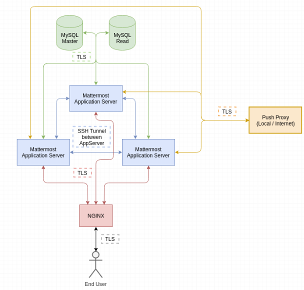

Configuring Transport Encryption
=================================

The components of the Mattermost setup are shown in the following diagram,
including the transport encryption used. Aside from the encryption between the nodes
of the Mattermost cluster, all transports rely on TLS encryption.

**Note:** The transport between the Application servers is not used by default and
requires additional setup steps. Enhancing the core product to include automatic
encryption between cluster nodes is in progress and planned for a later release.

The configuration guides are split up into the following documents:

.. toctree::
  :titlesonly:

  proxy-to-mattermost-transport-encryption.rst
  database-transport-encryption.rst
  cluster-transport-encryption.rst