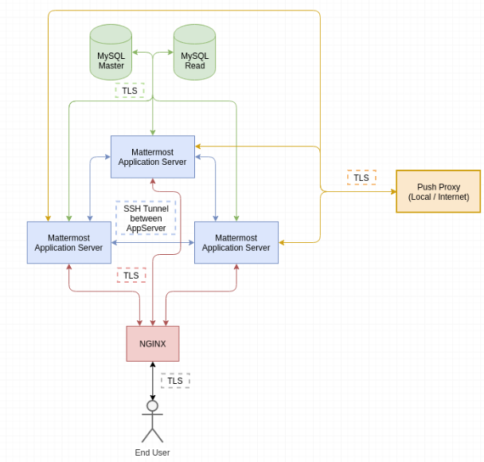

=============================================
Configuring Transport Encryption Overview
=============================================

The components of the Mattermost setup can be shown in the following graphic,
incl. the used transport encryption used. Aside from the encryption between the
Mattermost Application Server, all transport rely on TLS as encryption mechanism.

**Note:** The transport between the Application servers is not used by default and
requires additional setup steps. Enhancing the core product to include automatic
encryption between cluster nodes is in progress and planned for the 5.18 release.

The configuration guides are split up in the following documents:

- `Configuring NGINX with SSL and HTTP/2 (End-User - Proxy) </install/install-rhel-6.html#configuring-nginx-with-ssl-and-http-2>`__
- `Configuring Proxy to Mattermost Transport Encryption <config-mattermost.html>`__
- `Configuring Database Transport Encryption <config-database.html>`__
- `Configuring Cluster Transport Encryption (E20) <config-cluster.html>`__

In the case you are not running a proxy in front of Mattermost, you can skip the first
two steps mentioned above and follow instead the following steps:

- `Configuring TLS on Mattermost Server <https://docs.mattermost.com/install/install-ubuntu-1804.html#configuring-tls-on-mattermost-server>`__
