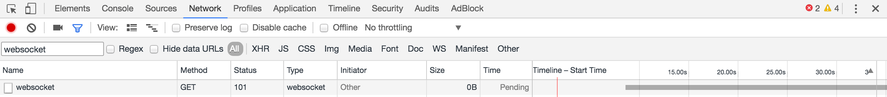

..  _troubleshooting:

This document summarizes common troubleshooting issues and techniques.

Depending on the type of error or problem you're experiencing, refer to the sections below for troubleshooting guidance. If you're a new user, it might help to go over the installation steps again to confirm the process.

Enterprise Edition customers have Premier Support and can open a support ticket in the `Enterprise Edition Support portal <https://mattermost.zendesk.com/hc/en-us/requests/new>`_.

Additionally, peer-to-peer support is available for all Mattermost users on our `Community server <https://community.mattermost.com/core/channels/peer-to-peer-help>`_ and the `Troubleshooting forum <https://forum.mattermost.org/c/trouble-shoot>`__.

Important Notes
---------------

- Do not manipulate the Mattermost database directly. Mattermost is designed to stop working if data integrity is compromised.
- Any manipulation of the database must be done using the built in command line tools.
- Start simple with the step-by-step install guides for your operating system.

General Troubleshooting
-----------------------

Some of these suggestions can be done directly, and others may need consultation from your network administrator.

Review Mattermost Logs
~~~~~~~~~~~~~~~~~~~~~~

You can access logs for Mattermost and use them for troubleshooting. These steps assume that you have `System Admin permissions <https://docs.mattermost.com/help/getting-started/managing-members.html#system-admin>`_.

**Mattermost Server**

- Ensure that log files are being created: Navigate to **System Console > Environment > Logging**, confirm that **Output logs to file** is set to **true**.
- You can obtain the path for the log files in **System Console > Environment > Logging > File Log Directory**.

The resulting server log file is called ``mattermost.log`` and can be opened with a standard text editor or shared directly.

.. note::
    For a more complete log open **System Console > Environment > Logging**, set **File Log Level** to **DEBUG**, then replicate the issue to log it again. Make sure to revert the file log level to **INFO** after troubleshooting to save disk space.

If filesystem access is not possible, navigate to **System Console > Reporting > Server Logs** to locate the current system logs which can be copied to a file.

You can find more on logging settings `here <https://docs.mattermost.com/administration/config-settings.html#logging>`_.

**Mattermost Desktop App**

The desktop app log file can be found in the user directory:

- **Windows:** ``%userprofile%\AppData\Roaming\Mattermost\logs``
- **Linux:** ``~/.local/share/Mattermost/logs``

**Mattermost Browser App**

The browser-based app does not produce additional log files. If the app has to be debugged, use the development tools integrated in your browser.

**Mattermost Push Notification Service**

Logging for the Mattermost Push Notification Service is handled via system log with logger and is appended to ``/var/log/syslog``.

Review Mattermost Environment
~~~~~~~~~~~~~~~~~~~~~~~~~~~~~~

Put together a timeline to eliminate events prior to the error/problem occurring. For example, if you recently reconfigured your firewall and are now having connection issues it might be worth reviewing the settings or rolling back to see whether that resolves the problem.

- If the problem occurred subsequent to some period of normal operation, did anything change in the environment?
    - Was the client, host, or server upgraded?
    - Was an operating system update applied?
    - Did the network environment change? For example, was a server moved or a domain migrated?
    - Did the system (client or server) recently fail or abnormally terminate?
- How many users are impacted?
    - Is this problem affecting one, some, or all users?
    - Is the problem occurring only for a user who was recently added to the environment, such as a new employee?
    - Do differences exist between the users who are affected and the users who are not affected?

You can also search the error messages online. Existing solutions from our `forum <https://forum.mattermost.org/t/how-to-use-the-troubleshooting-forum/150>`_ can often be found and applied.

Administration Issues
----------------------

Lost System Administrator Account
~~~~~~~~~~~~~~~~~~~~~~~~~~~~~~~~~~

-  To reset the account, run from the command line:
   ``./mattermost -assign_role -team_name="yourteam" -email="you@example.com" -role="system_admin"``.
-  Log out and back in to apply the change.

Switching System Administrator Account to Single Sign-on (SSO)
~~~~~~~~~~~~~~~~~~~~~~~~~~~~~~~~~~~~~~~~~~~~~~~~~~~~~~~~~~~~~~

When Mattermost is initially set up, the first account created becomes the System Admin account. This account will typically use email authentication to sign in, since it is usually created before other sign in methods are configured.

After setting up SSO authentication, it's common for the System Admin to want to turn off email sign-in so users will only have SSO as a sign-in option.

Before doing this, the System Admin needs to change their sign-in method to SSO by doing the following:

1. Sign in to Mattermost using an email and password.
2. Go to **Account Settings > Security > Sign-in Method**.
3. Select **Switch** to select a sign-in method and complete the process provided.

The System Admin can now turn off email sign in and still access their account. To avoid locking other existing users out of their accounts, it's recommended that the System Admin ask them to switch authentication methods as well.

Locked Out of System Administrator Account
~~~~~~~~~~~~~~~~~~~~~~~~~~~~~~~~~~~~~~~~~~~

If the System Admin is locked out of the system during SAML configuration process, they can set an existing account to System Admin using `a command line tool <https://docs.mattermost.com/deployment/on-boarding.html#common-tasks>`__.

If email sign in was turned off before the System Admin switched sign in methods, sign up for a new account and promote it to System Admin from the command line:

1. Sign in to the server Mattermost is running on via ``ssh``.
2. Go to the directory of the Mattermost application. If you've followed our setup process this is ``/opt/mattermost``.
3. Run:

.. code-block:: none

    $ sudo -u mattermost bin/mattermost roles system_admin {username}

4. Replace ``{username}`` with the name of the user you'd like to promote to System Admin.

Password Resets
~~~~~~~~~~~~~~~

**Email address or username sign in**

If you sign in to Mattermost using an email address or username, you can send a password reset request by selecting **I forgot my password**. The Mattermost Support team does not have access to your Mattermost server/instance. If you experience any problems, the next step is to contact your Mattermost System Admin.

If you're not sure who the System Admin is, contact the internal IT team at your organization for further help.

**AD/LDAP users**

The password reset process is performed on the directory level as Mattermost pulls the credential information from the LDAP directory. If you experience issues with your password for your LDAP log in, contact your organization's LDAP administrator for further help.

**SSO users (OneLogin/Okta etc)**

The password reset process is completed on the IdP provider side, and not via the Mattermost System Console.

Multi-Factor Authentication (MFA)
~~~~~~~~~~~~~~~~~~~~~~~~~~~~~~~~~

If MFA has stopped working, confirm that your server clock is not out of sync. On Unix systems you can view the hardware time of your system using ``# hwclock -r``. If you're using systemd you can also use ``# timedatectl``.

SAML issues
-----------

Unable to Switch to SAML Authentication Successfully
~~~~~~~~~~~~~~~~~~~~~~~~~~~~~~~~~~~~~~~~~~~~~~~~~~~~

First, ensure you have installed the `XML Security Library <https://www.aleksey.com/xmlsec/download.html>`__ on your Mattermost instance and that **it is available in your** PATH.

Second, ensure you have completed each step of the SAML configuration.

System Admin locks themselves out of the system
~~~~~~~~~~~~~~~~~~~~~~~~~~~~~~~~~~~~~~~~~~~~~~~~~~~~~~~

If the System Admin is locked out of the system during SAML configuration process, they can set an existing account to System Admin using `a command line tool <https://docs.mattermost.com/deployment/on-boarding.html#common-tasks>`__.

``An account with that username already exists. Please contact your Administrator.``
~~~~~~~~~~~~~~~~~~~~~~~~~~~~~~~~~~~~~~~~~~~~~~~~~~~~~~~~~~~~~~~~~~~~~~~~~~~~~~~~~~~

This usually means an existing account has another authentication method enabled. If so, the user should sign in using that method (such as email and password), then change their sign-in method to SAML via **Account Settings > Security > Sign-in method**.

This error message can also be received if the ``Username Attribute`` of their SAML credentials doesn't match the username of their Mattermost account. If so, the user can update the attribute at their identity provider (for instance, back to the old value if it had been previously updated).

``An account with that email already exists. Please contact your Administrator.``
~~~~~~~~~~~~~~~~~~~~~~~~~~~~~~~~~~~~~~~~~~~~~~~~~~~~~~~~~~~~~~~~~~~~~~~~~~~~~~~~~

This usually means an existing account has another authentication method enabled. If so, the user should sign in using that method (such as email and password), then change their sign-in method to SAML via **Account Settings > Security > Sign-in method**.

This error message can also be received if the ``Email Attribute`` of their SAML credentials doesn't match the email address of their Mattermost account. If so, the user can update the attribute at their identity provider (for instance, back to the old value if it had been previously updated).

``SAML login was unsuccessful because one of the attributes is incorrect. Please contact your System Administrator.``
~~~~~~~~~~~~~~~~~~~~~~~~~~~~~~~~~~~~~~~~~~~~~~~~~~~~~~~~~~~~~~~~~~~~~~~~~~~~~~~~~~~~~~~~~~~~~~~~~~~~~~~~~~~~~~~~~~~~

Confirm all attributes, including ``Email Attribute`` and ``Username Attribute``, are correct in both the Identity Provider configuration and in **System Console > SAML**.

``An error occurred while building Service Provider Metadata.``
~~~~~~~~~~~~~~~~~~~~~~~~~~~~~~~~~~~~~~~~~~~~~~~~~~~~~~~~~~~~~~~

This error indicates that the installation does not have an Enterprise license. The error message you receive will look similar to this:

.. code-block:: sh

     ERRO[2019-12-23T10:04:33.5074-07:00] An error occurred while building Service Provider Metadata.  caller="mlog/log.go:175" err_details="err=Your license does not support SAML authentication." err_where=GetSamlMetadata http_code=501 ip_addr="::1" method=GET path=/api/v4/saml/metadata request_id=fbtsbxzb33f67gn6yuy73asxjw user_id=

To resolve the issue, upload an Enterprise License and restart the process.

``SAML 2.0 is not configured or supported on this server.``
~~~~~~~~~~~~~~~~~~~~~~~~~~~~~~~~~~~~~~~~~~~~~~~~~~~~~~~~~~~

The error indicates that the installation is using the Mattermost Team Edition. The error message you receive will look similar to this:

.. code-block:: sh

   ERRO[2019-12-23T10:12:56.5884001-07:00] An error occurred while building Service Provider Metadata.  caller="mlog/log.go:175" err_details="err=SAML 2.0 is not configured or supported on this server." err_where=GetSamlMetadata http_code=501 ip_addr="::1" method=GET path=/api/v4/saml/metadata request_id=1c7jrw3fzbggpe9rs83r5ge5fw user_id=

To resolve the issue, install Enterprise Edition and restart the process.

``An error occurred while initiating the request to the Identity Provider. Please contact your System Administrator.``
~~~~~~~~~~~~~~~~~~~~~~~~~~~~~~~~~~~~~~~~~~~~~~~~~~~~~~~~~~~~~~~~~~~~~~~~~~~~~~~~~~~~~~~~~~~~~~~~~~~~~~~~~~~~~~~~~~~~

This error message can have multiple causes. The log messages provide more information about the root cause and are provided below, along with a suggested fix.

**Issue: Missing a Certificate File**

.. code-block:: sh

   ERRO[2019-12-20T17:20:24.3999581-07:00] Identity Provider Public Certificate File was not found. Please contact your System Administrator.  caller="mlog/log.go:175" err_details= err_where=SamlInterfaceImpl.BuildRequest http_code=500 ip_addr="::1" method=GET path=/login/sso/saml request_id=tm9ywzxcbj88dypkhjgg8hideo user_id=

Install the Identity Provider Certificate and restart the process.

**Issue: Missing Service Provider Private Key**

.. code-block:: sh

   ERRO[2019-12-23T08:51:28.423397-07:00] An error occurred while configuring SAML Service Provider  caller="app/enterprise.go:154" error="saml-public.crt: cannot read: failed to get config file saml-private.key: failed to read file from .../mattermost-server/config/saml-private.key: open .../mattermost-server/config/saml-private.key: no such file or directory"

Install the Service Provider Private Key and restart the process.

**Issue: Missing Service Provider Public Certificate**

.. code-block:: sh

   ERRO[2019-12-23T09:06:27.654774-07:00] An error occurred while configuring SAML Service Provider  caller="app/enterprise.go:154" error="saml-public.crt: cannot read: failed to get config file saml-public.crt: failed to read file from .../mattermost-server/config/saml-public.crt: open .../mattermost-server/config/saml-public.crt: no such file or directory"

Install the Service Provider Public Certificate and restart the process.

.. note::

   If making adjustments for these errors within System Console, no restart is required. However, if making configuration changes outside System Console, such as moving certificate files to the corrrect path, a server restart is required.

``SAML login was unsuccessful because one of the attributes is incorrect. Please contact your System Administrator.``
~~~~~~~~~~~~~~~~~~~~~~~~~~~~~~~~~~~~~~~~~~~~~~~~~~~~~~~~~~~~~~~~~~~~~~~~~~~~~~~~~~~~~~~~~~~~~~~~~~~~~~~~~~~~~~~~~~~

This error indicates that a required attribute was missing from the assertion received from the Idp provider, check log file for which attribute is missing.

.. code-block:: sh

   ERRO[2019-12-09T21:23:24.506631-07:00] SAML login was unsuccessful because one of the attributes is incorrect. Please contact your System Administrator.  caller="mlog/log.go:174" err_details="id attribute is missing" err_where=SamlInterfaceLibImpl.DoLogin http_code=302 ip_addr="::1" method=POST path=/login/sso/saml request_id=5bb6uchhm38kxys6rqm8i5p4ow user_id=

To address the issue, update settings on Idp to include the required attribute.

.. note::

   Turning on debug logging will allow the assertion to be logged.

``SAML login was unsuccessful because encryption is not enabled. Please contact your System Administrator.``
~~~~~~~~~~~~~~~~~~~~~~~~~~~~~~~~~~~~~~~~~~~~~~~~~~~~~~~~~~~~~~~~~~~~~~~~~~~~~~~~~~~~~~~~~~~~~~~~~~~~~~~~

This error indicates a mismatch between SP Provider (Mattermost) configuration and Idp Provider configuration. The SP Provider SAML is configured to expect an unencrypted SAML assertion but the assertion received was encrypted.

.. code-block:: sh

   ERRO[2019-12-23T10:53:42.332484-07:00] SAML login was unsuccessful because encryption is not enabled. Please contact your System Administrator.  caller="mlog/log.go:175" err_details= err_where=SamlInterfaceImpl.DoLogin http_code=302 ip_addr="::1" method=POST path=/login/sso/saml request_id=63s9b8i7u38nzfeuqyzdbank7h user_id=

To address this issue, turn on encryption and restart the process.

``SAML login was unsuccessful as the Identity Provider response is not encrypted. Please contact your System Administrator.``
~~~~~~~~~~~~~~~~~~~~~~~~~~~~~~~~~~~~~~~~~~~~~~~~~~~~~~~~~~~~~~~~~~~~~~~~~~~~~~~~~~~~~~~~~~~~~~~~~~~~~~~~~~~~~~~~~~~~~~~~~~~~

This error indicates a mismatch between SP Provider (Mattermost) configuration and Idp Provider configuration. The SP Provider SAML is configured to expect an unencrypted SAML Assertion but the assertion received was encrypted.

.. code-block:: sh

   ERRO[2019-12-23T10:59:13.486763-07:00] SAML login was unsuccessful as the Identity Provider response is not encrypted. Please contact your System Administrator.  caller="mlog/log.go:175" err_details= err_where=SamlInterfaceImpl.DoLogin http_code=302 ip_addr="::1" method=POST path=/login/sso/saml request_id=j61b8mqpc3n97pgqqeuxupx93y user_id=

To address this issue, turn on encryption and restart the process.

``An error occurred while parsing the response from the Identity Provider. Please contact your System Administrator.``
~~~~~~~~~~~~~~~~~~~~~~~~~~~~~~~~~~~~~~~~~~~~~~~~~~~~~~~~~~~~~~~~~~~~~~~~~~~~~~~~~~~~~~~~~~~~~~~~~~~~~~~~~~~~~~~~~~~~~~

This error is caused by a malformed response or certificate issue, see log file for more information.

.. code-block:: sh

   ERRO[2019-12-23T11:22:16.733242-07:00] An error occurred while parsing the response from the Identity Provider. Please contact your System Administrator.  caller="mlog/log.go:175" err_details="err=illegal base64 data at input byte 15012" err_where=SamlInterfaceImpl.DoLogin http_code=302 ip_addr="::1" method=POST path=/login/sso/saml request_id=uhnbq1objfyqpyqct3sy3fch9y user_id=

``An error occurred while encoding the request for the Identity Provider. Please contact your System Administrator.``
~~~~~~~~~~~~~~~~~~~~~~~~~~~~~~~~~~~~~~~~~~~~~~~~~~~~~~~~~~~~~~~~~~~~~~~~~~~~~~~~~~~~~~~~~~~~~~~~~~~~~~~~~~~~~~~~~~~

This error indicates an issue with ``xmlsec1``; either ``xmlsec1`` is not installed or the version of ``xmlsec1`` in use does not accept self-signed certificate.

.. code-block:: sh

   ERRO[2019-12-23T12:42:04.389431-07:00] An error occurred while encoding the request for the Identity Provider. Please contact your System Administrator.  caller="mlog/log.go:175" err_details= err_where=SamlInterfaceImpl.BuildRequest http_code=500 ip_addr="::1" method=GET path=/login/sso/saml request_id=mg4mdc78q3r798y5ierdz5qqdc user_id=

``SAML login was unsuccessful because an error occurred while decrypting the response from the Identity Provider. Please contact your System Administrator.``
~~~~~~~~~~~~~~~~~~~~~~~~~~~~~~~~~~~~~~~~~~~~~~~~~~~~~~~~~~~~~~~~~~~~~~~~~~~~~~~~~~~~~~~~~~~~~~~~~~~~~~~~~~~~~~~~~~~~~~~~~~~~~~~~~~~~~~~~~~~~~~~~~~~~~~~~~~~~

This error indicates an issue with ``xmlsec1``; either ``xmlsec1`` is not installed or the version of ``xmlsec1`` in use does not accept self-signed certificates.

.. code-block:: sh

   ERRO[2019-12-23T12:45:45.041627-07:00] SAML login was unsuccessful because an error occurred while decrypting the response from the Identity Provider. Please contact your System Administrator.  caller="mlog/log.go:175" err_details="err=failed to decrypt xml: error invoking xmlsec1: : exec: \"xmlsec1\": executable file not found in $PATH" err_where=SamlInterfaceImpl.DoLogin http_code=302 ip_addr="::1" method=POST path=/login/sso/saml request_id=i7d7kc4hk3ymzneetdbuafz9ca user_id=

``An error occurred while validating the response from the Identity Provider. Please contact your System Administrator.``
~~~~~~~~~~~~~~~~~~~~~~~~~~~~~~~~~~~~~~~~~~~~~~~~~~~~~~~~~~~~~~~~~~~~~~~~~~~~~~~~~~~~~~~~~~~~~~~~~~~~~~~~~~~~~~~~~~~~~~~~

This error message applies to various validation issues. The log message provides more information about the cause of the issue.

.. code-block:: sh

   ERRO[2019-12-23T13:09:49.171975-07:00] An error occurred while validating the response from the Identity Provider. Please contact your System Administrator.  caller="mlog/log.go:175" err_details="err=unsupported SAML Version" err_where=SamlInterfaceImpl.DoLogin http_code=302 ip_addr="::1" method=POST path=/login/sso/saml request_id=5omhhgei8jr68jba3j4tiwo48c user_id=

**Parameters**

- ``unsupported SAML Version``: The assertion xml contains the wrong SAML version, 2.0 supported.

- ``missing ID attribute on SAML Response``: The assertion did not contain an ID attribute. Invalid XML received.

- ``no signature``: No signature, but signature validation required.

- ``invalid signature reference uri``: Invalid signature tag. Invalid XML received.

- ``destination mismatch expected: x not y``: ``AssertionConsumerServiceURL`` did not match expected.

- ``too soon`` or ``too late``: Assertion ``NotOnOrAfter`` or ``NotBefore`` attribute outside current time.

Why does the objectGUID of a user in Mattermost differ from what we're seeing in ADFS?
~~~~~~~~~~~~~~~~~~~~~~~~~~~~~~~~~~~~~~~~~~~~~~~~~~~~~~~~~~~~~~~~~~~~~~~~~~~~~~~~~~~~~~~~~

The Active Directory ObjectGUID attribute LDAP display name ``objectGUID`` is a 16 byte array which can be displayed in different ways:

- The ``ldapsearch`` Linux command displays it as base64: ``Hrz/HqNKnU+lCNTYHx9Ycw==``. This is also the format used in LDIF files.
- The `LDAP Golang package we use <https://github.com/go-ldap/ldap>`__ shows the value as hexadecimal (base 16) array with each byte separated by a backslash: ``\1e\bc\ff\1e\a3\4a\9d\4f\a5\08\d4\d8\1f\1f\58\73``.
    - You can remove the backslashes: ``1ebcff1ea34a9d4fa508d4d81f1f5873`` and parse it with `Golang <https://play.golang.org/p/9b8iDPuz0Nm>`__ as snippets which prints the base 10 representation of each value: ``30 188 255 30 163 74 157 79 165 8 212 216 31 31 88 115``.
- Windows PowerShell displays the value like this: ``1effbc1e-4aa3-4f9d-a508-d4d81f1f5873``.

Deployment and Clustering
-------------------------

Red Server Status
~~~~~~~~~~~~~~~~~

When High Availability is enabled, the System Console displays the server status as red or green, indicating if the servers are communicating correctly with the cluster. The servers use inter-node communication to ping the other machines in the cluster, and once a ping is established the servers exchange information, such as server version and configuration files.

A server status of red can occur for the following reasons:

- **Configuration file mismatch:** Mattermost will still attempt the inter-node communication, but the System Console will show a red status for the server since the high availability feature assumes the same configuration file to function properly.
- **Server version mismatch:** Mattermost will still attempt the inter-node communication, but the System Console will show a red status for the server since the High Availability feature assumes the same version of Mattermost is installed on each server in the cluster. It's recommended to use the `latest version of Mattermost <https://mattermost.org/download/>`__ on all servers. Follow the upgrade procedure in :doc:`../administration/upgrade` for any server that needs to be upgraded.
- **Server is down:** If an inter-node communication fails to send a message it makes another attempt in 15 seconds. If the second attempt fails, the server is assumed to be down. An error message is written to the logs and the System Console shows a status of red for that server. The inter-node communication continues to ping down the server in 15-second intervals. When the server comes back up, any new messages are sent to it.

WebSocket Disconnect
~~~~~~~~~~~~~~~~~~~~~

When a client WebSocket receives a disconnect it will automatically attempt to re-establish a connection every three seconds with a backoff. After the connection is established, the client attempts to receive any messages that were sent while it was disconnected.

App Refreshes Continuously
~~~~~~~~~~~~~~~~~~~~~~~~~~

When configuration settings are modified through the System Console, the client refreshes every time a user connects to a different app server. This occurs because the servers have different ``config.json`` files in a High Availability cluster.

Modify configuration settings directly through ``config.json`` `following these steps <https://docs.mattermost.com/deployment/cluster.html#updating-configuration-changes-while-operating-continuously>`__.

Messages Do Not Post Until After Reloading
~~~~~~~~~~~~~~~~~~~~~~~~~~~~~~~~~~~~~~~~~~~

When running in High Availability mode, make sure all Mattermost application servers are running the same version of Mattermost. If they are running different versions, it can lead to a state where the lower version app server cannot handle a request and the request will not be sent until the frontend application is refreshed and sent to a server with a valid Mattermost version.

Symptoms to look for include requests failing seemingly at random or a single application server having a drastic rise in goroutines and API errors.

Server Administration
---------------------

``Please check connection, Mattermost unreachable. If issue persists, ask administrator to check WebSocket port.``
~~~~~~~~~~~~~~~~~~~~~~~~~~~~~~~~~~~~~~~~~~~~~~~~~~~~~~~~~~~~~~~~~~~~~~~~~~~~~~~~~~~~~~~~~~~~~~~~~~~~~~~~~~~~~~~~~~

-  Message appears in blue bar on team site.
-  To check the WebSocket connection, open the developer console in your browser and view the **Network** panel. If the WebSocket is not connecting properly, you will see a pending WebSocket connection show up in the list. The screenshot below shows an example from Chrome.

-  **If this issue is reported repeatedly**, the most likely cause is a proxy being misconfigured somewhere in your infrastructure, and possibly stripping headers off of WebSocket communications.
-  Mattermost clients connect to the server using multiple protocols, ``https`` to enable general site functionality, and ``wss`` for real-time updates. This error message appears when the ``https`` connection is working, but the ``wss`` connection has issues, most commonly having headers stripped off by a firewall or proxy that is either misconfigured or which does not support secure WebSockets.

**Note:** If your ``https`` connection is working and ``wss`` is not, and you dismiss the blue bar message, your team site will render, but will not support real time communications (you will need to refresh to see updates and the system is effectively "broken").

**Solution:**

      1. Follow the `installation guide to set up your WebSocket port properly <https://docs.mattermost.com/install/install-ubuntu-1604.html#installing-nginx-server>`__.
      2. Speak with the owner of any other proxies between your device and the Mattermost server to ensure ``wss`` connections are passing through without issue.

If this issue is reported rarely, in some cases the issue comes from *intermittent* internet connectivity, where the initial load works, but the device then becomes disconnected from the internet and real time updates over the ``wss`` connection fail repeatedly and the error is displayed to check if the ``wss`` connection were misconfigured.

If only a small number of users have this issue, it could be from intermittent internet access, if almost every user has this issue, it's likely from a misconfiguration of the ``wss`` connection.

``Cannot connect to the server. Please check your server URL and internet connection.``
~~~~~~~~~~~~~~~~~~~~~~~~~~~~~~~~~~~~~~~~~~~~~~~~~~~~~~~~~~~~~~~~~~~~~~~~~~~~~~~~~~~~~~

This error may appear on some devices when trying to connect to a server that is using an SSL curve that's not supported by the client device.

**Solution:**

If you are using NGINX as a proxy, set the ``ssl_ecdh_curve`` directive in your site configuration file (for example, in ``/etc/nginx/sites-available/mattermost``), to a value that's supported by both client and server. Suggested values for varying levels of compatibility can be found at `Mozilla's Security/Server Side TLS <https://wiki.mozilla.org/Security/Server_Side_TLS>`__ page.

As security and encryption standards often change rapidly, it's best to check for up-to-date information. However, the suggested value as of January 2018 is to use the curves: prime256v1, secp384r1, secp521r1.

For NGINX, this would translate to ``ssl_ecdh_curve prime256v1:secp384r1:secp521r1;``.

**Note:** Setting multiple curves requires nginx 1.11.0, if you can only set one curve, the most compatible is prime256v1.

``x509: certificate signed by unknown authority``
^^^^^^^^^^^^^^^^^^^^^^^^^^^^^^^^^^^^^^^^^^^^^^^^^

This error may appear in server logs when attempting to sign-up when using self-signed certificates to set up SSL, which is not yet supported by Mattermost.

**Solution:**

Set up a load balancer like NGINX `per production install guide <https://docs.mattermost.com/install/install-ubuntu-1604.html#configuring-nginx-with-ssl-and-http-2>`__. The core team is looking into allowing self-signed certificates in the future.

As a work around, in **System Console > Security > Connections** set **Enable Insecure Outgoing Connections** to **True**.

This will allow insecure TLS connections, but be careful in doing so as it also opens your Mattermost site to man-in-the-middle attacks.

``panic: runtime error: invalid memory address or nil pointer dereference``
~~~~~~~~~~~~~~~~~~~~~~~~~~~~~~~~~~~~~~~~~~~~~~~~~~~~~~~~~~~~~~~~~~~~~~~~~~~

This error can occur if you've manually manipulated the Mattermost database, typically with deletions. Mattermost is designed to serve as a searchable archive, and manual manipulation of the database elements compromises integrity and may prevent upgrade.

**Solution:**

Restore from database backup created prior to manual database updates, or reinstall the system.

``We couldn't find an existing account matching your email address for this team. This team may require an invite from the team owner to join.``
~~~~~~~~~~~~~~~~~~~~~~~~~~~~~~~~~~~~~~~~~~~~~~~~~~~~~~~~~~~~~~~~~~~~~~~~~~~~~~~~~~~~~~~~~~~~~~~~~~~~~~~~~~~~~~~~~~~~~~~~~~~~~~~~~~~~~~~~~~~~~~~~

This error appears when a user tries to sign in, and Mattermost can't find an account matching the credentials they entered.

**Solution:**

1. If you're signing in with email and have previously created an account:

Check that you are using the correct email address. If you can't remember what email address was used, contact the System Admin for assistance.

2. If you haven't signed up for an account on this team yet:

Click the link at the bottom of the sign-in page that says “Don't have an account? Create one now” to create an account. If the link is not available, contact a Team or System Admin for an invitation.

3. If your account uses a different sign-in method (for example, the account was created with email but the user is trying to use SSO to sign in):

   - Check the sign in page.
   - If the sign-in method the account was created with is available, use that to sign in.

      -  **Note:** You may then switch authentication methods from **Account Settings > Security > Sign-in Method**.

   - If the sign-in method is not available, contact the System Admin.

      -  This can happen if the site was originally set up to allow an account to be created using either GitLab or email, but then the System Admin turned one of the options off.
      -  The System Administrator can fix this issue by:

         1. Turning the sign-in option back on.
         2. Asking the user to switch sign-in methods before turning the sign-in option off.

``Failed to upgrade websocket connection``
~~~~~~~~~~~~~~~~~~~~~~~~~~~~~~~~~~~~~~~~~~

This error can occur if you're using multiple URLs to reach Mattermost via proxy forwarding.

**Solution:**

1. Upgrade to a Mattermost server v3.8.0 or later, which adds `WebSocket CORS support <https://github.com/mattermost/mattermost-server/pull/5667>`__.
2. Follow the installation guide to configure `NGINX as a proxy for Mattermost server <https://docs.mattermost.com/install/install-ubuntu-1604.html#configuring-nginx-as-a-proxy-for-mattermost-server>`__.
3. If you're doing reverse proxy with IIS, upgrade to IIS 8.0 or later and enable WebSockets. For more information, see `IIS 8.0 WebSocket Protocol Support <https://www.iis.net/learn/get-started/whats-new-in-iis-8/iis-80-websocket-protocol-support>`__.

``Websocket closed`` or ``Websocket re-established connection``
~~~~~~~~~~~~~~~~~~~~~~~~~~~~~~~~~~~~~~~~~~~~~~~~~~~~~~~~~~~~~~~

This alert can appear every few seconds in the desktop application or web browser connected to Mattermost.

**Solution:**

- If you're using an Amazon ELB check that ``Idle Timeout`` is set to ``120s``, if it's significantly lower it will cause an undesireable WebSocket disconnections.
- If you're using NGINX, make sure you follow the `Mattermost configuration instructions <https://docs.mattermost.com/install/config-proxy-nginx.html>`__ for setting the  ``proxy_read_timeout``.

``context deadline exceeded``
~~~~~~~~~~~~~~~~~~~~~~~~~~~~~

This error appears when a request from Mattermost to another system, such as an Elasticsearch server, experiences a connection timeout.

**Solution:**

1. Verify that the Mattermost server is able to connect to the system referenced in the error message.
2. Increase the request timeout value for that integration in the Mattermost ``config.json`` file.
3. Ensure the target system is behaving properly and has sufficient resources to handle current load.

Settings
--------

User Availability gets Stuck on "Away" or "Offline"
~~~~~~~~~~~~~~~~~~~~~~~~~~~~~~~~~~~~~~~~~~~~~~~~~~~

If you notice more than one user has their `availability <https://docs.mattermost.com/help/getting-started/setting-your-status-availability.html>`__ stuck as **Away** or **Offline**, try one of the following steps:

1. If you're using an NGINX proxy, configure IP Hash load balancing to determine what server should be selected for the next request (based on the client’s IP address) `as described here <https://nginx.org/en/docs/http/load_balancing.html>`__.
2. If you're using an AWS Application Load Balancer (ALB), enable Sticky Sessions feature in Amazon EC2’s Elastic Load Balancing `as described here <https://aws.amazon.com/blogs/aws/new-elastic-load-balancing-feature-sticky-sessions/>`__.

If neither of the above steps help resolve the issue, please open a new topic `in the Mattermost forums <https://forum.mattermost.org/>`__ for further troubleshooting.

System Console Settings Revert to Previous Values after Saving
~~~~~~~~~~~~~~~~~~~~~~~~~~~~~~~~~~~~~~~~~~~~~~~~~~~~~~~~~~~~~~~

If you try to save a System Console page and notice that the settings revert to previous values, your ``config.json`` file may have a permissions issue.

Check that the ``config.json`` file is owned by the same user as the process that runs the Mattermost server. If not, change the owner to be the Mattermost user and restart the server.

Mattermost Can't Connect to LDAP/AD Server
~~~~~~~~~~~~~~~~~~~~~~~~~~~~~~~~~~~~~~~~~~

LDAP and Active Directory troubleshooting can be found on `this page <https://docs.mattermost.com/deployment/sso-ldap.html#troubleshooting-faq>`__.

Mobile
-------

Login with ADFS/Office365 is Not Working
~~~~~~~~~~~~~~~~~~~~~~~~~~~~~~~~~~~~~~~~

In line with Microsoft guidance we recommend `configuring intranet forms-based authentication for devices that do not support WIA <https://docs.microsoft.com/en-us/windows-server/identity/ad-fs/operations/configure-intranet-forms-based-authentication-for-devices-that-do-not-support-wia>`_.

The “Connecting…” Bar Doesn't Clear
~~~~~~~~~~~~~~~~~~~~~~~~~~~~~~~~~~~

If your app is working properly, you should see a grey “Connecting…” bar that clears or says “Connected” after the app reconnects.

If you're seeing this message all the time, and your internet connection seems fine, ask your server administrator whether the server uses NGINX or another webserver as a reverse proxy. If so, they should check that it is configured correctly for `supporting the websocket connection for APIv4 endpoints <https://docs.mattermost.com/install/install-ubuntu-1604.html#configuring-nginx-as-a-proxy-for-mattermost-server>`__.

I’m Not Receiving Push Notifications on my Device
~~~~~~~~~~~~~~~~~~~~~~~~~~~~~~~~~~~~~~~~~~~~~~~~~

If you didn't receive a push notification when :doc:`testing push notifications <mobile-testing-notifications>`, use the following procedure to troubleshoot:

1. Under **System Console > Environment > Logging > File Log Level** , then select **DEBUG** in order to watch for push notifications in the server log.
2. Delete and reinstall your mobile application.
3. Sign in with "Account A" and **confirm you want to receive push notifications** when prompted by the mobile app.
4. On desktop, go to **Account Settings > Security > View and Logout of Active Sessions** and check that there is a session for the native mobile app matching your login time.
5. Repeat the procedure for :doc:`testing push notifications <mobile-testing-notifications>`.
6. If no push notification appears go to **System Console > Logs**, then select **Reload**. Look at the bottom of the logs for a message similar to:

``[2016/04/21 03:16:44 UTC] [DEBG] Sending push notification to 608xyz0... wi msg of '@accountb: Hello'``

  - If the log message appears, it means a message was sent to the HPNS server and was not received by your mobile application. Please contact support@mattermost.com with the subject "HPNS issue on Step 8" for help from the support team.
  - If the log message does not appear, it means no mobile push notification was sent to “Account A”. Please repeat the process, starting at step 2, and double-check each step.
7. **IMPORTANT:** After your issue is resolved, to conserve disk space, go to **System Console > Environment > Logging > File Log Level**, then select **ERROR** to switch your logging detail level to Errors Only, instead of **DEBUG**.

All Outbound Connections go Through a Proxy. How Can I Connect to the Mattermost Hosted Push Notification Service?
~~~~~~~~~~~~~~~~~~~~~~~~~~~~~~~~~~~~~~~~~~~~~~~~~~~~~~~~~~~~~~~~~~~~~~~~~~~~~~~~~~~~~~~~~~~~~~~~~~~~~~~~~~~~~~~~~~

You can set up an internal server to proxy the connection out of their network to the Mattermost Hosted Push Notification Service (HPNS) by following the steps below:

1. Make sure your proxy server is properly configured to support SSL. Confirm it works by checking the URL at https://www.digicert.com/help/.
2. Set up a proxy to forward requests to ``https://push.mattermost.com``.
3. In Mattermost, go to **System Console > Environment > Push Notification Server**, and set **Enable Push Notifications** to **Manually enter Push Notification Service location**.
4. Enter the URL of your proxy in the **Push Notification Server** field.

**Note:** Depending on how your proxy is configured you may need to add a port number and create a URL like ``https://push.internalproxy.com:8000`` mapped to ``https://push.mattermost.com``.

``Cannot connect to the server. Please check your server URL and internet connection.``
~~~~~~~~~~~~~~~~~~~~~~~~~~~~~~~~~~~~~~~~~~~~~~~~~~~~~~~~~~~~~~~~~~~~~~~~~~~~~~~~~~~~~

First, confirm that your server URL has no typos and that it includes ``http://`` or ``https://`` according to the server deployment configuration.

If the server URL is correct, there could be an issue with the SSL certificate configuration.

To check your SSL certificate set up, test it by visiting a site such as `SSL Labs <https://www.ssllabs.com/ssltest/index.html>`__. If there’s an error about the missing chain or certificate path, there is likely an intermediate certificate missing that needs to be included.

Please note that the apps cannot connect to servers with self-signed certificates, consider using `Let's Encrypt <https://docs.mattermost.com/install/config-ssl-http2-nginx.html>`__ instead.

Configuration Issues
--------------------

In some cases, the configuration from the product’s website differs from the Mattermost configuration. Review the configuration to ensure it’s aligned with Mattermost.

- See detailed client software requirements for PC, mobile, and email.
- See detailed server software requirements for operating system and database.
- Check which Mattermost server version you're on, and confirm whether it's the latest version.
- Have you made any changes to the default settings in the System Console (or in ``config.json`` file)?
- What device (webapp, desktop app), browser, and operating system (Windows, macOS, etc.) are you using?
- Confirm that the SSL/TLS certificate was installed successfully by entering your Mattermost server URL to Symantec’s online SSL/TLS certificate checker.
- Look for JavaScript errors in the Chrome developer console: Open the Chrome menu in the top-right of the browser window and select **More Tools > Developer Tools**.

Integrations
~~~~~~~~~~~~

YouTube Videos Show a "Video not found" Preview
^^^^^^^^^^^^^^^^^^^^^^^^^^^^^^^^^^^^^^^^^^^^^^^

1. First, make sure the YouTube video exists by pasting a link to the video into your browser's address bar.
2. If you're using the Mattermost Desktop App, please ensure you have installed version 3.5.0 or later.
3. If you've specified `a Google API key <https://docs.mattermost.com/administration/config-settings.html#google-api-key>`__ to enable the display of titles for embedded YouTube video previews, regenerate the key.

Hitting an Error "Command with a trigger of failed" When Configuring Giphy Integration
^^^^^^^^^^^^^^^^^^^^^^^^^^^^^^^^^^^^^^^^^^^^^^^^^^^^^^^^^^^^^^^^^^^^^^^^^^^^^^^^^^^^^^

When trying to configure the Giphy integration in Mattermost, you may hit the error "Command with a trigger of <keyword> failed". To solve this, you need to edit your ``config.json`` file and configure ``AllowedUntrustedInternalConnections`` to contain the hostname of the webhook.

Gfycat gifs are not loading even though they show up in the emoji picker
^^^^^^^^^^^^^^^^^^^^^^^^^^^^^^^^^^^^^^^^^^^^^^^^^^^^^^^^^^^^^^^^^^^^^^^^

1. Check whether the server has access to the Gfycat servers. It may be behind a proxy or firewall which is blocking outgoing connections.
2. Check whether the server reaches the link metadata timeout (see **System Console > Experimental > Link Metadata Timeout**).

Mobile
~~~~~~

Build Gets Stuck at ``bundleReleaseJsAndAssets``
^^^^^^^^^^^^^^^^^^^^^^^^^^^^^^^^^^^^^^^^^^^^^^^^

As a workaround, you can bundle the ``js`` manually first with

.. code-block:: none

  react-native bundle --platform android --dev false --entry-file index.js --bundle-output android/app/src/main/assets/index.android.bundle --assets-dest android/app/src/main/res/

and then ignore the gradle task with

.. code-block:: none

  ./gradlew assembleRelease -x bundleReleaseJsAndAssets

No Image Previews Available in The Mobile App
^^^^^^^^^^^^^^^^^^^^^^^^^^^^^^^^^^^^^^^^^^^^^

This can happen if the server running Mattermost has its mime types not set up correctly. A server running Linux has this file located in ``/etc/mime.types``. This might vary depending on your specific OS and distribution.

Some distributions also ship without ``mailcap`` which can result in missing or incorrectly configured mime types.

None of These Solve my Problem!
-------------------------------

To help us narrow down whether it’s a server configuration issue, device specific issue, or an issue with the app, please try the following steps and include the results in your support request or `Troubleshooting forum <https://forum.mattermost.org/c/trouble-shoot>`__ post.

**Connect to another server**

1. Create an account at https://community.mattermost.com.
2. Erase your mobile application and reinstall it.
3. In your mobile app, enter the server URL https://community.mattermost.com and then your login credentials to test whether the connection is working.

**Connect with another device**

- If you have another mobile device available, try connecting with that to see if your issue still reproduces.
- If you don’t have another device available, check with other teammates to see if they are having the same issue.

Opening a Support Ticket for Self-Managed Deployments
-----------------------------------------------------

When opening a Support ticket, it's important that you provide us with as much information as you can in a timely manner. Knowing what information is relevant can be confusing. We use the anagram C.L.U.E.S. to remember what we need:

* Configurations
* Logs
* Users affected
* Environment
* Steps to reproduce

C.L.U.E.S. represents all of the information that can clarify your issue. With these details, we can begin searching for a cause, whether it's a simple configuration change or a product bug. It also helps us when we need to escalate the issue to our developers so they can spend as much time as possible improving our product.

Enterprise Edition customers have Premier Support and can open a support ticket in the `Enterprise Edition Support portal <https://mattermost.zendesk.com/hc/en-us/requests/new>`_. Additionally, peer-to-peer support is available for all Mattermost users on our `Community server <https://community.mattermost.com/core/channels/peer-to-peer-help>`_ and the `Troubleshooting forum <https://forum.mattermost.org/c/trouble-shoot>`__.

General Guidelines for Information
~~~~~~~~~~~~~~~~~~~~~~~~~~~~~~~~~~~

Follow these guidelines when providing diagnostic data to us:

* Make sure the files you provide are as complete as possible, rather than providing a few lines. Entire log files and configurations provide us with important context.
* Provide configuration and log files in plaintext format if possible, as these are far easier for us to search than screenshots.
* Be sure to sanitize configuration and log files to remove usernames, passwords, and LDAP groups. Replace these details with example strings that contain the same special characters if possible, as special characters are common causes of configuration errors.
* Provide screenshots or screen recordings of unexpected product behavior so that we know exactly what your users are seeing.

Configuration
~~~~~~~~~~~~~

Why we need your configuration data
^^^^^^^^^^^^^^^^^^^^^^^^^^^^^^^^^^^

On Linux systems, settings are generally stored in configuration files. Many issues can be resolved by enabling or disabling a configuration setting. In order to find a resolution, we need to have as complete a picture of your system setup as possible. This also helps us to reproduce bugs so our developers can fix them.

What configuration data includes
^^^^^^^^^^^^^^^^^^^^^^^^^^^^^^^^

Configuration includes (but is not limited to):

- The Mattermost ``config.json`` file.
- The configuration for the reverse proxy, e.g. NGINX, HAProxy, AWS.
- The database configuration.
- SAML configuration when the issue is regarding SAML authentication. The configuration for the Mattermost service is in the SAML IdP.
- Any other systems that Mattermost connects to or systems that exist between the user and the Mattermost server.

How to access your configuration data
^^^^^^^^^^^^^^^^^^^^^^^^^^^^^^^^^^^^^

**Mattermost configuration**

The Mattermost configuration is usually stored at ``/opt/mattermost/config/config.json``. If you've migrated the Mattermost configuration to the database, you can get the configuration using ``mmctl`` or by running this database query:

.. code-block:: none
    
   SELECT Value FROM Configurations WHERE Active = 1;

**Reverse Proxy configuration**

NGINX usually splits its configuration into two parts: the main server configuration at ``/etc/nginx/nginx.conf``, and a virtual server configuration. On Ubuntu, this is stored in ``/etc/nginx/sites-available``. Providing both of these configuration files is helpful, but providing the latter is more important.

**SAML configuration**

If the issue you're seeing is with SAML login, we will need to see the full configuration for the Mattermost service in the SAML provider. The configuration for the Mattermost service is in the SAML IdP. Providing screenshots similar to the ones in the setup documentation is sufficient because most SAML providers are configured using a web interface.

**LDAP configuration**

The LDAP administrator should confirm the correct values for the following Mattermost LDAP settings:

- LDAP server hostname.
- LDAP connection port, security, and certificates.
- BaseDN, bind username, and bind password.
- User, Group, Guest, and Admin filters.
- Display attributes.

These can be provided as a text file or as screenshots from the LDAP server.

**Other configurations**

If you're experiencing an issue on mobile, and you're using an MDM or VPN to connect to the server, those configurations will be necessary to diagnose the problem. A System Administrator for the external system should be able to provide you with the configuration.

Logs
~~~~

Why we need them
^^^^^^^^^^^^^^^^

Nearly all computer systems have logs of errors and application behavior that can show us what's happening when an application is running. Error logs are invaluable when diagnosing a problem, but only if they're as complete as possible.

What logs are available
^^^^^^^^^^^^^^^^^^^^^^^

**Mattermost**

Mattermost has two log files, one for general messages and the other for notification-related messages. These are found at:

* ``/opt/mattermost/logs/mattermost.log``
* ``/opt/mattermost/logs/notification.log``

**Proxy**

The location of these depend on your proxy configuration, but a good place to start looking is in ``/var/log``. Your proxy administrator should be able to help you find the logs.

**Database**

MySQL and PostgreSQL have different logs, and their location varies based on your configuration. If the issue is related to database connectivity, check the database documentation to locate the logs.

**SAML, LDAP, and other systems**

Your organization's System Administrator should be able to find these for you.

How to access logs
^^^^^^^^^^^^^^^^^^

**Mattermost**

Make sure debug logging is enabled so that we can get the most information from the logs. To do this, go to **System Console > Environment > Logging**, then set console and file log level to **DEBUG**.

If the behavior started at a known time or date, use ``journalctl`` to get the logs like this:

.. code-block:: none

   sudo journalctl -u mattermost --since "2020-08-23 17:15:00" > mattermost_journalctl.log

Replace 2020-08-23 17:15:00 with the date and time (relative to the server) when the behavior started. To get the server time, use the ``date`` command. If the log files generated are too large to send, compress them with this command:

.. code-block:: none
   
   tar -czf /tmp/mattermost.log.tgz

The compressed logs will be located on the server at ``/tmp/mattermost.log.tgz``.

If the compressed file is still too big, use these commands to split the compressed file into two or more 20MB files:

.. code-block:: none
   
   mkdir -p /tmp/mattermost-logs
   cd /tmp/mattermost-logs
   tar czf - /opt/mattermost/logs/mattermost.log | split -b 20m - mattermost.log.tgz.

The compressed files will be located on the server at ``/tmp/mattermost-logs`` and be named ``mattermost.log.tgz.aa``, ``mattermost.log.tgz.ab``, and so on. Use a file transfer client that supports SSH/SFTP, such as Cyberduck, to copy these files from the server.

If you are experiencing issues with Elasticsearch, SAML, LDAP, or the database, you can enable trace logging in ``config.json`` by setting ``Trace`` to ``true`` under their respective settings. Combining this with ``DEBUG`` level file log output will result in huge log files, so only leave trace logging on long enough to replicate the behavior. The resulting logs will also contain a lot more sensitive data, including user data, so be sure to sanitize it completely before sharing it with us.

**System logs**

The location of log files for other systems varies, but a good way to get the logs for all processes on the Mattermost server is to use ``journalctl`` like this:

.. code-block:: none
  
   sudo journalctl --since "2020-08-23 17:15:00" > mattermost_journalctl.log

Replace 2020-08-23 17:15:00` with the date and time (relative to the server) when the error occurred. You can use ``--until`` with the same timestamp format to get the logs between two times:

.. code-block:: none
  
   sudo journalctl --since "2020-08-23 17:15:00" --until "2020-08-23 16:30:00" > mattermost_journalctl.log

Users affected
~~~~~~~~~~~~~~

Why we need it
^^^^^^^^^^^^^^

Mattermost servers are chaotic places. Thousands of posts, websocket actions, and webhook calls happen every second while users can be in dozens of channels across multiple teams. Knowing which users are affected by a problem can help us sift through all this information to find the root cause.

What information to include
^^^^^^^^^^^^^^^^^^^^^^^^^^^

This should be a detailed explanation of anything the end users who are reporting the unexpected behavior have in common. This includes (but is not limited to):

- Team and Channel memberships, including Direct and Group Messages.
- Authentication methods.
- Client operating system and app versions.
- How users connect to the Mattermost server.
- Any other things these users have in common such as when they joined, whether their login information recently changed, or if they are being synchronized via LDAP.

Note for Agents: This information is also required:

- Customer name
- Customer contacts
- Customer license, e.g. E20/PS
- Customer tier

Environment
~~~~~~~~~~~

Where the Mattermost server sits in your architecture has a lot of impact on potential issues. For example, a misconfigured proxy server can prevent users from connecting even if there's nothing wrong with Mattermost.

What information to include
^^^^^^^^^^^^^^^^^^^^^^^^^^^

Because of this, having a complete picture of the servers and network that the Mattermost server operates in is key to solving problems. This includes (but is not limited to):

- Mattermost version (e.g. 5.28.0, 5.25.5)
- Server OS and version (e.g. RHEL7, Ubuntu 18.04)
- Any orchestration/automation used like Docker or Kubernetes
- Reverse proxy and version (e.g. NGINX 1.16)
- Database type and version (e.g. MySQL 5.7, PostgreSQL 12.4)
- SAML provider (e.g. Windows Server 2012 Active Directory, Okta, KeyCloak)
- LDAP provider (e.g. Windows Server 2016 Active Directory, Okta, OpenLDAP)
- The type and version of any proxies or VPNs on the network that the Mattermost server is connecting through

Be as specific as possible when describing the environment. If you are seeing errors like **Connection Refused** be sure to include any firewalls or filtering proxies that may be on your network, either inbound or outbound.

**Examples**

Mattermost server

 - External hostname: mattermost.example.com
 - Internal hostname: mattermost.lan
 - Mattermost v5.28.0
 - Zoom plugin v1.4.1
 - NGINX v1.18.0

Database server

 - Internal hostname: mysql.lan
 - MySQL v5.7
 - LDAP Provider - 192.168.1.102
 - Internal hostname: ldap.lan
 - OpenLDAP 2.4.54 (Docker container)

Mattermost servers

 - Hostnames: mm1.local.lan, mm2.local.lan, mm3.local.lan, mm4.local.lan

Mattermost server versions

 - mm1-3: 5.25.4
 - mm4: 5.21.0

Proxy server

 - External hostname: mattermost.example.com
 - Internal hostname: proxy.local.lan
 - NGINX v1.16.0

Database servers

 - Hostnames: db1.local.lan, db2.local.lan, db3.local.lan
 - Primary: db1.local.lan
 - Read-Only: db2.local.lan, db3.local.lan  
 - MySQL v5.6

Elasticsearch server

 - Hostname: elastic.local.lan
 - Elasticsearch 7.9 with these plugins
 - analysis-icu

Steps to Reproduce
~~~~~~~~~~~~~~~~~~

What it is
^^^^^^^^^^

If the behavior only happens when the user performs a specific action, providing detailed steps to reproduce it will help us make sure we find and fix the right bug. These details should be as descriptive as possible, but nothing is better than a screenshot or a screen recording of the behavior.

A short summary of the steps to reproduce is also helpful. If you want some examples, look at the bug tickets on some Mattermost Jira tickets.

How to provide these details
^^^^^^^^^^^^^^^^^^^^^^^^^^^^

**macOS**

Press CMD+SHIFT+5 to open the screen recording tool and select the region of the screen you want to record. To take a screenshot, press CMD+SHIFT+4 and select the region to take a screenshot. The screenshot files are placed on the desktop by default.

**Windows**

Press CTRL+SHIFT+S to open the snipping tool to take a screenshot. If you want to take a screen recording you'll need to install third-party software such as `OBS <https://obsproject.com/>`_.

**iOS**

Take a screenshot or screen recording `on iPhone <https://support.apple.com/guide/iphone/take-a-screenshot-or-screen-recording-iphc872c0115/ios>`_.

**Android**

Take a screenshot or record your screen on your `Android device <https://support.google.com/android/answer/9075928?hl=en>`_.

Appendix
--------

**A note on mobile issues**

Because the mobile app doesn't have a debug mode, diagnosing issues stemming from user data requires a proxy like Charles or mitmproxy. These will intercept and record traffic from the client which can then be replayed to reproduce issues. Contact your Customer Engineer for help setting these up.

**SAML login issues**

If the issue is with SAML login, one important piece of context is the SAML login flow. This contains headers and authentication information that can reveal issues that are easy to fix. Follow these instructions to view the SAML login flow if you are experiencing SAML authentication.

Checking keys and certificates
~~~~~~~~~~~~~~~~~~~~~~~~~~~~~~

Key and certificate files should never be shared, but if the error indicates a problem with the format of a key or certificate, then you should verify the format of the keys and certificates by running this command:

.. code-block:: none

  cat -A /path/to/key-or.cert

The output must meet these criteria exactly to be valid:

* Start with ``-----BEGIN CERTIFICATE-----$``.
* All lines must end with ``$``. If they end with ``^M$`` then convert them to UNIX line endings with ``dos2unix``.
* End with ``-----END CERTIFICATE-----$``.
