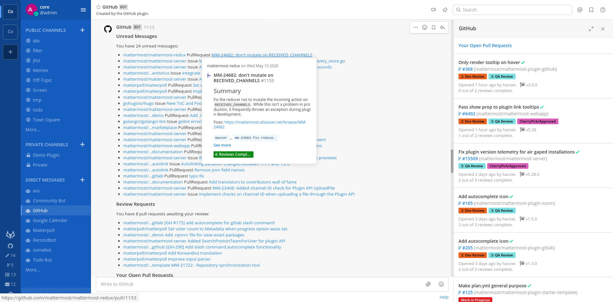

Connect GitHub to Mattermost
=============================

.. include:: ../_static/badges/allplans-cloud-selfhosted.rst
  :start-after: :nosearch:

Minimize distractions and reduce context switching between your GitHub code repositories and your communication platform by integrating GitHub with Mattermost. Help your teams stay focused and productive with real-time updates on commits, pull requests, issues, and more directly from Mattermost channels.

Deploy
------

Setup starts in GitHub and configuration ends in Mattermost.

Register an OAuth app in GitHub
~~~~~~~~~~~~~~~~~~~~~~~~~~~~~~~

A Mattermost system admin must perform the following steps in GitHub.

1. Go to https://github.com/settings/applications/new to register an OAuth app with GitHub.
2. Set the following values:

  - **Application name**: ``Mattermost GitHub Plugin - <YOUR COMPANY NAME>``
  - **Homepage URL**: ``https://github.com/mattermost/mattermost-plugin-github``
  - **Authorization callback URL**: ``https://YOUR-MATTERMOST-URL.COM/plugins/github/oauth/complete``, replacing ``https://YOUR-MATTERMOST-URL.COM`` with your Mattermost URL. This value must match the Mattermost server URL you use to log in.

3. Save your changes.
4. Select **Generate a new client secret**, and enter your GitHub password to continue.
5. Copy the **Client ID** and **Client Secret** in the resulting screen.
6. In Mattermost, go to **System Console > Plugins > GitHub**, and regenerate both a **Webhook Secret** and **At Rest Encryption Key** by selecting **Regenerate** next to each field. You'll need a copy of the **Webhook Secret** value to create a webhook in GitHub.

.. note::

  We recommend making a copy of your webhook secret and encryption key, as it will only be visible to you once.

Create a webhook in GitHub
~~~~~~~~~~~~~~~~~~~~~~~~~~

A Mattermost system admin must perform the following steps in GitHub. Create a webhook in GitHub for each GitHub organization you want to set up.

1. In GitHub, go to the **Settings** page where you want to send notifications from, then select **Webhooks** in the sidebar.
2. Select **Add Webhook**.
3. Set the following values:

  - **Payload URL**: ``https://YOUR-MATTERMOST-URL.COM/plugins/github/webhook``. Replace ``https://YOUR-MATTERMOST-URL.COM`` with your Mattermost URL.
  - **Content Type**: ``application/json``
  - **Secret**: The **Webhook Secret** value you copied earlier.

4. Under **Which events would you like to trigger this webhook?**, select **Let me select individual events**.
5. Select the following events:

  - Branch or Tag creation
  - Branch or Tag deletion
  - Discussions
  - Issue comments
  - Issues
  - Pull requests
  - Pull request review
  - Pull request review comments
  - Pushes
  - Releases
  - Stars
  - Workflows
  - Discussions
  - Discussion comments

6. Select **Add Webhook** to save your changes.

Mattermost configuration
~~~~~~~~~~~~~~~~~~~~~~~~

A Mattermost system admin must perform the following steps in Mattermost.

1. Confirm whether your Mattermost deployment has a ``github`` user account. If it exists, that account posts GitHub messages in channels by default, and the messages won't include a BOT tag. You can change this account behavior to include a BOT tag by using one of the following methods:

 - Convert the user account to a bot using :ref:`mmctl user convert <manage/mmctl-command-line-tool:mmctl user convert>`.
 - Change the existing ``github`` username to something else. A new bot account called ``github`` is created the Mattermost server is restarted when the :ref:`enable bot account creation <configure/integrations-configuration-settings:enable bot account creation>` configuration setting is enabled.

2. Install the GitHub integration from the in-product App Marketplace:

  a. In Mattermost, from the Product menu |product-list|, select **App Marketplace**.
  b. Search for or scroll to GitHub, and select **Install**.
  c. Once installed, select **Configure**. You're taken to the System Console.
  d. On the GitHub configuration page, enable and configure GitHub interoperability as follows, and then select **Save**:

    - Enter the **GitHub OAuth Client ID** and **GitHub OAuth Client Secret** obtained during registration.
    - (Optional) **GitHub Organization**: Lock the integration to GitHub organizations by specifying a comma seperated list of your GitHub organizations.
    - (GitHub Enterprise Only): Set **Enterprise Base URL** and **Enterprise Upload URL** values to your GitHub Enterprise URLs, e.g. ``https://github.example.com``. These values are often the same.
    - (Mattermost desktop app only) **Display Notification Counters in Left Sidebar**: Display or hide GitHub notification counters in the Mattermost sidebar.
    - (Optional) **Enable Private Repositories**: Enable the ability to work with private repositories. Affected users are notified once private repositories are enabled, and must reconnect their GitHub accounts to gain access to private repositories.
    - (Optional) **Connect to private Repositories by default**: Connect to private GitHub repositories by default, when private repositories are enabled.
    - (Optional) **Enable Code Previews**: Expand permalinks to GitHub files with previews. You can can enable public repositories, public and private repositories, or disable this option.
    - (Optional) **Enable Webhook Event Logging**: Log webhook events when log level set to DEBUG by enabling the  option.
    - (Optional) **Show Author in commit notification**: Show commit author instead of committer in GitHub push event notifications.

Enable
------

Notify your teams that they can `connect their GitHub accounts to Mattermost <#connect-a-github-account-to-mattermost>`__.

Upgrade
-------

We recommend updating this integration as new versions are released. Generally, updates are seamless and don't interrupt the user experience in Mattermost. Visit the `Releases page <https://github.com/mattermost/mattermost-plugin-github/releases>`__ for the latest release, available releases, and compatibiilty considerations.

Use
-----

Users who want to use GitHub interconnectivity must register an OAuth app in GitHub for Mattermost, and then connect a GitHub account to Mattermost.

Once connected, you'll receive direct messages from the GitHub bot in Mattermost when someone mentions you, requests a review, comments on, modifies one of your pull requests/issues (includes adding labels or reopening the issue), or assigns you to an issue on GitHub.

Register an OAuth app in GitHub for Mattermost
~~~~~~~~~~~~~~~~~~~~~~~~~~~~~~~~~~~~~~~~~~~~~~

1. Go to https://github.com/settings/applications/new to register an OAuth app.
2. In GitHub, set the following values:

  - **Application name**: ``Mattermost GitHub Plugin - <YOUR COMPANY NAME>``
  - **Homepage URL**: ``https://github.com/mattermost/mattermost-plugin-github``
  - **Authorization callback URL**: ``https://YOUR-MATTERMOST-URL.COM/plugins/github/oauth/complete``, replacing ``https://YOUR-MATTERMOST-URL.COM`` with your Mattermost URL. This value must match the Mattermost server URL you use to log in.

3. Submit your changes in GitHub.

Connect a GitHub account to Mattermost
~~~~~~~~~~~~~~~~~~~~~~~~~~~~~~~~~~~~~~~

1. In Mattermost, run the ``/github connect`` slash command in any Mattermost channel to link your Mattermost account with your GitHub account.

2. Once connected, run the ``/github help`` slash command to see what you can do.

Get started
~~~~~~~~~~~

Here are some common slash commands you can get started with:

Run the ``/github subscriptions add`` slash command to subscribe a Mattermost channel to receive notifications for new pull requests, issues, branch creation, and more in a GitHub repository.

For example, to post notifications for issues, issue comments, and pull requests matching the label **Help Wanted** from the ``mattermost/mattermost-server`` GitHub repository, use: ``/github subscriptions add mattermost/mattermost-server --features issues,pulls,issue_comments,label:"Help Wanted"``. The following flags are supported:

- ``--features``: A comma-delimited list of one or more of: issues, pulls, pulls_merged, pulls_created, pushes, creates, deletes, issue_creations, issue_comments, pull_reviews, releases, workflow_success, workflow_failure, discussions, discussion_comments, label:"labelname". Defaults to ``pulls,issues,creates,deletes``.
- ``--exclude-org-member``: The events triggered by organization members that won't be delivered. It will be locked to the organization configured and only works for users whose membership is public. Organization members and collaborators are not the same.
- ``--include-only-org-members``: events triggered only by organization members will be delivered. It will be locked to the organization provided in the plugin configuration and it will only work for users whose membership is public. Note that organization members and collaborators are not the same.
- ``--render-style``: Notifications are delivered in the specified style (for example, the body of a pull request will not be displayed). Supported values are ``collapsed``, ``skip-body``, or ``default`` (which is the same as omitting the flag).
- ``--exclude``: A comma-separated list of the repositories to exclude from getting the subscription notifications like ``mattermost/mattermost-server``. Only supported for subscriptions to an organization.

Run the ``/github todo`` slash command to get a message with items to do in GitHub, including a list of unread messages and pull requests awaiting your review.

Run the ``/github settings`` slash command to update your settings for notifications and daily reminders.

Run the ``/github setup`` slash command to configure the integration between GitHub and Mattermost. You can run this command to run the entire setup process, or run one of the following subcommands to revisit a particular setup step:

- ``/github setup oauth``: Sets up the OAuth2 application in GitHub, establishing the necessary authorization connection between GitHub and Mattermost.
- ``/github setup webhook``: Creates a webhook from GitHub to Mattermost, allowing real-time notifications and updates from GitHub to be sent to Mattermost channels.
- ``/github setup announce``: Sends a message to designated channels in Mattermost, announcing the availability of the GitHub integration for team members to use.
- ``/github default-repo``:  Sets a default repository for user per channel to be auto-filled in the Create GitHub Issue modal for convenience.

Frequently asked questions
---------------------------

How do I connect a repository instead of an organization?
~~~~~~~~~~~~~~~~~~~~~~~~~~~~~~~~~~~~~~~~~~~~~~~~~~~~~~~~~~

Set up your GitHub webhook from the repository instead of the organization. Notifications and subscriptions will then be sent only for repositories you create webhooks for. The reminder and ``/github todo`` searches the whole organization, but only show items assigned to you.

How do I send notifications when a certain label is applied?
~~~~~~~~~~~~~~~~~~~~~~~~~~~~~~~~~~~~~~~~~~~~~~~~~~~~~~~~~~~~

If you want to send notifications to a Mattermost channel when **Severity/Critical** label is applied to any issue in the ``mattermost/mattermost-plugin-github`` repository, run the following slash command to subscribe to these notifications: ``/github subscriptions add mattermost/mattermost-plugin-github issues,label:"Severity/Critical"``

How does the integration save user data for each connected GitHub user?
~~~~~~~~~~~~~~~~~~~~~~~~~~~~~~~~~~~~~~~~~~~~~~~~~~~~~~~~~~~~~~~~~~~~~~~

GitHub user tokens are AES-encrypted with an **At Rest Encryption Key** generated in Mattermost. Once encrypted, the tokens are saved in the ``PluginKeyValueStore`` table in your Mattermost database.

Customize
---------

This integration contains both a server and web app portion. Visit the `Mattermost Developer Workflow <https://developers.mattermost.com/extend/plugins/developer-workflow/>`__ and `Mattermost Developer environment setup <https://developers.mattermost.com/extend/plugins/developer-setup/>`_ for information about developing, customizing, and extending Mattermost functionality.

In order to get your environment set up to run Playwright tests, please see the setup guide at `e2e/playwright <https://github.com/mattermost/mattermost-plugin-github/blob/master/e2e/playwright#readme>`_.

Get help
--------

Mattermost customers can open a `Mattermost support case <https://support.mattermost.com/hc/en-us/requests/new>`_. To report a bug, please open a GitHub issue against the `Mattermost GitHub plugin repository <https://github.com/mattermost/mattermost-plugin-github>`_.

For questions, feedback, and assistance, join our pubic `Integrations and Apps channel <https://community.mattermost.com/core/channels/integrations>`_ on the `Mattermost Community Server <https://community.mattermost.com/>`_ for assistance.

Mattermost Team Edition and Free customers can visit the Mattermost `peer-to-peer troubleshooting forum <https://forum.mattermost.com/c/trouble-shoot/16>`_ to access the global Mattermost Community for assistance.