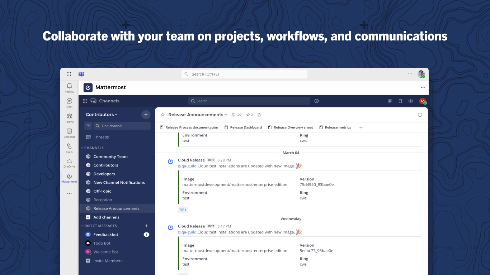

Mattermost for Microsoft Teams
==============================

Join the Mattermost Community directly from your Microsoft 365, Microsoft Outlook, or Microsoft Teams instance!

Use the Mattermost for Microsoft Teams integration to stay connected with thousands of users, contributors, and Mattermost staff directly from the tools you use every day. Join thousands of Mattermost users, contributors, and staff members in a vibrant community where you can ask questions, get support, share ideas, and contribute to shaping the future of Mattermost.

Key features
------------

- **Direct Access**: Access the Community for Mattermost directly from a tab without switching applications or opening a browser.
- **Seamless Integration**: Experience the full functionality of Community for Mattermost within a familiar interface.
- **Real-time Collaboration**: Engage with the Community for Mattermost in real-time discussions on product features, technical questions, and best practices.
- **Product Support**: Get help from both Mattermost staff and experienced community members.
- **Contribute to Development**: Participate in discussions that shape the future direction of Mattermost products.
- **Knowledge Sharing**: Learn implementation strategies and best practices from a diverse community of users.
- **Stay Updated**: Keep up with the latest Mattermost announcements, updates, and roadmap information.

This app is designed to work with Microsoft 365, Outlook, and Microsoft Teams.

Setup
-----

Install the Mattermost for Microsoft 365 application
~~~~~~~~~~~~~~~~~~~~~~~~~~~~~~~~~~~~~~~~~~~~~~~~~~~~~

Any Microsoft 365 user can complete the steps below to access the Mattermost for Microsoft 365 within their Microsoft environment:

1. Sign in to your Microsoft Teams account from a `web browser <https://teams.microsoft.com/v2/?clientexperience=t2>`_ or the desktop application.

2. Select the **[+] Apps** button in the Teams sidebar.

3. Search for **Mattermost for Microsoft 365** and then select **Add** to install the application.

4. (Optional) Pin the Mattermost app to your Teams sidebar by right-clicking on it and selecting **Pin**.

5. Once the Mattermost app is installed, you'll be connected to the public Mattermost Community instance.

Getting started
----------------

Once you've installed the app, here are some ways to get started:

- **Ask questions**: Use the `~ask-anything <https://community.mattermost.com/core/channels/ask-anything>`_ channel to ask technical questions or get support from the community.

- **Stay informed**: Follow the `~release-announcements <https://community.mattermost.com/core/channels/release-announcements>`_ channel to keep up with the latest news about upcoming releases and updates from the Mattermost team.

- **Contribute**: If you're interested in contributing to Mattermost, join the `~developers <https://community.mattermost.com/core/channels/developers>`_ channel to connect with other contributors.

- **Share feedback**: Your ideas and feedback are valuable! Share your thoughts in the `~user-feedback <https://community.mattermost.com/core/channels/user-feedback>`_ channel.

Roadmap: Upcoming Features for Microsoft Teams Integration
----------------------------------------------------------

We are continually enhancing the integration experience between Mattermost and Microsoft Teams. Here's a glimpse of what's coming next:

1. **Entra-Based SSO**:

   - Seamless and secure single sign-on for organizations using Microsoft Entra ID.
   - Benefits: Simplifies user authentication and enhances security with enterprise-grade identity management.

2. **Activity Feed Notifications for Mentions in Mattermost**:

   - Stay updated with real-time notifications in your Microsoft Teams activity feed whenever someone mentions you in Mattermost.
   - Benefits: Ensures you never miss critical updates, even while collaborating within Microsoft Teams.

3. **Support for Multiple Mattermost Instances in Teams Tabs**: 

   - View and access multiple Mattermost instances directly from different tabs in Microsoft Teams.
   - Benefits: Streamlined workflows for organizations with multiple Mattermost deployments or diverse team setups.

4. **Unread Badge and Unread Counter Badge**: 

   - Easily identify unread messages from Mattermost and see a numeric indicator of the unread message count directly in the Teams app.
   - Benefits: Saves time and ensures you're always aware of unread communication.

FAQ
---

Where can I get support for the Mattermost for Microsoft 365 app?
~~~~~~~~~~~~~~~~~~~~~~~~~~~~~~~~~~~~~~~~~~~~~~~~~~~~~~~~~~~~~~~~~

You can browse existing open issues or submit a new issue for support `in GitHub <https://github.com/mattermost/mattermost-teams-tab/issues>`_.

Do I need a Mattermost account to use this application?
~~~~~~~~~~~~~~~~~~~~~~~~~~~~~~~~~~~~~~~~~~~~~~~~~~~~~~~

Yes, you'll need to create a free account on the Mattermost Community server when you first access it through the app.

Can I use this app to connect to my organization's Mattermost server?
~~~~~~~~~~~~~~~~~~~~~~~~~~~~~~~~~~~~~~~~~~~~~~~~~~~~~~~~~~~~~~~~~~~~~

No, this app is specifically designed to connect to the public Mattermost Community instance. If you're interested in connecting to your own Mattermost instance, please reach out to support@mattermost.com for assistance.
