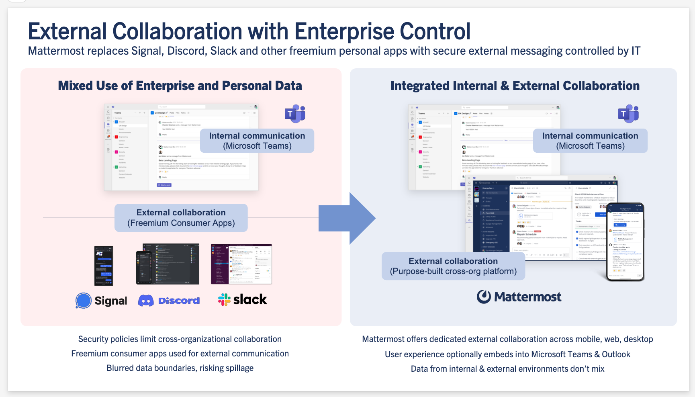

Mattermost Mission Collaboration for Microsoft 365 (Beta)
=========================================================

.. include:: ../_static/badges/ent-cloud-selfhosted.rst
  :start-after: :nosearch:

Mattermost Mission Collaboration for Microsoft extends Microsoft Office365, Microsoft Outlook, and Microsoft Teams for mission-critical coordination, command and control, incident response, and DevSecOps workflows in demanding environments, including air-gapped and classified networks.

This app is designed to work with Microsoft 365, Outlook, and Teams.

Setup
-----

Create an MS Teams app in Azure
~~~~~~~~~~~~~~~~~~~~~~~~~~~~~~~~

1. Sign in to the `Azure portal <https://portal.azure.com/>`_ using an admin Azure account.

2. Go to your **Azure Portal > Microsoft Entra ID**.

3. Go to **App registrations**.

4. Create a new app registration by selecting **Add > App registration**:

  - Give it a name
  - Accounts in this organizational directory only (single tenant)
  - No redirect URIs

5. Go to your newly created application and copy the **Application (client) ID** and **Directory (tenant) ID** values. You'll need those later to configure the plugin.

  .. image:: ../images/remember-tenant-client.png
    :alt: Go to your newly created application and copy the Application (client) ID and Directory (tenant) ID values. You'll need those later to configure the plugin.

6. Go to **Certificates and secrets** to generate a new client secret. Make a copy of the secrfet value, as it will only be shown once. You'll need this value to configure the plugin.

  .. image:: ../images/remember-client-secret.png
    :alt: Go to Certificates and secrets to generate a new client secret. Make a copy of the secret value, as it will only be shown once. You'll need this value to configure the plugin.

7. Go to **API Permissions** to complete the following steps:

  - Ensure the ``User.Read`` **delegated** permission is added. See the `Microsoft SSO documentation <https://learn.microsoft.com/en-us/microsoftteams/platform/tabs/how-to/authentication/tab-sso-register-aad#enable-sso-in-microsoft-entra-id>`_ for details.
  - (Optional) Add the ``TeamsActivity.Send`` **application** permission for notifications. See the `Microsoft notifications documentation <https://learn.microsoft.com/en-us/graph/teams-send-activityfeednotifications?tabs=desktop%2Chttp>`_ for details.`
  - (Optional) Add the ``AppCatalog.Read.All`` **application** permission for notifications. See the `Microsoft List teamsApp documentation <https://learn.microsoft.com/en-us/graph/api/appcatalogs-list-teamsapps?view=graph-rest-1.0&tabs=http>`_ for details.
  - Grant admin consent for the default directory to prevent users from seeing the consent prompt.

8. Go to **Expose an API** to complete the following steps:

  - Edit the ``_Application ID URI_`` to ``api://{{Mattermost Site URL Hostname}}/{{Application (client) ID}}``.
  - Add the ``access_as_user`` scope by selecting **Add a scope** and setting the following values:

    - **Scope name**: ``access_as_user``.
    - **Who can consent?** Admins and users
    - Provide a display name and description, as well as a user consent display name and description. These will be shown to end users on the consent screen. For example:

      - **Display name**: Log in to Mattermost
      - **Description**: Used to allow O365 users to log in to the Mattermost application 
      - **User consent display name**: Log in to Mattermost
      - **User consent description**: This permission is required to automatically log you in into Mattermost from Microsoft applications.

    See the `Microsoft API scope documentation <https://learn.microsoft.com/en-us/microsoftteams/platform/tabs/how-to/authentication/tab-sso-register-aad#to-configure-api-scope>`_ for details.

    - Add authorised client applications for the scope. See the `Microsoft authorized client documentation <https://learn.microsoft.com/en-us/microsoftteams/platform/tabs/how-to/authentication/tab-sso-register-aad#to-configure-authorized-client-application>`_ for details.

      - Select ``_Add a client application_``. **You must add a client application for each target Microsoft application**:

        - **Authorised scopes**: The one we just created

          - **Client ID**:

            - **Teams web**: 5e3ce6c0-2b1f-4285-8d4b-75ee78787346
            - **Teams app**: 1fec8e78-bce4-4aaf-ab1b-5451cc387264

    - If you want to make your application available in more Microsoft applications, keep adding client applications from `the following table <https://learn.microsoft.com/en-us/microsoftteams/platform/tabs/how-to/authentication/tab-sso-register-aad#to-configure-authorized-client-application:~:text=Select%20one%20of%20the%20following%20client%20IDs%3A>`_.

Mattermost plugin setup
~~~~~~~~~~~~~~~~~~~~~~~

1. Download the `latest release of the plugin <https://github.com/mattermost/mattermost-plugin-msteams-devsecops/releases>`_.

2. Go to **System Console > Plugins > Plugin Management > Upload Plugin**, and upload the plugin binary you downloaded in the previous step.

3. Go to **System Console > Plugins > Plugin Management**. In the **Installed Plugins** section, scroll to **MSTeams DevSecOps**, and select **Enable**.

4. Enter an **Application Version**. You can start with ``1.0.0``.

5. Generate an Application ID in `version 4 UUID format <https://www.uuidgenerator.net/>`_ and enter it in the **Application ID** field.

6. Enter the values you noted earlier in the appropriate fields, including **Directory (tenant) ID**, **Application (client) ID**, and **Client Secret**. 

    .. image:: ../images/tenant-client-secret-sysconsole.png
      :alt: In the Mattermost System Console, enter the Directory (tenant) ID, Application (client) ID, and Client Secret for the plugin.

7. Enter an **Application Display Name** to define how your application is named in the MS Teams App Store.

8. Save the changes and enable the plugin.

9. Select the **Download Manifest** button to generate the MS Teams application as a ZIP file, containing the app manifest. Save this file as it will be used in the next steps.

10. Configure Mattermost with the list of domains permitted to embed the Mattermost web client via an iFrame by setting the :ref:`frame ancestors <configure/integrations-configuration-settings:frame ancestors>` configuration setting. Additionally, ensure that correct configurations are in place to allow communication between the iframe and the parent domain without violating security.

Install Mattermost in Microsoft Teams
~~~~~~~~~~~~~~~~~~~~~~~~~~~~~~~~~~~~~~

1. Go to the `Microsoft Teams admin center <https://admin.teams.microsoft.com/dashboard>`_.

2. Go to **Teams apps > Manage apps**.

    .. image:: ../images/select-manage-apps.png
      :alt: In MS Teams, go to Manage Apps to install the Mattermost Mission Collaboration for Microsoft 365 app.

3. Go to **Actions > Upload new app** located in the upper-right corner of the Manage apps page.

4. Select **Upload** and select the ZIP file saved previously.

5. Done! Your application is now available to users.

Usage
------

This plugin bypasses standard authentication methods, enabling automatic authentication when logged into Microsoft Teams. Teams authentication automatically logs users into Mattermost if the email addresses in both platforms match exactly. Regular authentication methods (LDAP, SAML, email/password, OpenID) can additionally be used for Mattermost.

In air-gapped environments or during business continuity disruptions, users who can't join Microsoft Teams, can continue to access Mattermost using their Mattermost credentials by opening Mattermost in a separate app (e.g., in a new browser window). Alternatively, a Mattermost admin can pre-distribute the Mattermost desktop app using Windows MSI or the mobile app via EMM.

Benefits and use cases
-----------------------

- **External Collaboration with IT Control**: Replace non-compliant freemium personal apps with dedicated external collaboration across mobile, web, and desktop, fully controlled by IT.
- **Intelligent, AI-Accelerated Incident Response**: Augment Microsoft Security Suite with AI-powered collaborative workflows, from detection to resolution, within secure environments.
- **Sovereign, Cyber-Resilient S4B Replacement for Classified Workflows**: Replace legacy Skype for Business with a self-hosted, fully sovereign solution for classified operations, tightly integrated within Microsoft ecosystems.
- **Embedded DevSecOps Collaboration Inside Microsoft Teams**: Maintain a unified user experience while achieving higher operational productivity for DevSecOps and mission teams.
- **Mission Operations at the Tactical Edge**: Real-time command and control for joint operations, mission partner environments, and disconnected/denied environments (DDIL).

Key features
-------------

- **Direct Access**: Access Mattermost directly from a tab without switching applications or opening a browser.
- **Seamless Integration**: Experience the full functionality of Mattermost within a familiar Microsoft Teams interface.
- **Real-time Collaboration**: Collaborate with your team on projects, workflows, and communications in real time.
- **Unified Communications**: Combine chat, meetings, workflows, and task management inside MS Teams.
- **Secure Data Handling**: Maintain data sovereignty with self-hosted deployment options.
- **AI-Powered Insights**: Use multi-agent AI, including Azure OpenAI and local LLMs, for faster decision-making and situational awareness.
- **Embedded DevSecOps Collaboration**: Keep developer teams productive with integrated workflows inside Microsoft Teams.
- **Entra-Based SSO**: Simplify user authentication and enhance security with enterprise-grade identity management for organizations using Microsoft Entra ID.
- **Activity Feed Notifications for Mentions in Mattermost**: Never miss critical updates, with real-time notifications in your MS Teams activity feed whenever someone mentions you in Mattermost.

FAQ
---

Where can I get support?
~~~~~~~~~~~~~~~~~~~~~~~~~~

`Submit an issue on GitHub <https://github.com/mattermost/mattermost-plugin-msteams-devsecops/issues>`_. Share your thoughts and suggestions in the `~user-feedback channel <https://community.mattermost.com/core/channels/user-feedback>`_ on the Mattermost Community server.