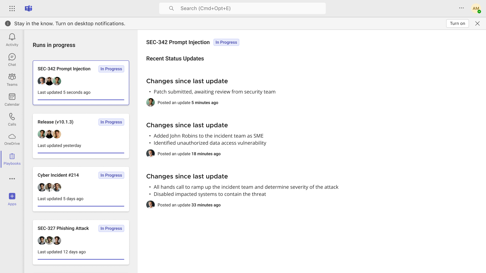

Connect Microsoft Teams to Mattermost Playbooks (Technical Preview)
===================================================================

.. include:: ../_static/badges/ent-cloud-selfhosted.rst
  :start-after: :nosearch:

The Mattermost Playbooks for Teams technical preview improves cross-organizational alignment and awareness by enabling access to your :doc:`active, repeatable processes </guides/repeatable-processes>` and :ref:`status updates <repeatable-processes/notifications-and-updates:status updates>` in Mattermost directly in Microsoft Teams. Stakeholders working in Teams gain enhanced visibility into ongoing incidents, while incident responders working in Mattermost can stay focused on incident response and eliminate context switching. With the Mattermost Playbooks for Teams integration, you can:

- View active incidents, responders, and last updated time
- Read real-time incident status updates in chronological order

Deploy
-------

Update and configure the Playbooks integration for Mattermost
~~~~~~~~~~~~~~~~~~~~~~~~~~~~~~~~~~~~~~~~~~~~~~~~~~~~~~~~~~~~~~

A Mattermost system admin must complete the following steps:

1. Go to the **System Console > Plugin Management** page to upload the `latest preview build of Mattermost Playbooks <https://github.com/mattermost/mattermost-plugin-playbooks/releases/tag/v2.0.1%2Btabapp>`_ with support for the Teams app integration.

2. Once uploaded, select **Settings** under the Playbooks plugin to **Enable Teams Tab App**, and enter your Teams tenant ID in the **Authorised Tenant IDs for Teams Tab App** field. 

Install the Mattermost Playbooks for Teams application
~~~~~~~~~~~~~~~~~~~~~~~~~~~~~~~~~~~~~~~~~~~~~~~~~~~~~~  

Any Teams user in the associated tenant that was configured for the Playbooks integration must complete the steps below to access playbooks and runs within Teams.

1. Sign in to your Microsoft Teams account from a `browser <https://teams.microsoft.com/v2/?clientexperience=t2>`_ or the desktop application.

2. Select the **[+] Apps** button in the Teams sidebar.

3. Search for "Mattermost Playbooks" and then select **Add** to install the application.

4. (Optional) Pin the application to your Teams sidebar by right-clicking on it and selecting **Pin**.

5. Once the Mattermost Playbooks app is installed, enter the URL for your Mattermost Enterprise self-managed or cloud server.

Choose which Mattermost playbook runs are accessible to Microsoft Teams users
~~~~~~~~~~~~~~~~~~~~~~~~~~~~~~~~~~~~~~~~~~~~~~~~~~~~~~~~~~~~~~~~~~~~~~~~~~~~~~

Any Mattermost user who has the :ref:`permissions <repeatable-processes/share-and-collaborate:playbooks permissions>` to add participants to :doc:`playbooks </repeatable-processes/work-with-playbooks>` or :doc:`runs </repeatable-processes/work-with-runs>` can complete the following step.

Once the Mattermost Playbooks plugin is updated and configured, choose which playbook runs are accessible by users in Microsoft Teams. 

To add the **@msteams** bot as a participant to a playbook run:

1. Ensure the **@msteams** bot is a member of the team to add it to a playbook or run. 
2. Find the active run in Mattermost Playbooks (or go to the associated run channel).
3. Select the **Participants** in the right-hand sidebar.
4. Add the **@msteams** bot as a new participant.

Playbooks and runs that include the **@msteams** bot as a participant are visible to users in Microsoft Teams.

Setup complete
~~~~~~~~~~~~~~

Setup is now complete. In Teams, you should now see a list of all active runs where the **@msteams** is a participant. You can select any active run to see recent status updates in chronological order.
 
FAQ
-----

Where can I get support for the Mattermost Playbooks for Teams app?
~~~~~~~~~~~~~~~~~~~~~~~~~~~~~~~~~~~~~~~~~~~~~~~~~~~~~~~~~~~~~~~~~~~
You can browse existing open issues or submit a new issue for support `here <https://github.com/mattermost/mattermost-teams-tab/issues>`_.

Do I need a Mattermost instance to use this application?
~~~~~~~~~~~~~~~~~~~~~~~~~~~~~~~~~~~~~~~~~~~~~~~~~~~~~~~~

Yes, you must have an active Mattermost Enterprise self-managed or cloud deployment to use this app.

Why don't I see any runs after entering my Mattermost server URL?
~~~~~~~~~~~~~~~~~~~~~~~~~~~~~~~~~~~~~~~~~~~~~~~~~~~~~~~~~~~~~~~~~

Please ensure you've added the **@msteams** bot to any runs you want to be accessible within Microsoft Teams. You can automate this step for future runs of a Playbook by inviting the **@msteams** bot as a participant in the **Actions** section of any Playbook configuration.

Get help
---------

Reach out to playbooks-for-teams@mattermost.com to connect with our technical experts to help with installation and setup, including getting access to the latest experimental builds of Playbooks required to support this feature.