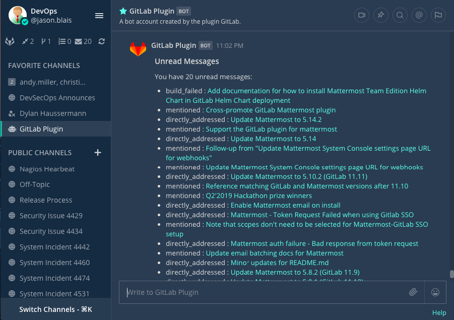

Connect GitLab to Mattermost
================================

.. include:: ../_static/badges/all-commercial.rst
  :start-after: :nosearch:

Minimize distractions and reduce context switching between your GitLab code repositories and your communication platform by integrating GitLab with Mattermost. You control which events trigger notifications beyond default events, including merges, issue comments, merge request comments, pipelines, pull reviews, and many more. Help your teams stay focused and productive with daily task summaries, real-time updates and notifications on new and closed merge requests, new and closed issues, and tag creation events, directly from Mattermost channel subscriptions.

Mattermost supports both Software-as-a-Service (SaaS) and on-premises versions of GitLab.

Deploy
------

A Mattermost system admin must perform the following steps to deploy the GitLab integration.

Install the integration
~~~~~~~~~~~~~~~~~~~~~~~

1. In Mattermost, from the Product menu |product-list|, select **App Marketplace**.
2. Search for or scroll to GitLab, and select **Install**.

Set up the integration
~~~~~~~~~~~~~~~~~~~~~~

You can configure the GitLab integration using either the built-in setup wizard (recommended) or by following the manual configuration steps.

.. tab:: Setup wizard (recommended)

  The recommended way to configure the GitLab integration is using the built-in setup wizard. The wizard guides you through each step of the configuration process, including creating the OAuth app in GitLab.

  1. In any Mattermost channel, run the ``/gitlab setup`` slash command.
  2. Follow the interactive prompts to complete the setup.

  The wizard walks you through:

  - Creating and configuring an OAuth app in GitLab
  - Configuring the plugin settings in Mattermost
  - Announcing the integration to your team

  You can also run individual setup steps at any time using the following subcommands:

  - ``/gitlab setup oauth``: Configure the OAuth2 application in GitLab.
  - ``/gitlab setup announce``: Announce the integration availability to designated channels.

.. tab:: Manual configuration

  If you prefer to configure the integration manually instead of using the setup wizard, follow the steps below.

  **Register an OAuth app in GitLab**

  1. Go to ``https://gitlab.com/-/profile/applications`` or ``https://gitlab.YOURDOMAIN.com/-/profile/applications``, replacing ``YOURDOMAIN.COM`` with your GitLab URL, to register an OAuth app with GitLab.
  2. Set the following values:

    - **Name**: ``Mattermost GitLab Plugin - <YOUR COMPANY NAME>``
    - **Redirect URI**: ``https://YOUR-MATTERMOST-URL.COM/plugins/com.github.manland.mattermost-plugin-gitlab/oauth/complete``, replacing ``YOUR-MATTERMOST-URL.COM`` with your Mattermost URL. This value must match the Mattermost server URL you use to log in.

  3. Select ``api`` and ``read_user`` in **Scopes**.
  4. Save your changes. Copy the **Application ID** and **Secret** fields in the resulting screen.

  **Configure the integration in Mattermost**

  1. In Mattermost, go to **System Console > Plugins > GitLab** and configure the following settings, then select **Save**:

    - Enter the **GitLab URL**, **GitLab OAuth Client ID**, and **GitLab OAuth Client Secret** you obtained when registering the OAuth app in GitLab.
    - Generate a **Webhook Secret** and **At Rest Encryption Key** by selecting **Generate**.
    - (Optional) **GitLab Group**: Lock the integration to a single GitLab group.
    - (Optional) **Enable Private Repositories**: Enable the ability to work with private repositories. Affected users are notified once private repositories are enabled, and must reconnect their GitLab accounts to gain access to private repositories.
    - (Optional) **Enable Child Pipeline Notifications**: When enabled, allows notifications for child pipeline events in addition to parent pipeline events. When disabled, only parent pipeline notifications are sent. This setting helps reduce notification noise in environments with complex CI/CD pipeline structures that use child pipelines extensively.
    - (Optional) **Enable Code Previews**: Control automatic expansion of GitLab file permalinks with code previews. Options include:

      - **Enable for public projects** (Default): Shows previews only for public GitLab repositories.
      - **Enable for public and private projects**: Shows previews for both public and private repositories.

        .. warning::
           This setting has the potential to leak confidential code into public channels in cases where users with access to private GitLab repositories post permalinks in public Mattermost channels. The plugin automatically generates previews using the poster's GitLab permissions, allowing other channel members without access to view the confidential code.

      - **Disable**: Completely disables code preview functionality.

      **Supported Permalink Types:**

      - Single line permalinks: Shows target line plus 3 lines of context
      - File permalinks: Shows file information (no code preview)
      - Line range permalinks: Shows file information (no code preview)

      **Preview Limits:**

      - Maximum 10 lines displayed per preview (single line permalinks may show fewer preview lines due to context limits)

Upgrade
-------

We recommend updating this integration as new versions are released. Generally, updates are seamless and don't interrupt the user experience in Mattermost. Visit the `Releases page <https://github.com/mattermost/mattermost-plugin-gitlab/releases>`__ for the latest release, available releases, and compatibility considerations.

Enable
------

Once you setup the integration, notify your teams that they can `connect their GitLab accounts to Mattermost <#connect-a-gitlab-account-to-mattermost>`__.

Use
-----

Users who want to use GitLab interconnectivity must connect their GitLab account to Mattermost.

Once connected, you'll receive direct messages from the GitLab bot in Mattermost when someone mentions you, requests a review, comments on, or modifies one of your merge requests/issues, or assigns you to an issue on GitLab.

Connect a GitLab account to Mattermost
~~~~~~~~~~~~~~~~~~~~~~~~~~~~~~~~~~~~~~~~

Run the ``/gitlab connect`` slash command in any Mattermost channel to link your Mattermost account with your GitLab account.

Disconnect a GitLab account by running the ``/gitlab disconnect`` slash command. Run the ``/gitlab me`` slash command to review which account is connected to GitLab.

Once connected, run the ``/gitlab help`` slash command to see what you can do.

Get started
~~~~~~~~~~~

Run the  ``/gitlab todo`` slash command to get a list of to-do's, assigned issues, assigned merge requests and merge requests awaiting your review. Alternatively, use the options located in the left sidebar.

Run the ``/gitlab webhook`` slash command to have GitLab send events to Mattermost. For example: ``/gitlab webhook add group[/project]``

Channel subscriptions
~~~~~~~~~~~~~~~~~~~~~

Run the ``/gitlab subscriptions list`` to review all of your subscriptions.

Run the ``/gitlab subscriptions add group[/project] [features]`` slash command to subscribe a Mattermost channel and receive posts for new merge requests, issues, or other features, from a GitLab project. To unsubscribe and stop receiving posts, run the ``/gitlab subscriptions delete group[/project]`` slash command.

The following features are supported for channel subscriptions:

- ``merges`` - Get notified when merge requests are merged
- ``issues`` - Get notified when issues are created
- ``pushes`` - Get notified when commits are pushed to a branch
- ``issue_comments`` - Get notified when comments are made on issues
- ``merge_request_comments`` - Get notified when comments are made on merge requests
- ``tag`` - Get notified when tags are created
- ``pipeline`` - Get notified about pipeline events (includes child pipeline events if enabled in plugin configuration)
- ``wiki`` - Get notified about wiki page events
- ``releases`` - Get notified when releases are created
- ``deployments`` - Get notified about deployment events

For example, to subscribe to release and deployment events: ``/gitlab subscriptions add group[/project] releases,deployments``

For each project you want to receive notifications for or subscribe to, create a webhook in a channel where you want to watch events sent from GitLab by running the ``/gitlab webhook`` slash command. For example: ``/gitlab webhook add group[/project]``

.. note::

  For GitLab versions prior to 1.2:

  1. In GitLab, go to the project you want to subscribe to, and select **Settings > Integrations** in the sidebar.
  2. Set the following values:

    - **URL**: ``https://YOUR-MATTERMOST-URL.COM/plugins/com.github.manland.mattermost-plugin-gitlab/webhook``, replacing ``https://YOUR-MATTERMOST-URL.COM`` with your Mattermost URL. Ensure that you add ``/plugins/com.github.manland.mattermost-plugin-gitlab/webhook`` to the URL, or the webhook won't work.
    - **Secret Token**: Copy the webhook secret you generated earlier.
    - Select all the events in **Triggers**.
    - Add the webhook.

Create issues and manage comments
~~~~~~~~~~~~~~~~~~~~~~~~~~~~~~~~~

You can create GitLab issues and manage issue comments directly from Mattermost using slash commands and interactive modals.

Create a GitLab issue
^^^^^^^^^^^^^^^^^^^^^^

Run the ``/gitlab issue create`` slash command to open an interactive modal where you can create a new GitLab issue. The modal allows you to perform the following actions:

- Set the issue title and description
- Assign labels
- Set the assignee
- Choose the milestone
- Select the target project

Attach comments to existing issues
^^^^^^^^^^^^^^^^^^^^^^^^^^^^^^^^^^^

Run the ``/gitlab issue comment [issue-number]`` slash command to attach a comment to an existing GitLab issue. This opens an interactive modal where you can compose and submit your comment directly from Mattermost.

Update settings
~~~~~~~~~~~~~~~

Run the ``/gitlab settings [setting] [value]`` slash command to update your preferences for the integration:

- Turn personal notifications on or off.
- Turn reminders on or off when you connect initially each day.

Get help
--------

Mattermost customers can open a `Mattermost support case <https://support.mattermost.com/hc/en-us/requests/new>`_. To report a bug, please open a GitHub issue against the `Mattermost GitLab plugin repository <https://github.com/mattermost/mattermost-plugin-gitlab>`_.

For questions, feedback, and assistance, join our public `Integrations and Apps channel <https://community.mattermost.com/core/channels/integrations>`_ on the `Mattermost Community Server <https://community.mattermost.com/>`_ for assistance.

Mattermost Team Edition and Free customers can visit the Mattermost `peer-to-peer troubleshooting forum <https://forum.mattermost.com/c/trouble-shoot/16>`_ to access the global Mattermost Community for assistance.

.. tip::

  Watch `this on-demand webinar on release management with Mattermost and GitLab <https://mattermost.com/webinar/release-management-with-gitlab/>`_ to learn how to streamline and standardize your release processes, while reducing the amount of effort required to ship your latest releases.
