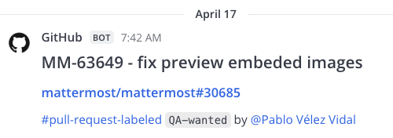
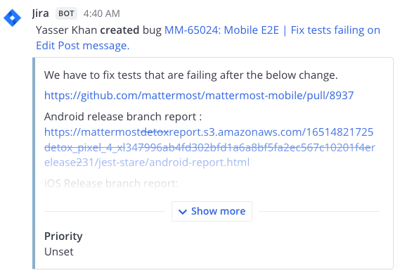
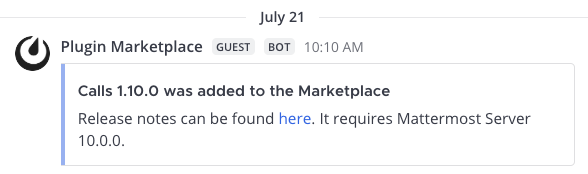
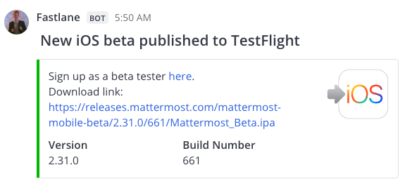
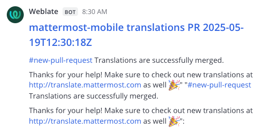
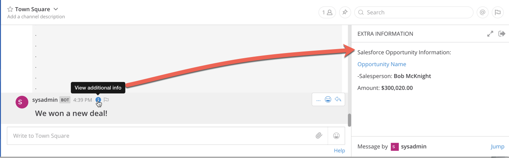

Incoming Webhooks
==================

.. include:: ../_static/badges/all-commercial.rst
  :start-after: :nosearch:

**Technical complexity:** :ref:`No-code <no-code>`

Send or receive real-time data from external tools. Webhooks require minimal coding and are easy to set up with virtually any tool or platform because they use lightweight HTTP POST requests with JSON payloads.

Using incoming webhooks in Mattermost requires only basic setup. You generate a webhook URL using the Mattermost interface, then point another service to send data to that address. No coding is required if your external service triggering the events is able to send data via webhooks or HTTP POST requests, which most modern applications and platforms support. Setting this up usually involves pasting the Mattermost webhook URL into the service’s settings and selecting what type of events you want it to send. 

Example Use Cases
-----------------

Here are some example use cases for incoming webhooks in Mattermost:

**Monitoring alerts**

Send real-time alerts from monitoring systems (such as Prometheus or Datadog) into a dedicated Mattermost channel so your team is immediately notified about system issues or downtime.

**Build and deployment notifications**

Post automated updates from CI/CD pipelines (such as Jenkins or GitLab CI) to a channel, keeping developers informed of build status, test results, and deployment progress.

**Customer support updates**

Forward new support ticket notifications from systems like Zendesk or ServiceNow into a support channel, ensuring the team can respond quickly to incoming requests.

Create
------

1.  In Mattermost, go to **Product Menu > Integrations**. If you don't have the **Integrations** option, incoming webhooks may not be enabled on your Mattermost server or may be disabled for non-admins. A System Admin can enable them from **System Console > Integrations > Integration Management**.

  .. image:: ../images/product-menu-integrations.png
    :alt: Mattermost menu options showing the ability to work with integrations.

2. From the Integrations page, select **Incoming Webhooks**.

  .. image:: ../images/manage-webhooks.png
    :alt: Dialog box showing the option to add an incoming webhook.

3. Select **Add Incoming Webhook**.

  .. image:: ../images/select-add-incoming-webhook.png
    :alt: Dialog box showing the option to add an incoming webhook.

4. Enter a name and description for the webhook, and then select the channel. You can optionally limit bot posts to a specific channel by selecting **Lock to this channel**, or you can allow the webhook to post to any public channel or private channel the incoming webhook creator is a member of. Note that administrators can enforce channel locking for all incoming webhooks through **System Console > Integrations > Integration Management**. Select **Save**.

  .. image:: ../images/create-incoming-webhook-details.png
    :alt: Dialog box showing the incoming webhook details.

5. Select **Done** to confirm. Mattermost generates a unique webhook URL, which will look something like this:
``https://your-mattermost-server.com/hooks/xxx-generatedkey-xxx``. Treat this URL as a secret. Anyone who has it will be able to post messages to your Mattermost instance.

  .. image:: ../images/incoming-webhook-created.png
    :alt: Dialog box showing the incoming webhook URL.

Use
---

To post a message, your application needs to send an HTTP POST request to the webhook URL with a JSON payload in the request body.

.. code-block:: bash

    curl -i -X POST -H 'Content-Type: application/json' -d '{"text": "Hello, this is some text\nThis is more text. :tada:"}' https://your-mattermost-server.com/hooks/xxx-generatedkey-xxx

A successful request will receive an HTTP 200 response with `ok` in the response body.

For compatibility with Slack incoming webhooks, if no ``Content-Type`` header is set, the request body must be prefixed with ``payload=``.

Post Examples
~~~~~~~~~~~~~

Here are some examples of simple messages posted using incoming webhooks:

Parameters
----------

The JSON payload can contain the following parameters:

.. list-table::
   :widths: 20 15 65
   :header-rows: 1

   * - Parameter
     - Required
     - Description
   * - ``text``
     - Yes (if ``attachments`` is not set)
     - :doc:`Markdown-formatted </end-user-guide/collaborate/format-messages>` message. Use ``@<username>``, ``@channel``, and ``@here`` for notifications.
   * - ``channel``
     - No
     - Overrides the default channel. Use the channel's name (e.g., ``town-square``), not the display name. Use ``@<username>`` to send a Direct Message. The webhook can post to any public channel, and any private channel the creator is a member of.
   * - ``username``
     - No
     - Overrides the default username. The :ref:`Enable integrations to override usernames <administration-guide/configure/integrations-configuration-settings:enable integrations to override usernames>` setting must be enabled.
   * - ``icon_url``
     - No
     - Overrides the default profile picture URL. The :ref:`Enable integrations to override profile picture icons <administration-guide/configure/integrations-configuration-settings:enable integrations to override profile picture icons>` setting must be enabled.
   * - ``icon_emoji``
     - No
     - Overrides the ``icon_url`` with an emoji. Use the emoji name (e.g., ``:tada:``). The :ref:`Enable integrations to override profile picture icons <administration-guide/configure/integrations-configuration-settings:enable integrations to override profile picture icons>` setting must be enabled.
   * - ``attachments``
     - Yes (if ``text`` is not set)
     - An array of `message attachment <https://developers.mattermost.com/integrate/reference/message-attachments/>`_ objects for richer formatting.
   * - ``type``
     - No
     - Sets the post type, mainly for use by plugins. If set, must begin with ``custom_``.
   * - ``props``
     - No
     - A JSON object for storing metadata. The ``card`` property can be used to display extra Markdown-formatted text in the post's info panel (RHS). This is available in Mattermost v5.14 and later, and is not yet supported on mobile.
   * - ``priority``
     - No
     - Sets the priority of the message. See `message priorities <https://developers.mattermost.com/integrate/reference/message-priority/>`_.

Example with Parameters
~~~~~~~~~~~~~~~~~~~~~~~

.. code-block:: json

    {
      "channel": "town-square",
      "username": "test-automation",
      "icon_url": "https://mattermost.com/wp-content/uploads/2022/02/icon.png",
      "text": "#### Test results for July 27th, 2017\n@channel please review failed tests.\n\n| Component  | Tests Run   | Tests Failed                                   |\n|:-----------|:-----------:|:-----------------------------------------------|\n| Server     | 948         | :white_check_mark: 0                           |\n| Web Client | 123         | :warning: 2 [(see details)](https://linktologs) |\n| iOS Client | 78          | :warning: 3 [(see details)](https://linktologs) |"
    }

This renders as:

.. image:: ../images/incoming_webhooks_full_example.png
   :alt: Example of a webhook post with a custom username, icon, and formatted text.
   :width: 400

Example with Card Prop
~~~~~~~~~~~~~~~~~~~~~~

Using the ``card`` property inside ``props`` will display an info icon on the post. Clicking the icon opens the right-hand sidebar to display the content.

.. code-block:: json

    {
      "channel": "town-square",
      "username": "Winning-bot",
      "text": "#### We won a new deal!",
      "props": {
        "card": "Salesforce Opportunity Information:\n\n [Opportunity Name](https://salesforce.com/OPPORTUNITY_ID)\n\n-Salesperson: **Bob McKnight** \n\n Amount: **$300,020.00**"
      }
    }

Slack Compatibility
-------------------

Mattermost provides compatibility with Slack's webhook format to make migration easier.

Translating Slack's Data Format
~~~~~~~~~~~~~~~~~~~~~~~~~~~~~~~

Mattermost automatically translates JSON payloads from Slack format:

- ``<https://mattermost.com/>`` is rendered as a link.
- ``<https://mattermost.com/|Click here>`` is rendered as linked text.
- ``<userid>`` triggers a user mention.
- ``<!channel>``, ``<!here>``, or ``<!all>`` trigger channel-wide mentions.

You can also send a direct message by overriding the channel name with ``@username``, e.g., ``"channel": "@jim"``.

Using Mattermost Webhooks in GitLab
~~~~~~~~~~~~~~~~~~~~~~~~~~~~~~~~~~~

You can use GitLab's built-in Slack integration to send notifications to Mattermost:

1. In GitLab, go to **Settings > Services** and select **Slack**.
2. Paste the Mattermost incoming webhook URL.
3. Optionally, set a **Username**. Leave the **Channel** field blank.
4. Select **Save** and test the integration.

Known Slack Compatibility Issues
~~~~~~~~~~~~~~~~~~~~~~~~~~~~~~~~

- Referencing channels using ``<#CHANNEL_ID>`` is not supported.
- ``<!everyone>`` and ``<!group>`` are not supported.
- ``*bold*`` formatting is not supported; use ``**bold**`` instead.
- Webhooks cannot send a direct message to the user who created the webhook.

Troubleshooting
---------------

To debug incoming webhooks, a System Admin can enable **Webhook Debugging** and set the **Console Log Level** to **DEBUG** in **System Console > Logging**.

Common error messages include:

- **Couldn't find the channel**: The channel specified in the ``channel`` parameter does not exist.
- **Couldn't find the user**: The user specified does not exist.
- **Unable to parse incoming data**: The JSON payload is malformed.

If your integration posts the JSON payload as plain text instead of a rendered message, ensure the request includes the ``Content-Type: application/json`` header.

Do More with Incoming Webhooks
-------------------------------

Transform basic message posts into rich, interactive notifications by including buttons, menus, and other interactive elements in your webhook messages, making them more engaging and useful for your team.

- `Message Attachments <https://developers.mattermost.com/integrate/reference/message-attachments/>`_: Present rich, structured summaries such as status, priority, fields, links, or images for faster triage and comprehension. (Slack‑compatible schema.)
- `Interactive Messages <https://developers.mattermost.com/integrate/plugins/interactive-messages>`_: Make notifications actionable with buttons or menus such as Acknowledge, Assign, or Escalate that enable an immediate user response without switching tools or context.
- `Interactive Dialogs <https://developers.mattermost.com/integrate/plugins/interactive-dialogs/>`_: Guide users to successful outcomes when interactions need structured input or confirmation (for example, “Acknowledge with note” or “Assign to user”). Improve data quality with required fields, minimum/maximum input lengths, server‑driven user/channel pickers, validated defaults, inline field errors, placeholders, and help text that help users enter the right data the first time.
- `Message Priority <https://developers.mattermost.com/integrate/reference/message-priority/>`_: Set ``priority`` to elevate critical posts and optionally request acknowledgements or persistent notifications.

.. tip::

    - Need a dedicated identity, permissions scoping, or need to post outside of webhook/command flows? Use a `bot account <https://developers.mattermost.com/integrate/reference/bot-accounts/>`_ if you need a more permanent solution than using overrides for simple branding.
    - If your system later needs to call Mattermost APIs (e.g., post follow-ups, open dialogs), authenticate with a bot user `personal access token <https://developers.mattermost.com/integrate/reference/personal-access-token/>`_. We recommend avoiding human/System Admin personal access tokens for automations and rotating and storing tokens securely.