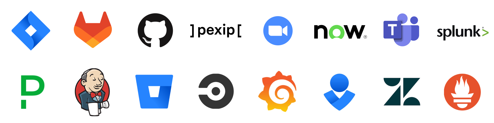

Integrations Guide
=====================

.. toctree::
   :maxdepth: 1
   :hidden:
   :titlesonly:

   plugins
   webhook-integrations
   slash-commands
   restful-api
   no-code-automation
   faq

Mattermost provides a variety of methods to integrate with your favorite tools, automate critical workflows, and extend the capabilities of the platform. This guide provides a high-level overview of integration options and the level of technical skills required :ref:`(no-code, low-code, or pro-code) <integrations-guide/faq:what is meant by no-code, low-code, and pro-code?>`, and links to detailed documentation for each.

Choose Your Path
-----------------

.. list-table::
   :header-rows: 1
   :widths: 15 40 45

   * - Skill Level
     - Best Options
     - Examples

   * - :ref:`No-code <no-code>`
     - - `Pre-built plugins <#pre-built-plugins>`__
       - `Built-in slash commands <#built-in-slash-commands>`__
       - `No-code automation <#no-code-automation-platforms>`__
       - `Playbooks <#mattermost-playbooks>`__
     - - Connect Jira, GitHub, Zoom
       - Command line interactions
       - Automate with n8n, Zapier
       - Run incident playbooks

   * - :ref:`Low-code <low-code>`
     - - `Webhooks <#webhooks>`__
       - `Custom slash commands <#custom-slash-commands>`__
     - - Send monitoring alerts
       - Trigger actions with keywords

   * - :ref:`Pro-code <pro-code>`
     - - `REST API <#restful-api>`__
       - `Custom plugins <#custom-built-plugins>`__
     - - Build custom apps
       - Extend Mattermost core

Integration Options
--------------------

Plugins
~~~~~~~~

Learn more about :doc:`Mattermost plugins </integrations-guide/plugins>`.

Pre-Built Plugins
^^^^^^^^^^^^^^^^^

**Technical complexity:** :ref:`No-code <no-code>`

Mattermost provides a set of :doc:`pre-built plugins </integrations-guide/popular-integrations>` that require no coding to install, configure, and use. These plugins are installed and managed entirely through the System Console, where you can enable, configure, and customize settings without any development work.

Custom-Built Plugins
^^^^^^^^^^^^^^^^^^^^

**Technical complexity:** :ref:`Pro-code <pro-code>`

:ref:`Building custom plugins <integrations-guide/plugins:custom-built plugins>` are the most comprehensive way to add new features and customization to self-hosted Mattermost deployments. Custom plugins are ideal for customers wanting to change the behavior of the Mattermost server, desktop, and web apps without forking the core codebase to suit their organization’s needs.

Building a custom plugin is a **software development** task, using ``Go`` for the server-side functionality and optionally ``TypeScript/React`` for UI components. 

Webhooks
~~~~~~~~

Learn more about :doc:`Mattermost webhooks </integrations-guide/webhook-integrations>`.

Incoming Webhooks
^^^^^^^^^^^^^^^^^^

**Technical complexity:** :ref:`No-code <no-code>`

:doc:`Incoming webhooks </integrations-guide/incoming-webhooks>` allow external applications to post messages into Mattermost channels and direct messages. They are a simple way to receive notifications and data from other services in real-time and require only basic setup.

Additionally, Mattermost webhook payloads are :ref:`fully compatible <integrations-guide/incoming-webhooks:slack compatibility>` with Slack’s webhook format to make migration easier.

Outgoing Webhooks
^^^^^^^^^^^^^^^^^^

**Technical complexity:** :ref:`Low-code <low-code>`

:doc:`Outgoing webhooks </integrations-guide/outgoing-webhooks>` allow Mattermost to send messages and trigger actions in external applications when specific keywords are typed in channels. They are a straightforward way to connect Mattermost conversations to other services and automate responses. Outgoing webhooks require no coding to configure in Mattermost. Some light coding is required to parse the request from the external service and format a JSON response payload.

Slash Commands
~~~~~~~~~~~~~~

Learn more about :doc:`Mattermost slash commands </integrations-guide/slash-commands>`.

Built-In Slash Commands
^^^^^^^^^^^^^^^^^^^^^^^^

**Technical complexity:** :ref:`No-code <no-code>`

Out-of-the-box :doc:`built-in slash commands </integrations-guide/built-in-slash-commands>` enable command line interaction with users, channels, and conversations.

Custom Slash Commands
^^^^^^^^^^^^^^^^^^^^^^

**Technical complexity:** :ref:`Low-code <low-code>`

You can create :ref:`custom slash commands <integrations-guide/slash-commands:custom slash commands>` that run preconfigured commands that can return a response, such as plain text, rich message content, interactive buttons or forms, directly into a channel.

Mattermost's slash command format is Slack compatible, so you can easily migrate your commands from Slack.

RESTful API
~~~~~~~~~~~

**Technical complexity:** :ref:`Pro-code <pro-code>`

With :doc:`Mattermost's RESTful API </integrations-guide/restful-api>`, you have full developer control for automation, bots, and integrations.

Build and Automate Workflows
-----------------------------

**Technical complexity:** :ref:`No-code <no-code>`

In addition to direct tool integrations, Mattermost can be part of larger automated workflows across your integrated services. Automate multi-step processes across Mattermost and other systems, often with no coding required.

No-code Automation Platforms
~~~~~~~~~~~~~~~~~~~~~~~~~~~~~

Platforms like n8n, Zapier, and Make provide powerful visual editors that support thousands of connected tools, with triggers and actions that integrate Mattermost to external services, enabling teams to build complex workflows without writing code. Admins migrating from tools like Slack Workflow Builder can recreate familiar automations in Mattermost using these platforms.

Learn more about additional :doc:`no-code automation options </integrations-guide/no-code-automation>` available in Mattermost.

Mattermost Playbooks
~~~~~~~~~~~~~~~~~~~~

:doc:`Mattermost Playbooks </end-user-guide/workflow-automation>` lets you define and execute repeatable processes without any coding. Playbooks are often used for incident response, onboarding checklists, or any workflow that involves multiple steps, owners, and notifications. Playbooks have integration points you can use to trigger actions, and they can work in conjunction with plugins, making them a powerful no-code automation tool for orchestrating both human and system actions.

Learn more about using :doc:`Playbooks </end-user-guide/workflow-automation>`.

Frequently Asked Questions
--------------------------

Have questions about coding levels, Slack compatibility, or setup options? Visit the :doc:`Integrations FAQ </integrations-guide/faq>`.