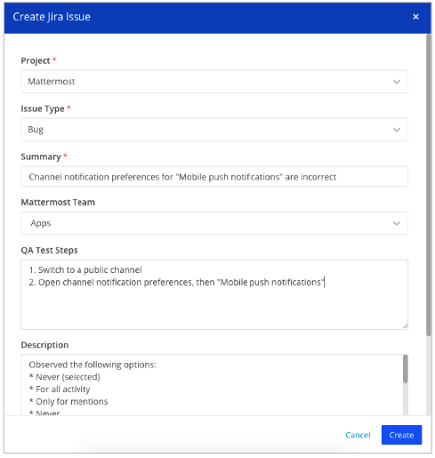

Connect Jira to Mattermost
============================

.. include:: ../_static/badges/all-commercial.rst
  :start-after: :nosearch:

Minimize distractions, reduce context switching between your project management tool and your communication platform by integrating Jira with Mattermost. You control which events trigger notifications including issue creation, field-specific issue updates, reopened, resolved, or deleted issues, as well as new, updated, or deleted issue comments. Create Jira issues directly from Mattermost conversations, attach messages to Jira issues, transition and assign Jira issues, and follow up on action items in real-time, directly from Mattermost channel subscriptions.

Mattermost supports versions 7 and 8 of Jira Core and Jira Software products, for Server, Data Center, and Cloud platforms. From v3.0 of this integration, a commercial Mattermost license is required for multiple Jira instances with Mattermost configured using Administrator Slash Commands.

Jira Service Management (formerly known as Jira Service Desk) isn't supported.

Deploy
------

Setup starts in Mattermost, moves to Jira, and finishes in Mattermost.

.. note::

  - Jira Core and Jira Software products, for Server, Data Center, and Cloud platforms are supported, and tested with versions 7 and 8.
  - Jira Service Management (formerly known as Jira Service Desk) isn't supported.
  - From v3.0 of this integration, support for multiple Jira instances is supported with Mattermost Enterprise and Professional plans, configured using Administrator Slash Commands.

Mattermost configuration
~~~~~~~~~~~~~~~~~~~~~~~~~

A Mattermost system admin must perform the following steps in Mattermost.

1. Install the Jira integration from the in-product App Marketplace:

  a. In Mattermost, from the Product menu |product-list|, select **App Marketplace**.
  b. Search for or scroll to Jira, and select **Install**.
  c. Once installed, select **Configure**. You're taken to the System Console.
  d. On the Jira configuration page, enable and configure Jira interoperability as follows, and then select **Save**:

    - Generate a **Webhook Secret** by selecting **Regenerate**.

    .. note::
  
      We recommend making a copy of your webhook secret, as it will only be visible to you once.

    - **Allow users to attach and create Jira issues in Mattermost**: Enable or disable the user's ability to attach and create Jira issues in Mattermost. When enabled, you must also `install this Jira integration in your Jira instance <#install-integration-as-Jira-app>`__.
    - **Mattermost Roles Allowed to Edit Jira Subscriptions**: Specify the Mattermost roles that can edit Jira subscriptions to control which Mattermost users can subscribe channels to Jira tickets.
    - **Jira Groups Allowed to Edit Jira Subscriptions**: (Applies to older Jira v2.4 or earlier deployments only) Specify the Jira groups allowed to edit Jira subscriptions as a comma-separated list of user group names. Leave blank to allow any Jira user the ability to create subscriptions. The user editing a subscription only needs to be a member of one of the listed groups.
    - **Default Subscription Security Level to Empty**: Enable or disable default subscription security level. When enabled, subscriptions only include issues that have a security level assigned when a security level has been included as a filter.
    - **Additional Help Text to be shown with Jira Help**: Define any additional help text to display when users run the ``/jira help`` slash command.
    - **Hide issue descriptions and comments**: Show or hide issue descriptions and comments from subscription and webhook messages.
    - **Enable slash command**: Enable or disable slash command autocompletion to guide users through available ``/jira`` slash commands.
    - **Display Subscription name in notifications**: Show or hide subscription name in notification messages posted to a channel.
    - **Admin API Token**: Set an `API token  <https://support.atlassian.com/atlassian-account/docs/manage-api-tokens-for-your-atlassian-account/>`_ to get notified for comments and issue creation events, even when the user triggering the event isn't connected to Jira, and set up Autolink. API tokens must be created using an admin Jira account; otherwise, notifications won't be delivered for projects the user can't access, and Autolink won't work.
    - **Admin Email**: Set Admin email to get notified for comment and issue created events even if the user triggering the event is not connected to Jira and setup Autolink for Jira plugin.

2. Run ``/jira setup`` to start the wizard to configure the plugin. If you wish to set up the plugin manually, then please follow the steps below.     

Install Jira integration in your Jira instance
~~~~~~~~~~~~~~~~~~~~~~~~~~~~~~~~~~~~~~~~~~~~~~

To enable your users to create and manage Jira issues across Mattermost channels, you must install this Jira integration, as an application, in your Jira instance. 

- For Jira Server or Data Center instances, run the ``/jira instance install server <YOUR-JIRA-URL>`` slash command in a Mattermost channel as a Mattermost system admin, then follow the steps posted to the channel, replacing ``YOUR-JIRA-URL`` with your Jira URL. This value must match the Jira server URL you use to log in. Run the ``/jira instance uninstall server <YOUR-JIRA-URL>`` slash command to uninstall your Jira Server or Data Center instance from your Mattermost instance.
- For Jira Cloud, run the ``/jira instance install cloud-oauth <YOUR-JIRA-URL>`` slash command in a Mattermost channel as a Mattermost system admin, then follow the wizard to complete the setup. Run the ``/jira instance uninstall cloud-oauth <YOUR-JIRA-URL>`` slash command to uninstall your Jira Cloud instance from your Mattermost.

Configure webhooks in Jira
~~~~~~~~~~~~~~~~~~~~~~~~~~

A Mattermost system admin and a Jira system admin must perform the following steps to configure a single webhook for all possible event triggers, called a firehose, that you would like to be pushed into Mattermost. Mattermost receives a stream of events from the Jira server via a configured webhook, and routes the events to specific channels. A `channel subscription <#manage-channel-subscriptions-in-mattermost>`__ processes the firehose of data, and routes the events to channels based on your subscriptions. 

1. In Mattermost, run the  ``/jira webhook <YOUR-JIRA-URL>`` slash command in a Mattermost channel to get the appropriate webhook URL, replacing ``YOUR-JIRA-URL`` with your Jira URL.
2. In Jira, go to **Jira Settings > System > WebHooks**. (For older versions of Jira, select the gear icon in bottom left corner, then go to **Advanced > WebHooks**.)
3. Select **Create a WebHook**.
4. Enter a **Name** for the webhook and add the Jira webhook URL you retrieved above in Mattermost as the URL.
5. Specify the issue events that will be sent to Mattermost channels by selecting all of the following: 

  - Comments: created, updated, and deleted.
  - Issues: created, updated, and deleted.

6. Select **Save**.

Manage channel subscriptions in Mattermost
~~~~~~~~~~~~~~~~~~~~~~~~~~~~~~~~~~~~~~~~~~~

Mattermost channel admins can set up notifications they want to receive per channel as subscription rules based on the Jira project, event type, issue type. You can also filter out issues based on its value.

To modify subscription, users must meet the criteria of both the Mattermost user settings and Jira group settings. If you can subscribe channels to Jira events, you can also set up rules; however, you'll only see the projects and issue types you have access to within Jira. If you can't see a project in Jira, it won't be avaialble as an option.

If your organization's infrastructure is set up such that your Mattermost instance can't connect to your Jira instance, channel subscriptions won't be avaialable. Instead, use `legacy Webhooks <#legacy-jira-webhooks>`__ instead to allow a Jira webhook to post to a specific channel.

In any channel, run the ``/jira subscribe`` slash command to configure the following options:

- Configure what Jira notifications are sent to the current channel.
- Specify filters including: affects versions, epic link, fix versions, labels, and priority.
- Specify custom fields including: checkboxes, labels, radio buttons, and select list (single or multiple choice). 
- Review the approximate JQL output generated. This is not guaranteed to be valid JQL and is only shown as a reference to what the query may look like if converted to JQL.

Run the ``/jira subscribe list`` slash command to display all subscription rules set up across all channels and teams on your Mattermost instance.

Legacy Jira webhooks
^^^^^^^^^^^^^^^^^^^^

If your Mattermost instance can't connect to your Jira instance, you won't be able to subscribe Mattermost channels. You'll need to use legacy webhooks instead.

1. To generate the webhook URL for a specific channel, run the  ``/jira webhook`` slash command, and use the URL output in the **Legacy Webhooks** section of the output.

2. As a Jira system admin, go to **Jira Settings > System > WebHooks**. (For older versions of Jira, select the gear icon in bottom left corner, then go to **Advanced > WebHooks**.)

3. Select **Create a WebHook** to create a new webhook. Enter a **Name** for the webhook, and add the Jira webhook URL ``https://MATTERMOST-SITE-URL/plugins/jira/webhook?secret=MATTERMOST-WEBHOOK-SECRET&team=MATTERMOST-TEAM-URL&channel=MATTERMOST-CHANNEL-URL`` (for Jira 2.1) as the URL.

  - Replace ``MATTERMOST-TEAM-URL`` and ``MATTERMOST-CHANNEL-URL`` with the Mattermost team URL and channel URL you want the Jira events to post to, using lowercase characters.
  - Replace ``MATTERMOST-SITE-URL`` with the site URL of your Mattermost instance.
  - Replace ``MATTERMOST-WEBHOOK-SECRET`` with the secret generated in Mattermost by going to **System Console > Plugins > Jira**.

For example, if the team URL is ``contributors``, channel URL is ``town-square``, site URL is ``https://community.mattermost.com``, and the generated webhook secret is ``MYSECRET``, the final webhook URL would be: ``https://community.mattermost.com/plugins/jira/webhook?secret=MYSECRET&team=contributors&channel=town-square``.

4. (Optional) Set a description and a custom JQL query to determine which tickets trigger events. For information on JQL queries, see the `Atlassian help documentation <https://support.atlassian.com/jira-software-cloud/docs/what-is-advanced-search-in-jira-cloud/>`_.

5. Set which issue events send messages to Mattermost channels, then select **Save**. The following issue events are supported: issues created, issues deleted, and issues updated (including reopened or resolved when the assignee changes).

By default, the legacy webhook integration publishes notifications for issue created, resolve, unresolve, reopen, and assign events. To post more events, use the following extra &-separated parameters:

- ``updated_all=1``: all events
- ``updated_comments=1``: all comment events
- ``updated_description=1``: updated issue description
- ``updated_labels=1``: updated issue labels
- ``updated_priority=1``: updated issue priority
- ``updated_rank=1``: ranked issue higher or lower
- ``updated_sprint=1``: assigned issue to a different sprint
- ``updated_status=1``: transitioned issed to a different status, such as Done or In Progress
- ``updated_summary=1``: renamed issue

Here's an example of a webhook configured to create a post for comment events: ``https://community.mattermost.com/plugins/jira/webhook?secret=MYSECRET&team=contributors&channel=town-square&updated_comments=1``

Any previously configured webhooks set up in Jira that point to specific channels are supported and will continue to work.

Manage notifications
~~~~~~~~~~~~~~~~~~~~

Jira notifications are messages sent to a Mattermost channel when a particular event occurs in Jira. They can managed as `channel subscriptions <#manage-channel-subscriptions>`__ in Mattermost, or managed as `webhooks <#configure-webhooks-in-Jira>`__ in Jira. Notifications and metadata shown in a channel aren't protected by Jira permissions. Anyone in the channel can see what's posted to the channel. However, if users don't have the appropriate permission, they won't be able to see further details of the issue if they try to access it in Jira.

When any webhook event is received from Jira, and it matches a notification rule, it posts a notification to the channel. If there are no subscription matches, the webhook event is discarded.

Enable
------

Notify your teams that they can `connect their Jira accounts to Mattermost <#connect-a-jira-account-to-mattermost>`__.

Do more with Jira interoperabiilty as a Mattermost system admin by using the following slash commands:

- ``/jira instance alias [URL] [ALIAS-NAME]`` - Assign an alias to an instance.
- ``/jira instance unalias [ALIAS-NAME]`` - Remove an alias from an instance.
- ``/jira instance list`` - List all installed Jira instances.
- ``/jira instance v2 <YOUR-JIRA-URL>`` - Set the Jira instance to process legacy "v2" webhooks and subscriptions (which aren't prefixed with the instance ID).
- ``/jira stats`` - Display usage statistics.
- ``/jira webhook [--instance=<YOUR-JIRA-URL>]`` - Display the Mattermost webhook that receive JQL queries.
- ``/jira v2revert`` - Revert to the legacy V2 jira integration data model.

Use
-----

Users who want to use Jira interconnectivity must connect a Jira account to Mattermost. 

Once connected, you'll receive direct messages from the Jira bot in Mattermost for Jira activity.

Connect a Jira account to Mattermost
~~~~~~~~~~~~~~~~~~~~~~~~~~~~~~~~~~~~~

1. In Mattermost, run the ``/jira connect`` slash command in any Mattermost channel to link your Mattermost account with your Jira account. Follow the link into your Jira instance, and select **Allow**. 

If you have multiple Jira instances, run the ``/jira instance connect <YOUR-JIRA-URL>`` slash command instead to connect to a specific Jira instance. 

2. Once connected, run the ``/jira help`` slash command to see what you can do.

3. To disconnect a Jira account from Mattermost, run the ``/jira disconnect`` slash command in any Mattermost channel.

Get started 
~~~~~~~~~~~

Here are some common slash commands you can get started with:

- ``/jira info`` - Display information about the current user and the Jira integration
- ``/jira connect [jiraURL]`` - Connect your Mattermost account to your Jira account
- ``/jira disconnect [jiraURL]`` - Disconnect your Mattermost account from your Jira account
- ``/jira issue assign [issue-key] [assignee]`` - Change the assignee of a Jira issue
- ``/jira issue create [text]`` - Create a new Issue with 'text' inserted into the description field
- ``/jira issue transition [issue-key] [state]`` - Change the state of a Jira issue
- ``/jira issue unassign [issue-key]`` - Unassign the Jira issue
- ``/jira issue view [issue-key]`` - View the details of a specific Jira issue
- ``/jira instance settings`` - View your user settings
- ``/jira instance settings [setting] [value]`` - Update your user settings. ``[setting]`` can be notifications and ``[value]`` can be ``on`` or ``off``

Create a Jira issue
^^^^^^^^^^^^^^^^^^^^

Use the ``/jira issue create`` slash command to create a Jira issue without leaving Mattermost. You can prepopulate the issue's summary by running ``/jira issue create This is my issue's summary``. You're prompted to fill out the issue details.

Transition Jira issues
^^^^^^^^^^^^^^^^^^^^^^^

You can transition issues without leaving Mattermost by using the ``/jira transition <issue-key> <state>`` slash command. States and issue transitions are based on your Jira project workflow configuration. For example, ``/jira transition EXT-20 done`` transitions the issue key EXT-20 to a ``done`` state. Partial matches are supported. For example, running the  ``/jira transition EXT-20 in`` slash command transitions the issue to an ``in progress`` state. However, if your Jira instance includes states of both ``in review`` and ``in progress``, the Jira integration bot will prompt you to clarify which state you want.

Assign Jira issues
^^^^^^^^^^^^^^^^^^

Assign issues to other Jira users without leaving Mattermost using the ``/jira assign`` command. Partial matches on usernames, firstnames, and lastnames are supported. For example, running the slash command ``/jira assign EXT-20 john`` transitions the issue EXT-20 to John.

Upgrade
-------

We recommend updating this integration as new versions are released. Generally, updates are seamless and don't interrupt the user experience in Mattermost. Visit the `Releases page <https://github.com/mattermost/mattermost-plugin-jira/releases>`__ for the latest release, available releases, and compatibiilty considerations.

Frequenly asked questions
--------------------------

How do I disable Jira interoperability?
~~~~~~~~~~~~~~~~~~~~~~~~~~~~~~~~~~~~~~~

You can disable the Jira integration at any time from Mattermost by going to **System Console > Plugins > Jira**. Once disabled, any webhook requests coming from Jira are ignored, and users can't create Jira issues from Mattermost. 

Why isn't the Jira integration posting messages to Mattermost?
~~~~~~~~~~~~~~~~~~~~~~~~~~~~~~~~~~~~~~~~~~~~~~~~~~~~~~~~~~~~~~

Try the following troubleshooting steps:

1. Confirm that your :ref:`Mattermost Site URL <administration-guide/configure/environment-configuration-settings:site url>` is configured, and that the webhook created in Jira is pointing to this URL. To ensure the URL is correct, run the ``/jira webhook`` slash command, then copy the output and paste it into Jira's webhook setup page.

2. If you specified a JQL query in your Jira webhook setup, paste the JQL to Jira issue search and make sure it returns results. If it doesn't, the query may be incorrect. Refer to the `Atlassian documentation <https://support.atlassian.com/jira-software-cloud/docs/what-is-advanced-search-in-jira-cloud/>`__ for help. A JQL query isn't required when setting up the webhook.

If you're using legacy webhooks:

- Confirm the team URL and channel URL you specified in the Jira webhook URL match up with the path shown in your browser when visiting the channel.
- Only events described in the Legacy Webhook documentation are supported.
- Use a curl command to make a POST request to the webhook URL. If curl command completes with a ``200 OK`` response, the integration is configured correctly. For instance, you can run the following command:

.. code-block:: sh
  
  curl -X POST -v "https://<YOUR-MATTERMOST-URL>/plugins/jira/webhook?secret=<YOUR-SECRET>&team=<YOUR-TEAM>&channel=<YOUR-CHANNEL>&user_id=admin&user_key=admin" --data '{"event":"some_jira_event"}'

Replace ``<YOUR-MATTERMOST-URL>``, ``<YOUR-SECRET>``, ``<YOUR-TEAM>``, and ``<YOUR-SECRET>`` with your setup when configuring the Jira integration. The curl command won't post a message in your Mattermost channel.

Can admins restrict who can create or attach Mattermost messages to Jira issues?
~~~~~~~~~~~~~~~~~~~~~~~~~~~~~~~~~~~~~~~~~~~~~~~~~~~~~~~~~~~~~~~~~~~~~~~~~~~~~~~~

Yes, Mattermost system admins can disable this functionality by going to **System Console > Plugins > Jira** to disable the **Allow users to attach and create Jira issues in Mattermost** option.

How does Mattermost know which Jira issues users can access?
~~~~~~~~~~~~~~~~~~~~~~~~~~~~~~~~~~~~~~~~~~~~~~~~~~~~~~~~~~~~

Mattermost only displays static messages in the channel, and doesn't enforce Jira permissions on viewers in a channel.

Any messages in a channel can be seen by all users of that channel. Subscriptions to Jira issues should be made carefully to avoid unwittingly exposing sensitive Jira issues in a public channel for example. Exposure is limited to the information posted to the channel. To transition an issue, or re-assign it the user needs to have the appropriate permissions in Jira.

Why must every user authenticate with Jira?
~~~~~~~~~~~~~~~~~~~~~~~~~~~~~~~~~~~~~~~~~~~

The authentication with Jira lets the JiraBot provide personal notifications for each Mattermost/Jira user whenever they are mentioned on an issue, comment on an issue, or have an issue assigned to them. Additionally, the integration uses their authentication information to perform actions on their behalf. Tasks such as searching, viewing, creating, assigning, and transitioning issues all abide by the permissions granted to the user within Jira.

Users will need to temporarily enable third-party cookies in their browser during the Jira authentication process.

What does the error message ``'/(name)' not found`` mean?
~~~~~~~~~~~~~~~~~~~~~~~~~~~~~~~~~~~~~~~~~~~~~~~~~~~~~~~~~

If you see the error ``'/(name)' not found`` in Mattermost, disable the Jira integration, check the log file looking for messages that refer to plugins and health check fail, such as ``ExecuteCommand``, etc. And consider :ref:`enabling debug logging <administration-guide/manage/logging:how do i enable debug logging?>` to log more verbose error events in the Mattermost system log. Then try re-enabling Jira interoperability and review the log file for clues.

Debug logging can cause log files to expand substantially, and may adversely impact the server performance. Keep an eye on your server logs, or only enable it temporarily or in development environments, and not production enviornments.

Why do I get a webhooks error?
~~~~~~~~~~~~~~~~~~~~~~~~~~~~~~

If you see a ``WebHooks can only use standard http and https ports (80 or 443)`` error, it indicates that you're using a non-standard port. Jira only allows webhooks to connect to the standard ports 80 and 443. You need to set up a proxy between Jira and your Mattermost instance to let Jira communicate over port 443.

How do I handle credential rotation for the Jira webhook?
~~~~~~~~~~~~~~~~~~~~~~~~~~~~~~~~~~~~~~~~~~~~~~~~~~~~~~~~~

Generate a new secret by going to **System Console > Plugins > Jira**. Paste the new webhook URL in your Jira webhook configuration.

Customize
---------

This integration contains both a server and web app portion. Visit the `Mattermost Developer Workflow <https://developers.mattermost.com/extend/plugins/developer-workflow/>`__ and `Mattermost Developer environment setup <https://developers.mattermost.com/extend/plugins/developer-setup/>`_ for information about developing, customizing, and extending Mattermost functionality.

Get help
--------

Customers with a Mattermost subscription can open a `Mattermost support case <https://support.mattermost.com/hc/en-us/requests/new>`_. Community deployments can report a bug by opening a GitHub issue against the `Mattermost Jira plugin repository <https://github.com/mattermost/mattermost-plugin-jira>`_, or visit the Mattermost `peer-to-peer troubleshooting forum <https://forum.mattermost.com/c/trouble-shoot/16>`_ to access the global Mattermost Community for assistance.

For questions, feedback, and assistance, join our pubic `Integrations and Apps channel <https://community.mattermost.com/core/channels/integrations>`_ on the `Mattermost Community Server <https://community.mattermost.com/>`_ for assistance.

.. tip::

  Download `this Jira workflows datasheet <https://mattermost.com/mattermost-jira-datasheet/>`_ to learn more about using Mattermost and Jira, including:

  - Key benefits to integrating Jira and Mattermost
  - Common Jira Workflows on Mattermost
  - How to get started with the Jira plugin for Mattermost
