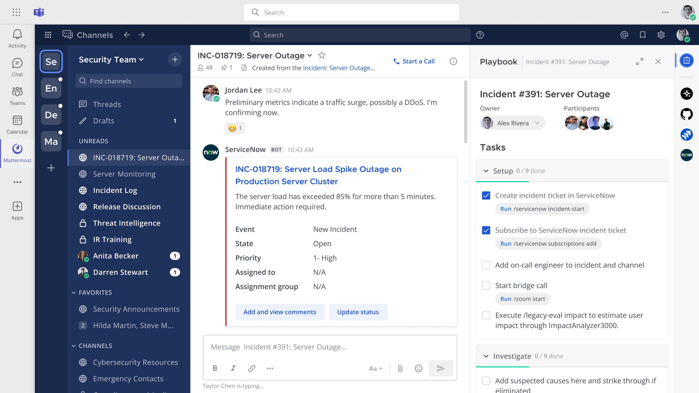
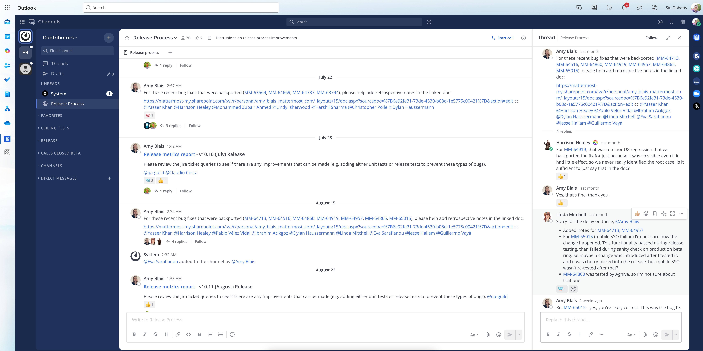

Connect Microsoft 365, Teams, and Outlook with Mattermost
==========================================================

.. include:: ../_static/badges/ent-adv-cloud-selfhosted.rst
  :start-after: :nosearch:

Mattermost Mission Collaboration for Microsoft extends Microsoft for mission-critical coordination, command and control, incident response, and DevSecOps workflows in demanding environments, including air-gapped and classified networks by embedding Mattermost inside Teams. Use data-sovereign tools like secure chat, Playbooks, and Calls directly within M365, Teams, and Outlook.

This app is designed to work with Microsoft 365, Teams, and Outlook and is currently in :ref:`Beta <administration-guide/manage/feature-labels:beta>`. From Mattermost v10.9, this integration supports third-party Single Sign-On (SSO). See the :doc:`user provisioning </administration-guide/manage/admin/user-provisioning>` product documentation for details on setting up SSO.

Deploy
-------

Before starting the setup, review this section to familiarize yourself with the 3 components needed to integrate Mattermost with M365, including `Azure App registration <#register-an-ms-teams-app-in-azure>`__, `Microsoft Teams App installation <#mattermost-plugin-setup>`__, and `Mattermost plugin configuration <#install-mattermost-in-microsoft-teams>`__. Each component plays a crucial role in ensuring seamless communication and collaboration between Mattermost and Microsoft 365 services. Then complete the following integration setup steps in the order listed below.

Register an MS Teams app in Azure
~~~~~~~~~~~~~~~~~~~~~~~~~~~~~~~~~~~

An application must be registered in Microsoft Azure to enable secure authentication and authorization between Mattermost and M365 services. This app registration acts as the bridge for permissions and connectivity. The **Azure App** is responsible for authentication and managing permissions.

1. Sign in to the `Azure portal <https://portal.azure.com/>`_ using an admin Azure account.

2. Go to your **Azure Portal > Microsoft Entra ID**.

3. Go to **App registrations**.

4. Create a new app registration by selecting **Add > App registration**:

  - Give it a name
  - Accounts in this organizational directory only (single tenant)
  - No redirect URIs

5. Go to your newly created application and copy the **Application (client) ID** and **Directory (tenant) ID** values. You'll need those later to configure the plugin.

  .. image:: ../images/remember-tenant-client.png
    :alt: Go to your newly created application and copy the Application (client) ID and Directory (tenant) ID values. You'll need those later to configure the plugin.

6. Go to **Certificates and secrets** to generate a new client secret. Make a copy of the secret value, as it will only be shown once. You'll need this value to configure the plugin.

  .. image:: ../images/remember-client-secret.png
    :alt: Go to Certificates and secrets to generate a new client secret. Make a copy of the secret value, as it will only be shown once. You'll need this value to configure the plugin.

7. Go to **API Permissions** to complete the following steps:

  - Ensure the ``User.Read`` **delegated** permission is added. See the `Microsoft SSO documentation <https://learn.microsoft.com/en-us/microsoftteams/platform/tabs/how-to/authentication/tab-sso-register-aad#enable-sso-in-microsoft-entra-id>`_ for details.
  - Add the ``TeamsActivity.Send`` **application** permission for notifications. See the `Microsoft notifications documentation <https://learn.microsoft.com/en-us/graph/teams-send-activityfeednotifications?tabs=desktop%2Chttp>`_ for details.`
  - Add the ``AppCatalog.Read.All`` **application** permission for notifications. See the `Microsoft List teamsApp documentation <https://learn.microsoft.com/en-us/graph/api/appcatalogs-list-teamsapps?view=graph-rest-1.0&tabs=http>`_ for details.
  - Grant admin consent for the default directory to prevent users from seeing the consent prompt.

8. Go to **Expose an API** to complete the following steps:

  - Edit the ``_Application ID URI_`` to ``api://{{Mattermost Site URL Hostname}}/{{Application (client) ID}}``.
  - Add the ``access_as_user`` scope by selecting **Add a scope** and setting the following values:

    - **Scope name**: ``access_as_user``.
    - **Who can consent?** Admins and users
    - Provide a display name and description, as well as a user consent display name and description. These will be shown to end users on the consent screen. For example:

      - **Display name**: Log in to Mattermost
      - **Description**: Used to allow O365 users to log in to the Mattermost application 
      - **User consent display name**: Log in to Mattermost
      - **User consent description**: This permission is required to automatically log you in into Mattermost from Microsoft applications.

    See the `Microsoft API scope documentation <https://learn.microsoft.com/en-us/microsoftteams/platform/tabs/how-to/authentication/tab-sso-register-aad#to-configure-api-scope>`_ for details.

    - Add authorised client applications for the scope. See the `Microsoft authorized client documentation <https://learn.microsoft.com/en-us/microsoftteams/platform/tabs/how-to/authentication/tab-sso-register-aad#to-configure-authorized-client-application>`_ for details.

      - Select ``_Add a client application_``. **You must add a client application for each target Microsoft application**:

        - **Authorised scopes**: The one we just created

          - **Client ID**:

            - **Teams web**: 5e3ce6c0-2b1f-4285-8d4b-75ee78787346
            - **Teams app**: 1fec8e78-bce4-4aaf-ab1b-5451cc387264
            - **Outlook desktop** : d3590ed6-52b3-4102-aeff-aad2292ab01c
            - **Outlook web**     : bc59ab01-8403-45c6-8796-ac3ef710b3e3
            

    - If you want to make your application available in more Microsoft applications, keep adding client applications from `the following table <https://learn.microsoft.com/en-us/microsoftteams/platform/tabs/how-to/authentication/tab-sso-register-aad#to-configure-authorized-client-application:~:text=Select%20one%20of%20the%20following%20client%20IDs%3A>`_.

Configure the Mattermost plugin
~~~~~~~~~~~~~~~~~~~~~~~~~~~~~~~~

A Microsoft Teams app is installed into Microsoft Teams. This app facilitates collaboration between Mattermost and Teams, providing a tab containing Mattermost within the Teams client. The **Teams App** is installed within Microsoft Teams to enable collaboration via a tab.

1. Download the `latest release of the plugin <https://github.com/mattermost/mattermost-plugin-msteams-devsecops/releases>`_.

2. Go to **System Console > Plugins > Plugin Management > Upload Plugin**, and upload the plugin binary you downloaded in the previous step.

3. Go to **System Console > Plugins > Plugin Management**. In the **Installed Plugins** section, scroll to **MSTeams DevSecOps**.

4. Enter an **Application Version**. You can start with ``1.0.0``.

5. Generate an Application ID in `version 4 UUID format <https://www.uuidgenerator.net/>`_ and enter it in the **Application ID** field.

6. Enter the values you noted earlier in the appropriate fields, including **Directory (tenant) ID**, **Application (client) ID**, and **Client Secret**. 

    .. image:: ../images/tenant-client-secret-sysconsole.png
      :alt: In the Mattermost System Console, enter the Directory (tenant) ID, Application (client) ID, and Client Secret for the plugin.

7. Enter an **Application Display Name** to define how your application is named in the MS Teams App Store.

8. Save the changes and enable the plugin.

9. Select the **Download Manifest** button to generate the MS Teams application as a ZIP file, containing the app manifest. Save this file as it will be used in the next steps.

Install Mattermost in Microsoft Teams
~~~~~~~~~~~~~~~~~~~~~~~~~~~~~~~~~~~~~~

Within Mattermost, the Mattermost Mission Collaboration for Microsoft plugin needs to be installed and configured. This plugin acts as the integration hub on the Mattermost side, connecting to both the Azure App and the Teams App. The **Mattermost Plugin** is the configuration point within Mattermost that unifies the integration.

1. Go to the `Microsoft Teams admin center <https://admin.teams.microsoft.com/dashboard>`_.

2. Go to **Teams apps > Manage apps**.

    .. image:: ../images/select-manage-apps.png
      :alt: In MS Teams, go to Manage Apps to install the Mattermost Mission Collaboration for Microsoft 365 app.

3. Go to **Actions > Upload new app** located in the upper-right corner of the Manage apps page.

4. Select **Upload** and select the ZIP file saved previously.

5. Done! Your application is now available to users.

Use
------

This plugin supports automatic authentication when logged into Microsoft Teams. Teams authentication automatically logs users into Mattermost if the email addresses in both platforms match exactly. Regular authentication methods (LDAP, SAML, email/password, OpenID) can additionally be used for Mattermost.

In air-gapped environments or during business continuity disruptions, users who can't join Microsoft Teams, can continue to access Mattermost using their Mattermost credentials by opening Mattermost in a separate app (e.g., in a new browser window). Alternatively, a Mattermost admin can pre-distribute the Mattermost desktop app using Windows MSI or the mobile app via EMM.

Get Help
---------

Mattermost commercial customers can open a `Mattermost support case <https://support.mattermost.com/hc/en-us/requests/new>`_. 

For questions, feedback, and assistance, join our pubic `Integrations and Apps channel <https://community.mattermost.com/core/channels/integrations>`_ on the `Mattermost Community Server <https://community.mattermost.com/>`_ for assistance.
