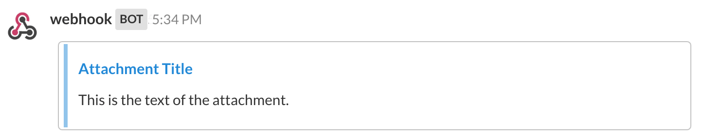
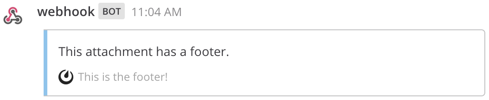

Message Attachments
===================

In addition to standard Markdown formatting, integrations can use message attachments to send richly formatted messages. Attachments can be included in posts sent from :doc:`webhooks </integrations-guide/webhook-integrations>`, :doc:`slash commands </integrations-guide/run-slash-commands>`, and the `REST API <https://developers.mattermost.com/api-documentation/>`_.

You can also include :doc:`interactive messages </integrations-guide/interactive-messages>` with buttons and menus as part of an attachment to create more engaging workflows.

Attachment Options
------------------

When sending a message with an attachment, you are sending a JSON payload that contains an ``attachments`` array. Each object in this array represents a single attachment and can be customized with the following fields:

.. list-table::
   :widths: 20 80
   :header-rows: 1

   * - Field
     - Description
   * - ``fallback``
     - (Required) A plain-text summary of the attachment. This is used in notifications and in clients that don’t support formatted text.
   * - ``color``
     - A hex color code (e.g., ``#FF8000``) that will be used as the left border color for the attachment. If not specified, it defaults to the channel sidebar header background color.
   * - ``pretext``
     - An optional line of text that appears above the attachment. It supports @mentions.
   * - ``text``
     - The main text of the attachment. It can be formatted using `Markdown <https://docs.mattermost.com/help/messaging/formatting-text.html>`_. Long messages are collapsed, and a "Show More" link is added. It supports @mentions.

.. image:: ../images/attachments-color.png
   :alt: Example of an attachment with a custom color border.

Author Details
~~~~~~~~~~~~~~

.. list-table::
   :widths: 20 80
   :header-rows: 1

   * - Field
     - Description
   * - ``author_name``
     - An optional name to identify the author, displayed at the top of the attachment.
   * - ``author_link``
     - An optional URL to hyperlink the ``author_name``.
   * - ``author_icon``
     - An optional URL for a 16x16 pixel icon displayed next to the ``author_name``.

.. image:: ../images/attachments-author.png
   :alt: Example of author details in an attachment.

Titles
~~~~~~

.. list-table::
   :widths: 20 80
   :header-rows: 1

   * - Field
     - Description
   * - ``title``
     - An optional title displayed below the author information.
   * - ``title_link``
     - An optional URL to hyperlink the ``title``.

Fields
~~~~~~

Fields are displayed in a table format within the attachment. They are specified as an array of field objects.

.. list-table::
   :widths: 20 80
   :header-rows: 1

   * - Field
     - Description
   * - ``title``
     - A title shown in the table above the ``value``. Emojis are supported.
   * - ``value``
     - The text value of the field, which can be formatted using `Markdown <https://docs.mattermost.com/help/messaging/formatting-text.html>`_ and supports @mentions.
   * - ``short``
     - A boolean that indicates if the value is short enough to be displayed next to other short values.

.. image:: ../images/attachments-fields.png
   :alt: Example of fields in an attachment.
   :width: 400

Images
~~~~~~

.. list-table::
   :widths: 20 80
   :header-rows: 1

   * - Field
     - Description
   * - ``image_url``
     - An optional URL for an image file (GIF, JPEG, PNG, BMP, or SVG) to be displayed inside the attachment. Large images are resized to a maximum width of 400px or a maximum height of 300px.
   * - ``thumb_url``
     - An optional URL for a 75x75 pixel thumbnail image displayed on the right side of the attachment.

.. image:: ../images/attachments-image.png
   :alt: Example of an image in an attachment.
   :width: 400

Footer
~~~~~~

.. list-table::
   :widths: 20 80
   :header-rows: 1

   * - Field
     - Description
   * - ``footer``
     - An optional line of text displayed at the bottom of the attachment. Truncated after 300 characters.
   * - ``footer_icon``
     - An optional URL for a 16x16 pixel icon displayed before the footer text.

Example Message Attachment
--------------------------

Here is an example of a JSON payload for a message with a complex attachment:

.. code-block:: json
   :linenos:

    {
        "attachments": [
            {
                "fallback": "Example attachment",
                "color": "#FF8000",
                "pretext": "This is optional pretext that shows above the attachment.",
                "text": "This is the text of the attachment. It should appear just above an image of the Mattermost logo.",
                "author_name": "Mattermost",
                "author_icon": "https://mattermost.com/wp-content/uploads/2022/02/icon_WS.png",
                "author_link": "https://mattermost.org/",
                "title": "Example Attachment",
                "title_link": "https://developers.mattermost.com/integrate/reference/message-attachments/",
                "fields": [
                    {
                        "short": false,
                        "title": "Long Field",
                        "value": "This is a long piece of text that will take up the whole width."
                    },
                    {
                        "short": true,
                        "title": "Column One",
                        "value": "Value One"
                    },
                    {
                        "short": true,
                        "title": "Column Two",
                        "value": "Value Two"
                    }
                ],
                "image_url": "https://mattermost.com/wp-content/uploads/2022/02/icon_WS.png"
            }
        ]
    }

This is how it renders in Mattermost:

.. image:: ../images/attachments-example.png
   :alt: Example of a complete message attachment.
   :width: 400

Known Issues
------------

- The footer timestamp field (``ts``) is not yet supported.
- The content of message attachments is not currently included in search results.

Frequently Asked Questions
--------------------------

**Can I send a message attachment via the API?**

Yes, you can use the `Create Post RESTful API <https://api.mattermost.com/#operation/CreatePost>`_. Add an ``attachments`` key to the post’s ``props`` JSON field. The value should be an array of message attachment objects.

Example ``curl`` command:

.. code-block:: bash

  curl -i -X POST -H 'Content-Type: application/json' -d '{"channel_id":"<your_channel_id>", "message":"Test message", "props":{"attachments": [{"pretext": "This is the attachment pretext.","text": "This is the attachment text."}]}}' https://{your-mattermost-site}/api/v4/posts

**Can I post a message attachment using a webhook?**

Yes, you can use an :doc:`incoming webhook </integrations-guide/incoming-webhooks>`. Add an ``attachments`` key to the JSON payload.

Example ``curl`` command:

.. code-block:: bash

  curl -i -X POST -H 'Content-Type: application/json' -d '{"text":"Test message", "attachments": [{"pretext": "This is the attachment pretext.","text": "This is the attachment text."}]}' https://{your-mattermost-site}/hooks/{your-webhook-id}
