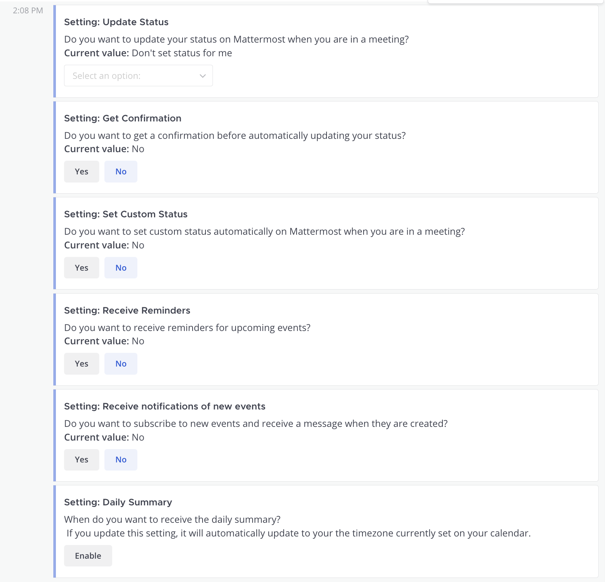

Connect Microsoft Calendar to Mattermost
=========================================

.. include:: ../_static/badges/all-commercial.rst
  :start-after: :nosearch:

Connect your Microsoft M365 Calendar to your Mattermost instance to receive daily summaries of calendar events, synchronize your  M365 status in Mattermost, and accept or decline calendar invites from Mattermost.

Deploy
-------

Setup starts in Microsoft Azure and ends in Mattermost.

Create a Mattermost App in Azure
~~~~~~~~~~~~~~~~~~~~~~~~~~~~~~~~~

1. Sign in to `portal.azure.com <https://portal.azure.com>`_ using an admin Azure account.
2. Navigate to `App Registrations <https://portal.azure.com/#blade/Microsoft_AAD_IAM/ActiveDirectoryMenuBlade/RegisteredApps>`_
3. Select **New registration** at the top of the page.

  .. image:: ../images/ms-calendar-new-azure-registration.png
    :alt: In Azure, create a new app registration.

4. Fill out the form with the following values. Select **Register** to submit the form.

  - **Name**: Mattermost MS Calendar Plugin
  - **Supported account types**: Default value (Single tenant)
  - **Redirect URI**: ``https://<MM_SITE_URL>/plugins/com.mattermost.mscalendar/oauth2/complete`` Replace ``<MM_SITE_URL>`` with your Mattermost server's Site URL. Select **Register** to submit the form.

  .. image:: ../images/ms-calendar-single-tenant.png
    :alt: In Azure, create a new app registration.

5. Go to **Certificates & secrets** in the left pane.

  .. image:: ../images/ms-calendar-certs-secrets.png
    :alt: In Azure, go to Certificates & secrets located in the left pane.

6. Select **New client secret > Add**, and copy the new secret in the bottom right corner of the screen. We'll use this value later in the Mattermost System Console.

  .. image:: ../images/ms-calendar-new-client-secret.png
    :alt: In Azure, create a new client secret and copy the value for later.

7. Go to **API permissions** in the left pane.

  .. image:: ../images/ms-calendar-api-permissions.png
    :alt: In Azure, go to API permissions located in the left pane.

8. Select **Add a permission**, then **Microsoft Graph** in the right pane.

  .. image:: ../images/ms-calendar-add-permission.png
    :alt: In Azure, add a permission for Microsoft Graph.

9. Select **Delegated permissions**, and scroll down to select the following permissions. Select **Add permissions** to submit the form:

  - ``Calendars.ReadWrite``
  - ``Calendars.ReadWrite.Shared``
  - ``MailboxSettings.Read``

  .. image:: ../images/ms-calendar-delegated-permissions.png
    :alt: In Azure, select required permissions.

10. Add application permissions by going to **Add a permission > Microsoft Graph > Application permissions**, and select **Add permissions** to submit the form.

11. Select the following permissions, and then select **Grant admin consent for mattermost** to grant the permissions for the application.

  - ``Calendars.Read``
  - ``MailboxSettings.Read``
  - ``User.Read.All``

  .. image:: ../images/ms-teams-meetings-grant-admin-consent.png
    :alt: In Azure, grant admin consent permissions for the application.

  .. image:: ../images/ms-teams-meeting-permissions-final-state.png
    :alt: In Azure, final state of the permissions for the application.

You're all set for configuration in the Azure portal.

Install the Microsoft Calendar Integration
~~~~~~~~~~~~~~~~~~~~~~~~~~~~~~~~~~~~~~~~~~

1. Log in to your Mattermost :doc:`workspace </end-user-guide/end-user-guide-index>` as a system admin.
2. In Mattermost, from the Product menu |product-list|, select **App Marketplace**.
3. Search for or scroll to Microsoft Calendar, and select **Install**.
4. Once installed, select **Configure**. You're taken to the System Console, directly to the **Microsoft Calendar** integration page, under **Plugins**.

.. note::

  From Mattermost v9.11.2 (ESR) and Mattermost Cloud v10, this plugin is pre-packaged with the Mattermost Server. If your Mattermost deployment is on a release prior to v9.11.2, download the `latest plugin binary release <https://github.com/mattermost/mattermost-plugin-mscalendar/releases>`_, and upload it to your server via **System Console > Plugin Management**.

Enable and configure the Microsoft Calendar Integration in Mattermost
~~~~~~~~~~~~~~~~~~~~~~~~~~~~~~~~~~~~~~~~~~~~~~~~~~~~~~~~~~~~~~~~~~~~~~

1. In Azure, copy the **Application (client) ID** and **Directory (tenant) ID** from the Azure portal.

  .. image:: ../images/ms-calendar-copy-ids.png
    :alt: In Azure, copy the Client ID and Tenant ID values.

2. In Mattermost, go to **System Console > Plugins > Microsoft Calendar** to enable this integration.

3. Copy the **Application (client) ID** and **Directory (tenant) ID** from the Azure portal.

4. In Mattermost, enter the following values in the fields provided. Select **Save** to apply the configuration:

  - **Admin User IDs** - A comma-separated list of :ref:`user IDs <administration-guide/configure/user-management-configuration-settings:identify a user's id>` for authorized users who can manage this integration.
  - **Copy plugin logs to admins, as bot messages** - Select the log level for logs.
  - **Display full context for each admin log message** - Show or hide full context for all log entries.
  - **Azure - Directory (tenant) ID** - Paste the **Directory (tenant) ID** from the Azure portal.
  - **Azure - Application (client) ID** - Paste the **Application (client) ID** from the Azure portal.
  - **Microsoft Office Client Secret** - Copy from the Azure portal (generated in **Certificates & secrets** earlier in these instructions).

Notify your teams that they can `connect their Microsoft Office accounts to Mattermost <#connect-a-microsoft-calendar-account-to-mattermost>`__.

Use
-----

Users who want to use Microsoft Calendar interconnectivity must connect a Microsoft Office account to Mattermost. 

Once connected, you'll receive direct messages from the Microsoft Calendar bot in Mattermost for Microsoft Calendar activity. 

See your upcoming events for the current day by typing ``/mscalendar today`` in the message input box.

.. image:: ../images/Microsoft-Calendar-viewcal.png
  :alt: Example of a direct message from the Microsoft Calendar bot in Mattermost.

A list of all supported slash commands are available by typing ``/mscalendar help`` in the message input box.

You can customize your notification preferences by typing ``/mscalendar settings`` in the message input box.

Upgrade
-------

We recommend updating this integration as new versions are released. Generally, updates are seamless and don't interrupt the user experience in Mattermost. Visit the `Releases page <https://github.com/mattermost/mattermost-plugin-mscalendar/releases>`__ for the latest release, available releases, and compatibiilty considerations.

Get help
--------

Customers with a Mattermost subscription can open a `Mattermost support case <https://support.mattermost.com/hc/en-us/requests/new>`_. Community deployments can report a bug by opening a GitHub issue against the `Mattermost Microsoft Calendar plugin repository <https://github.com/mattermost/mattermost-plugin-mscalendar>`_.

For questions, feedback, and assistance, join our pubic `Integrations and Apps channel <https://community.mattermost.com/core/channels/integrations>`_ on the `Mattermost Community Server <https://community.mattermost.com/>`_ for assistance.

Mattermost Team Edition and Free customers can visit the Mattermost `peer-to-peer troubleshooting forum <https://forum.mattermost.com/c/trouble-shoot/16>`_ to access the global Mattermost Community for assistance.