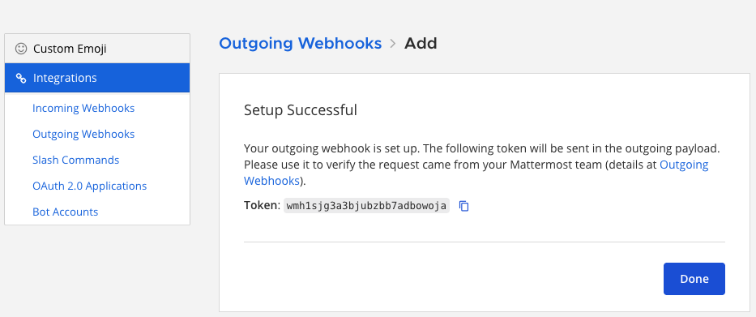

Outgoing Webhooks
=================

Outgoing webhooks let Mattermost send data out when users post messages that match certain triggers. You can configure a trigger word or phrase in a specific channel, along with a destination URL. When someone posts a matching message, Mattermost sends the post content to the external URL via HTTP POST. The receiving system can then process the data and optionally respond with a message back to Mattermost.

For example, a user types ``/weather Boston`` as a message, and your webhook calls a weather API, which sends the current forecast back into the channel. When a message in a specified channel matches one of the trigger words, an HTTP POST request is sent to the designated URL, allowing the external application to respond.

Create an Outgoing Webhook
--------------------------

1. In Mattermost, go to **Product Menu > Integrations**. If you don't have the **Integrations** option, outgoing webhooks may not be enabled on your Mattermost server or may be disabled for non-admins. A System Admin can enable them from **System Console > Integrations > Integration Management**.

  .. image:: ../images/product-menu-integrations.png
    :alt: Mattermost menu options showing the ability to work with integrations.

2. From the Integrations page, select **Outgoing Webhooks**.

  .. image:: /images/manage-webhooks.png
    :alt: Dialog box showing the option to add an outgoing webhook.

3. Select **Add Outgoing Webhook**.

  .. image:: ../images/select-add-outgoing-webhook.png
    :alt: Dialog box showing the option to add an outgoing webhook.

4. Enter a name and description for the webhook.
5. Specify the **Content Type** for the request. 

  - ``application/json`` will send a JSON object.
  - ``application/x-www-form-urlencoded`` will encode the parameters in the URL.

6. Specify a **Channel** and/or one or more **Trigger Words**.

  - If you specify a channel, the webhook will only fire for messages in that channel.
  - If you specify trigger words, the webhook will only fire when a message starts with one of those words.
  - If both are specified, the message must match both conditions.
  - If you leave the channel blank, the webhook will listen to all public channels in your team.
  - If you leave the trigger words blank, the webhook will respond to all messages in the selected channel.

  .. image:: ../images/create-outgoing-webhook-details.png
    :alt: Dialog box showing the outgoing webhook details.

7.  Set one or more **Callback URLs** that the HTTP POST requests will be sent to. Select **Save**. 

  .. image:: ../images/create-outgoing-webhook-details-more.png
    :alt: Dialog box showing the outgoing webhook callback URLs.

8. Copy the **Token** value. This token is used to verify that the requests are coming from Mattermost.

Use an Outgoing Webhook
-----------------------

When a message triggers the webhook, Mattermost will send an HTTP POST request to the callback URL(s) you specified.

Request Payload
~~~~~~~~~~~~~~~

The request body will contain the following data (either as JSON or URL-encoded, depending on the content type you selected):

.. list-table::
   :widths: 25 75
   :header-rows: 1

   * - Parameter
     - Description
   * - ``token``
     - The token generated when you created the webhook.
   * - ``team_id``
     - The ID of the team the message was posted in.
   * - ``team_domain``
     - The domain of the team.
   * - ``channel_id``
     - The ID of the channel the message was posted in.
   * - ``channel_name``
     - The name of the channel.
   * - ``timestamp``
     - The time the message was posted.
   * - ``user_id``
     - The ID of the user who posted the message.
   * - ``user_name``
     - The username of the user who posted the message.
   * - ``post_id``
     - The ID of the post.
   * - ``text``
     - The full text of the message.
   * - ``trigger_word``
     - The trigger word that was matched.

Your application should validate the ``token`` to ensure the request is from Mattermost.

Response Payload
~~~~~~~~~~~~~~~~

Your application can respond to the POST request with a JSON object to post a message back to Mattermost.

.. code-block:: json

    {
      "text": "| Component  | Tests Run | Tests Failed |\n|:-----------|:----------|:-------------|\n| Server     | 948       | :white_check_mark: 0 |"
    }

This would render in Mattermost as:

.. image:: ../images/webhooksTable.png
   :alt: Example of a formatted table response from an outgoing webhook.

Response Parameters
-------------------

The JSON response can contain the following parameters:

.. list-table::
   :widths: 20 80
   :header-rows: 1

   * - Parameter
     - Description
   * - ``text``
     - (Required if ``attachments`` is not set) `Markdown-formatted <https://docs.mattermost.com/messaging/formatting-text.html>`_ message.
   * - ``response_type``
     - Set to ``comment`` to reply to the message that triggered the webhook. Defaults to ``post``, which creates a new message.
   * - ``username``
     - Overrides the default username. Requires `Enable integrations to override usernames <https://docs.mattermost.com/configure/configuration-settings.html#enable-integrations-to-override-usernames>`_ to be enabled.
   * - ``icon_url``
     - Overrides the default profile picture. Requires `Enable integrations to override profile picture icons <https://docs.mattermost.com/configure/configuration-settings.html#enable-integrations-to-override-profile-picture-icons>`_ to be enabled.
   * - ``attachments``
     - (Required if ``text`` is not set) An array of :doc:`message attachment </integrations-guide/message-attachments>` objects.
   * - ``type``
     - Sets the post type, mainly for plugins. If set, must begin with ``custom_``.
   * - ``props``
     - A JSON object for storing metadata.
   * - ``priority``
     - Sets the priority of the message. See :doc:`message priorities </integrations-guide/message-priorities>`.

Example with Parameters
~~~~~~~~~~~~~~~~~~~~~~~

.. code-block:: json

    {
      "response_type": "comment",
      "username": "test-automation",
      "icon_url": "https://mattermost.com/wp-content/uploads/2022/02/icon.png",
      "text": "#### Test results for July 27th, 2017\n@channel here are the requested test results.",
      "props": {
        "test_data": {
          "server": 948,
          "web": 123,
          "ios": 78
        }
      }
    }

This response would produce a threaded reply to the original message that triggered the webhook.

.. image:: ../images/outgoing_webhooks_full_example.png
  :alt: Example of a full response from an outgoing webhook.
  :width: 400

You can also include :doc:`message attachments </integrations-guide/message-attachments>` and :doc:`interactive messages </integrations-guide/interactive-messages>` in your response to create more advanced workflows.
