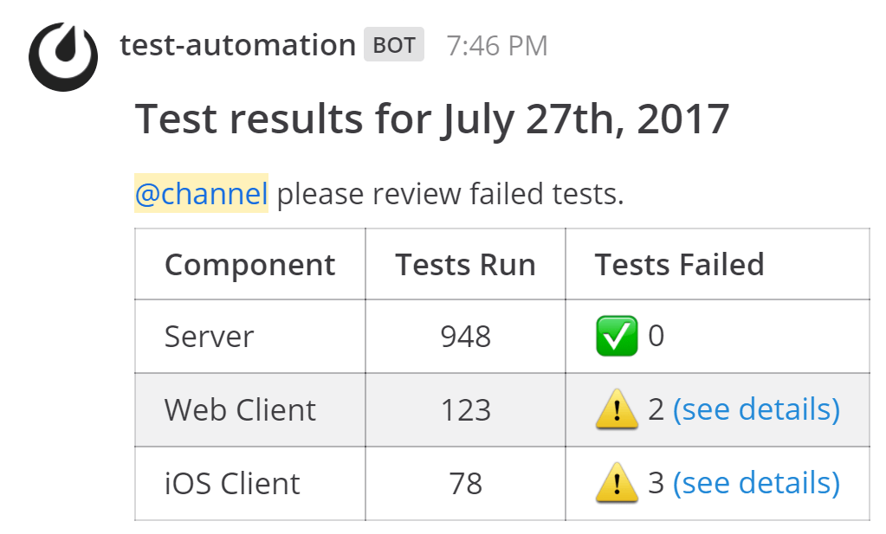

Outgoing Webhooks
=================

.. include:: ../_static/badges/all-commercial.rst
  :start-after: :nosearch:

**Technical complexity:** :ref:`Low-code <low-code>`

Outgoing webhooks can be used to create rich, interactive experiences in Mattermost by letting external services respond with rich message attachments, such as structured fields, buttons, and menus. Additionally, these responses can trigger interactive dialog forms where users provide additional input directly in Mattermost, or interactive messages that update dynamically based on user actions. Together, these capabilities turn simple keyword triggers into powerful in-product workflows that streamline how teams interact with external systems, all with minimal coding required.

Outgoing webhooks require no coding to configure on in Mattermost, however the external service that receives the HTTP POST request needs to process the data, and then format and send a respond with a message back to Mattermost. This usually requires light coding to parse the request and format a JSON response payload, though many :ref:`automation platforms <integrations-guide/integrations-guide-index:build and automate workflows>` handle this without writing custom code.

Learn more about :doc:`outgoing webhooks </integrations-guide/outgoing-webhooks>`.

Example Use Cases
------------------

Here are some example use cases for outgoing webhooks in Mattermost:

**Issue tracking integration**  

When a user types ``bug`` in a channel, an outgoing webhook sends the message to an external service that parses the details and responds with an interactive dialog in Mattermost. The user can enter fields like priority, description, and assignee, and submitting the dialog automatically creates a ticket in your ticketing software.

**Knowledge base lookup**  

A keyword like ``docs`` triggers an outgoing webhook that queries a documentation service and returns a rich interactive message with a list of suggested articles, each with clickable buttons or menus. Users can refine their search or open links without leaving Mattermost.

**Security incident enrichment**  

Typing a keyword like ``ioc`` (indicator of compromise) in a security channel can trigger an outgoing webhook that queries a threat intelligence platform. The response can return a formatted message attachment with reputation scores, related incidents, and quick-action buttons for escalating, investigating, or dismissing the alert.

Create
-------

1. In Mattermost, go to **Product Menu > Integrations**. If you don't have the **Integrations** option, outgoing webhooks may not be enabled on your Mattermost server or may be disabled for non-admins. A System Admin can enable them from **System Console > Integrations > Integration Management**.

  .. image:: ../images/product-menu-integrations.png
    :alt: Mattermost menu options showing the ability to work with integrations.

2. From the Integrations page, select **Outgoing Webhooks**.

  .. image:: ../images/manage-webhooks.png
    :alt: Dialog box showing the option to add an outgoing webhook.

3. Select **Add Outgoing Webhook**.

  .. image:: ../images/select-add-outgoing-webhook.png
    :alt: Dialog box showing the option to add an outgoing webhook.

4. Enter a name and description for the webhook.
5. Specify the **Content Type** for the request. 

  - ``application/json`` will send a JSON object.
  - ``application/x-www-form-urlencoded`` will encode the parameters in the URL.

6. Specify a **Channel** and/or one or more **Trigger Words**.

  - If you specify a channel, the webhook will only fire for messages in that channel.
  - If you specify trigger words, the webhook will only fire when a message starts with one of those words.
  - If both are specified, the message must match both conditions.
  - If you leave the channel blank, the webhook will listen to all public channels in your team.
  - If you leave the trigger words blank, the webhook will respond to all messages in the selected channel.

  .. image:: ../images/create-outgoing-webhook-details.png
    :alt: Dialog box showing the outgoing webhook details.

7.  Set one or more **Callback URLs** that the HTTP POST requests will be sent to. Select **Save**. 

  .. image:: ../images/create-outgoing-webhook-details-more.png
    :alt: Dialog box showing the outgoing webhook callback URLs.

8. Copy the **Token** value. This token is used to verify that the requests are coming from Mattermost.

Use
---

When a message triggers the webhook, Mattermost will send an HTTP POST request to the callback URL(s) you specified.

Request Payload
~~~~~~~~~~~~~~~

The request body will contain the following data (either as JSON or URL-encoded, depending on the content type you selected):

.. list-table::
   :widths: 25 75
   :header-rows: 1

   * - Parameter
     - Description
   * - ``token``
     - The token generated when you created the webhook.
   * - ``team_id``
     - The ID of the team the message was posted in.
   * - ``team_domain``
     - The domain of the team.
   * - ``channel_id``
     - The ID of the channel the message was posted in.
   * - ``channel_name``
     - The name of the channel.
   * - ``timestamp``
     - The time the message was posted.
   * - ``user_id``
     - The ID of the user who posted the message.
   * - ``user_name``
     - The username of the user who posted the message.
   * - ``post_id``
     - The ID of the post.
   * - ``text``
     - The full text of the message.
   * - ``trigger_word``
     - The trigger word that was matched.

Your application should validate the ``token`` to ensure the request is from Mattermost.

Response Payload
~~~~~~~~~~~~~~~~

Your application can respond to the POST request with a JSON object to post a message back to Mattermost.

.. code-block:: json

    {
      "text": "| Component  | Tests Run | Tests Failed |\n|:-----------|:----------|:-------------|\n| Server     | 948       | :white_check_mark: 0 |"
    }

This would render in Mattermost as:

.. image:: ../images/webhooksTable.png
   :alt: Example of a formatted table response from an outgoing webhook.

Response Parameters
-------------------

The JSON response can contain the following parameters:

.. list-table::
   :widths: 20 80
   :header-rows: 1

   * - Parameter
     - Description
   * - ``text``
     - (Required if ``attachments`` is not set) :doc:`Markdown-formatted </end-user-guide/collaborate/format-messages>` message.
   * - ``response_type``
     - Set to ``comment`` to reply to the message that triggered the webhook. Defaults to ``post``, which creates a new message.
   * - ``username``
     - Overrides the default username. Requires :ref:`Enable integrations to override usernames <administration-guide/configure/integrations-configuration-settings:enable integrations to override usernames>` to be enabled.
   * - ``icon_url``
     - Overrides the default profile picture. Requires :ref:`Enable integrations to override profile picture icons <administration-guide/configure/integrations-configuration-settings:enable integrations to override profile picture icons>` to be enabled.
   * - ``attachments``
     - (Required if ``text`` is not set) An array of `message attachment <https://developers.mattermost.com/integrate/reference/message-attachments/>`_ objects.
   * - ``type``
     - Sets the post type, mainly for plugins. If set, must begin with ``custom_``.
   * - ``props``
     - A JSON object for storing metadata.
   * - ``priority``
     - Sets the priority of the message. See `message priorities <https://developers.mattermost.com/integrate/reference/message-priority/>`_.

Example with Parameters
~~~~~~~~~~~~~~~~~~~~~~~

.. code-block:: json

    {
      "response_type": "comment",
      "username": "test-automation",
      "icon_url": "https://mattermost.com/wp-content/uploads/2022/02/icon.png",
      "text": "#### Test results for July 27th, 2017\n@channel here are the requested test results.",
      "props": {
        "test_data": {
          "server": 948,
          "web": 123,
          "ios": 78
        }
      }
    }

This response would produce a threaded reply to the original message that triggered the webhook.

You can also include `message attachments <https://developers.mattermost.com/integrate/reference/message-attachments/>`_ and `interactive messages <https://developers.mattermost.com/integrate/plugins/interactive-messages/>`_ in your response to create more advanced workflows.

Do More with Outgoing Webhooks
------------------------------

Turn keyword-triggered callbacks into guided, in-channel workflows by returning buttons, menus, and other interactive elements in your webhook responses so users can act immediately.

- `Message Attachments <https://developers.mattermost.com/integrate/reference/message-attachments/>`_: Return rich, structured results (IDs, statuses, fields, links, images) for quick confirmation and follow-up.
- `Interactive Messages <https://developers.mattermost.com/integrate/plugins/interactive-messages/>`_: Present next-step actions (Acknowledge, Assign, Escalate) as buttons/menus directly in your response—no context switching.
- `Interactive Dialogs <https://developers.mattermost.com/integrate/plugins/interactive-dialogs/>`_: When a button/menu click requires more info (e.g., “Acknowledge with note”, “Assign to user”), open a dialog to collect structured inputs with required fields, min/max lengths, server-driven user/channel pickers, validated defaults, inline field errors, placeholders, and help text.
- `Message Priority <https://developers.mattermost.com/integrate/reference/message-priority/>`_: Include ``priority`` in your response to mark critical updates and optionally request acknowledgements or persistent notifications.

.. note::

  - Outgoing webhook responses support attachments and interactive actions. When a user clicks an action, your integration receives a signed trigger ID and can open an interactive dialog via the dialog API. You can also control visibility with the response type (in-channel vs ephemeral).
  - Need a dedicated identity, permissions scoping, or need to post outside of webhook/command flows? Use a `bot account <https://developers.mattermost.com/integrate/reference/bot-accounts/>`_ if you need a more permanent solution than using overrides for simple branding.
  - If your command backend needs to call Mattermost APIs (e.g., posting messages, ephemeral posts, opening interactive dialogs, etc.), authenticate with a bot user `personal access token <https://developers.mattermost.com/integrate/reference/personal-access-token/>`_. We recommend avoiding human/System Admin personal access tokens for automations and rotating and storing tokens securely.
  - Looking to support private channels, direct messages, and autocomplete? Use a :doc:`built-in slash command </integrations-guide/built-in-slash-commands>`, or create a `custom slash command <https://developers.mattermost.com/integrate/slash-commands/custom/>`_. You can additionally tegrate Mattermost with custom integrations hosted within your internal OAuth infrastructure `using the Client Credentials OAuth 2.0 grant type <https://developers.mattermost.com/integrate/slash-commands/outgoing-oauth-connections/>`_. Mattermost also makes it easy to `migrate integrations written for Slack to Mattermost <https://developers.mattermost.com/integrate/slash-commands/slack/>`_.