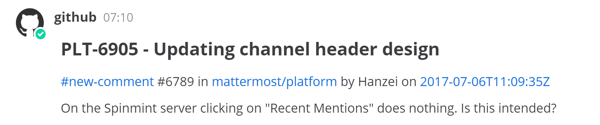
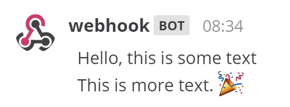
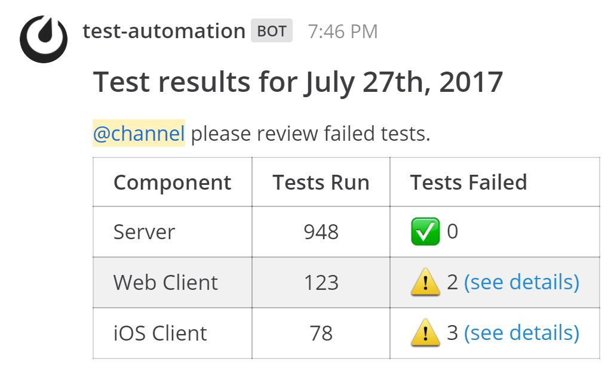

Incoming Webhooks
=================

.. note::
  This is the admin documentation for incoming webhooks. If you're a developer looking to build an integration, see `our developer documentation <https://developers.mattermost.com/integrate/getting-started/>`__.

Mattermost supports webhooks to easily integrate external applications into the cloud workspace.

Use incoming webhooks to post messages to Mattermost public channels, private channels and direct messages. Messages are sent via an HTTP POST request to a Mattermost URL generated for each application and contain a specifically formatted JSON payload in the request body.



*An example of a GitHub integration that posts updates to a Developers channel*

Use `curl <https://curl.haxx.se/>`__, a simple command line tool for sending HTTP requests in the examples that follow.

.. note::
  To prevent malicious users from trying to perform `phishing attacks <https://en.wikipedia.org/wiki/Phishing>`__, a *BOT* indicator appears next to posts coming from webhooks regardless of what username is specified.

.. toctree::
   :maxdepth: 2

Simple Incoming Webhook
-----------------------

Let's learn how to create a simple incoming webhook that posts the following message to Mattermost.


  
1. Go to **Main Menu > Integrations > Incoming Webhooks**. If you don't have the **Integrations** option in your Main Menu, incoming webhooks may not be enabled or may be disabled for non-admins. Enable them from **System Console > Integrations > Integration Management** or ask your System Admin to do so.
2. Select **Add Incoming Webhook** and add a title and description for the webhook. The description can be up to 500 characters. 
3. Choose the channel to receive webhook payloads, then select **Save** to create the webhook.
4. Use a curl command from terminal or command prompt to send the following JSON payload in a HTTP POST request:

.. code-block:: text

  curl -i -X POST -H 'Content-Type: application/json' -d '{"text": "Hello, this is some text\nThis is more text. :tada:"}' http://{your-mattermost-site}/hooks/xxx-generatedkey-xxx
  # or
  curl -i -X POST --data-urlencode 'payload={"text": "Hello, this is some text\nThis is more text. :tada:"}' http://{your-mattermost-site}/hooks/xxx-generatedkey-xxx

If you're running `cURL on Windows <https://curl.haxx.se/windows/>`__, ensure inner double quotes are escaped with a backslash. Here's an example payload on Windows:

.. code-block:: text

  curl -i -X POST -H "Content-Type: application/json" -d "{\"text\": \"Hello, this is some text\nThis is more text. :tada:\"}" http://{your-mattermost-site}/hooks/xxx-generatedkey-xxx

See `developer documentation <https://developers.mattermost.com/integrate/incoming-webhooks/>`__ for details on what parameters are supported by incoming webhooks. For instance, you can override the username and profile picture the messages post as, or specify a custom post type when sending a webhook message for use by `plugins <https://about.mattermost.com/default-plugins>`__. The following payload gives an example webhook that uses additional parameters and formatting options:

.. code-block:: text

  payload={
    "channel": "town-square",
    "username": "test-automation",
    "icon_url": "https://mattermost.org/wp-content/uploads/2016/04/icon.png",
    "text": "#### Test results for July 27th, 2017\n<!channel> please review failed tests.\n
    | Component  | Tests Run   | Tests Failed                                   |
    |:-----------|:-----------:|:-----------------------------------------------|
    | Server     | 948         | :white_check_mark: 0                           |
    | Web Client | 123         | :warning: 2 [(see details)](http://linktologs) |
    | iOS Client | 78          | :warning: 3 [(see details)](http://linktologs) |
    "
    }

This content will be displayed in the Town Square channel.



Messages with advanced formatting can be created by including an :doc:`attachment array <message-attachments>` and :doc:`interactive message buttons <interactive-messages>` in the JSON payload.

.. note::

  `Enable integrations to override usernames <https://docs.mattermost.com/configure/configuration-settings.html#enable-integrations-to-override-usernames>`__ must be set to ``true`` in ``config.json`` to override usernames. Enable them from **System Console > Integrations > Integration Management** or ask your System Admin to do so. If not enabled, the username is set to ``webhook``.
  
  Similarly, `Enable integrations to override profile picture icons <https://docs.mattermost.com/configure/configuration-settings.html#enable-integrations-to-override-profile-picture-icons>`__ must be set to ``true`` in ``config.json`` to override profile picture icons. Enable them from **System Console > Integrations > Integration Management** or ask your System Admin to do so. If not enabled, the icon of the creator of the webhook URL is used to post messages.

Tips and Best Practices
------------------------

1. Webhooks are designed to easily allow you to post messages. For other actions such as channel creation, you must also use the `Mattermost APIs <https://api.mattermost.com>`__.

2. If the text is longer than the allowable character limit per post, the message is split into multiple consecutive posts, each within the character limit. Posts up to 16383 characters are supported.

3. You can restrict who can create incoming webhooks in `System Console > Integrations > Integration Management <https://docs.mattermost.com/configure/configuration-settings#restrict-managing-integrations-to-admins>`__.

4. Mattermost incoming webhooks are Slack-compatible. You can copy and paste code used for a Slack incoming webhook to create Mattermost integrations. Mattermost `automatically translates the Slack's proprietary JSON payload format <https://docs.mattermost.com/developer/webhooks-incoming.html?highlight=translate%20slack%20data%20format%20mattermost#translate-slack-s-data-format-to-mattermost>`__.

5. The external application may be written in any programming language as long as it supports sending an HTTP POST request in the required JSON format to a specified Mattermost URL.

6. For the HTTP request body, if ``Content-Type`` is specified as ``application/json`` in the header of the HTTP request, then the body can be direct JSON. For example,

.. code-block:: text

  {"text": "Hello, this is some text."}

7. When using the ``icon_emoji`` parameter - the user profile image is replaced by the emoji provided. This will also override the ``icon_url`` parameter if both are provided. 

Share Your Integration
-----------------------

If you've built an integration for Mattermost, please consider `sharing your work <https://mattermost.org/share-your-mattermost-projects/>`__ in our `app directory <https://integrations.mattermost.com/>`__.

The `app directory <https://integrations.mattermost.com/>`__ lists open source integrations developed by the Mattermost community and are available for download, customization, and deployment to your private cloud or self-managed infrastructure.

Slack Compatibility
-------------------

Mattermost makes it easy to migrate integrations written for Slack to Mattermost. 

Using the Slack ``icon_emoji`` parameter overrides the profile icon and the icon_url parameter. 

Translate Slack's data format to Mattermost
~~~~~~~~~~~~~~~~~~~~~~~~~~~~~~~~~~~~~~~~~~~

Mattermost automatically translates the data coming from Slack:

1. JSON payloads written for Slack, that contain the following, are translated to Mattermost markdown and rendered equivalently to Slack:
   
   - ``<>`` to denote a URL link, such as ``{"text": "<https://mattermost.com/>"}``
   - ``|`` within a ``<>`` to define linked text, such as ``{"text": "Click <https://mattermost.com/|here> for a link."}``
   - ``<userid>``  to trigger a mention to a user, such as ``{"text": "<5fb5f7iw8tfrfcwssd1xmx3j7y> this is a notification."}``
   - ``<!channel>``, ``<!here>`` or ``<!all>`` to trigger a mention to a channel, such as ``{"text": "<!channel> this is a notification."}``

2. You can override the channel name with a *@username*, such as ```payload={"text": "Hi", channel: "@jim"}`` to send a direct message like in Slack.
3. You can prepend a channel name with *#* and the message will still be sent to the correct channel like in Slack.

Mattermost webhooks in GitLab using Slack UI
~~~~~~~~~~~~~~~~~~~~~~~~~~~~~~~~~~~~~~~~~~~~~~

GitLab is the leading open-source alternative to GitHub and offers built-in integrations with Slack. You can use the Slack interface in GitLab to add Mattermost webhooks directly without changing code:

1. In GitLab, go to **Settings > Services** and select **Slack**.
2. Paste the incoming webhook URL provided by Mattermost from **Main Menu > Integrations > Incoming Webhooks**.
3. Optionally set the **Username** you'd like displayed when the notification is made. Leave the **Channel** field blank.
4. Select **Save** then test the settings to confirm messages are sent successfully to Mattermost.

Known Slack compatibility issues
~~~~~~~~~~~~~~~~~~~~~~~~~~~~~~~~

1. Referencing  channels using <#CHANNEL_ID> does not link to the channel.
2. ``<!everyone>`` and ``<!group>`` are not supported.
3. Parameters "mrkdwn", "parse", and "link_names" are not supported. Mattermost converts Markdown by default and automatically links @mentions.
4. Bold formatting as ``*bold*`` is not supported (must be done as ``**bold**``).
5. Webhooks cannot direct message the user who created the webhook.

Troubleshooting
---------------

To debug incoming webhooks in **System Console > Logs**, set **System Console > Logging > Enable Webhook Debugging** to ``true`` and set **System Console > Logging > Console Log Level** to ``DEBUG``.

Some common error messages include:

1. ``Couldn't find the channel``: Indicates that the channel doesn't exist or is invalid. Please modify the ``channel`` parameter before sending another request.
2. ``Couldn't find the user``: Indicates that the user doesn't exist or is invalid. Please modify the ``channel`` parameter before sending another request.
3. ``Unable to parse incoming data``: Indicates that the request received is malformed. Try reviewing that the JSON payload is in a correct format and doesn't have typos such as extra `"`.
4. ``curl: (3) [globbing] unmatched close brace/bracket in column N``: Typically an error when using cURL on Windows, when:

  1. You have space around JSON separator colons, ``payload={"Hello" : "test"}`` or  
  2. You are using single quotes to wrap the ``-d`` data, ``-d 'payload={"Hello":"test"}'``

If your integration prints the JSON payload data instead of rendering the generated message, make sure your integration is returning the ``application/json`` content-type.

For further assistance, review the `Troubleshooting forum <https://forum.mattermost.org/c/trouble-shoot>`__ for previously reported errors, or `join the Mattermost user community for troubleshooting help <https://mattermost.com/pl/default-ask-mattermost-community/>`_.

Frequently Asked Questions
--------------------------

How do I send a webhook post to a direct message channel?
~~~~~~~~~~~~~~~~~~~~~~~~~~~~~~~~~~~~~~~~~~~~~~~~~~~~~~~~~~~

To send a message to a direct message channel, add an "@" symbol followed by the username to the channel parameter. You can add your own username to send the webhook posts to a direct message channel with yourself.

.. code-block:: text

  payload={"channel": "@username", "text": "Hello, this is some text\nThis is more text. :tada:"}

This will send a message from the account that has set up the incoming webhook to the username after the "@" symbol. For example, if you create a webhook with the user ``alice`` and send a direct message to ``bob`` using a webhook, it will show up as a direct message from ``alice`` to ``bob`` regardless of other settings such as username.

To send a message to a different direct message channel between two other users, you can specify the channel with the user IDs for the users separated with two underscore (_) symbols. To find the user ID you can `use the ``mattermost`` command - see details `here <https://docs.mattermost.com/administration/command-line-tools.html#mattermost-user-search>`__.

.. code-block:: text

  payload={"channel": "6w41z1q367dujfaxr1nrykr5oc__94dzjnkd8igafdraw66syi1cde", "text": "Hello, this is some text\nThis is more text. :tada:"}
