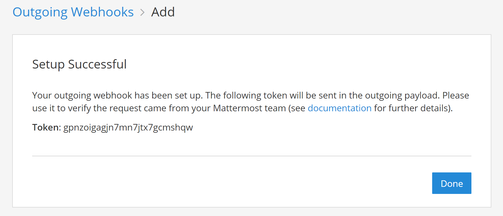
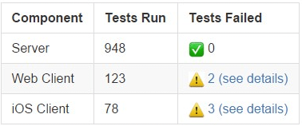

Outgoing Webhooks
=================

.. note::
  This is the admin documentation for outgoing webhooks. If you're a developer looking to build an integration, see `our developer documentation <https://developers.mattermost.com/integrate/getting-started/>`__.

Mattermost supports webhooks to easily integrate external applications into Mattermost.

Use outgoing webhooks to post automated responses to posts made by your users. Outgoing webhooks will send an HTTP POST request to a web service and process a response back to Mattermost when a message matches one or both of the following conditions:

 - It is posted in a specified channel
 - The first word matches or starts with one of the defined trigger words, such as ``gif``

Outgoing webhooks are supported in public channels only. If you need a trigger that works in a private channel or a direct message, consider using a `slash command <https://docs.mattermost.com/developer/slash-commands.html>`__ instead.

.. note::
  To prevent malicious users from trying to perform `phishing attacks <https://en.wikipedia.org/wiki/Phishing>`__ a *BOT* indicator appears next to posts coming from webhooks regardless of what username is specified.

.. toctree::
   :maxdepth: 2

Create an Outgoing Webhook
--------------------------

Suppose you want to write an external application, which executes software tests after someone posts a message starting with the word ``#build`` in the ``town-square`` channel.

You can follow these general guidelines to set up a Mattermost outgoing webhook for your application.

1. First, go to **Main Menu > Integrations > Outgoing Webhooks**. If you don't have the **Integrations** option in your Main Menu, outgoing webhooks may not be enabled on your Mattermost server or may be disabled for non-admins. Enable them from **System Console > Integrations > Integration Management**.
2. Select **Add Outgoing Webhook** and add a title and description for the webhook. The description can be up to 500 characters. 
3. Choose the content type by which the request will be sent.

 - If ``application/x-www-form-urlencoded`` is chosen, the server will encode the parameters in a URL format in the request body.
 - If ``application/json`` is chosen, the server will format the request body as JSON.

4. Choose the public channel to receive webhook responses, or specify one or more trigger words that send an HTTP POST request to your application. You may configure either the channel or the trigger words for the outgoing webhook, or both. If both are specified, then the message must match both values.

In our example, we would set the channel to ``town-square`` and specify ``#build`` as the trigger word.

  .. note::
    If you leave the channel field blank, the webhook will respond to trigger words in all public channels of your team.
    
    Similarly, if you don't specify trigger words, then the webhook will respond to all messages in the selected public channel.

5. If you specified one or more trigger words on the previous step, choose when to trigger the outgoing webhook.

 - If the first word of a message matches one of the trigger words exactly, or
 - If the first word of a message starts with one of the trigger words.

6. Finally, set one or more callback URLs that HTTP POST requests will be sent to, and select **Save**. If the URL is private, add it as a `trusted internal connection <https://docs.mattermost.com/configure/configuration-settings.html>`__.
7. On the next page, copy the **Token** value. This will be used in a later step.

8. Next, write your external application. Include a function, which receives HTTP POST requests from Mattermost. The function should look something like this:

    .. code-block:: text

      Content-Length: 244
      User-Agent: Go 1.1 package http
      Host: localhost:5000
      Accept: application/json
      Content-Type: application/x-www-form-urlencoded

      channel_id=hawos4dqtby53pd64o4a4cmeoo&
      channel_name=town-square&
      team_domain=someteam&
      team_id=kwoknj9nwpypzgzy78wkw516qe&
      post_id=axdygg1957njfe5pu38saikdho&
      text=some+text+here&
      timestamp=1445532266&
      token=zmigewsanbbsdf59xnmduzypjc&
      trigger_word=some&
      user_id=rnina9994bde8mua79zqcg5hmo&
      user_name=somename

If your integration sends back a JSON response, make sure it returns the ``application/json`` content type.

9. Add a configurable *MATTERMOST_TOKEN* variable to your application and set it to the **Token** value from step 7. This value will be used by your application to confirm the HTTP POST request came from Mattermost.
10. To have your application post a message back to ``town-square``, it can respond to the HTTP POST request with a JSON response such as:

.. code-block:: text

  {"text": "
  | Component  | Tests Run   | Tests Failed                                   |
  |:-----------|:------------|:-----------------------------------------------|
  | Server     | 948         | :white_check_mark: 0                           |
  | Web Client | 123         | :warning: [2 (see details)](http://linktologs) |
  | iOS Client | 78          | :warning: [3 (see details)](http://linktologs) |
  "}

which would render in Mattermost as:

11. You're all set! See `developer documentation <https://developers.mattermost.com/integrate/outgoing-webhooks/>`__ for details on what parameters are supported by outgoing webhooks. For instance, you can override the username and profile picture the messages post as, or specify a custom post type when sending a webhook message for use by `plugins <https://about.mattermost.com/default-plugins>`__.

Messages with advanced formatting can be created by including an `attachment array <https://docs.mattermost.com/developer/message-attachments.html>`_ and `interactive message buttons <https://docs.mattermost.com/developer/interactive-messages.html>`_ in the JSON payload.

.. note::
  `Enable integrations to override usernames <https://docs.mattermost.com/configure/configuration-settings.html#enable-integrations-to-override-usernames>`__ must be set to ``true`` in ``config.json`` to override usernames. Enable them from **System Console > Integrations > Integration Management** or ask your System Admin to do so. If not enabled, the username is set to ``webhook``.

  Similarly, `Enable integrations to override profile picture icons <https://docs.mattermost.com/configure/configuration-settings.html#enable-integrations-to-override-profile-picture-icons>`__ must be set to ``true`` in ``config.json`` to override usernames. Enable them from **System Console > Integrations > Integration Management** or ask your System Admin to do so. If not enabled, the icon of the creator of the webhook URL is used to post messages.

Tips and Best Practices
-----------------------

1. Webhooks are designed to easily allow you to post messages. For other actions such as channel creation, you must also use the `Mattermost APIs <https://api.mattermost.com>`__.
2. If the text in the JSON response is longer than the allowable character limit per post, the message is split into multiple consecutive posts, each within the character limit. Posts up to 16383 characters are supported. 
3. Outgoing webhooks are supported in public channels only. If you need a trigger that works in a private channel or a direct message, consider using a `slash command <https://docs.mattermost.com/developer/slash-commands.html>`__ instead.
4. You can restrict who can create outgoing webhooks in `System Console > Integrations > Integration Management <https://docs.mattermost.com/configure/configuration-settings.html#restrict-managing-integrations-to-admins>`__.
5. Mattermost outgoing webhooks are Slack-compatible. You can copy-and-paste code used for a Slack outgoing webhook to create Mattermost integrations. Mattermost `automatically translates Slack's proprietary JSON response format <https://docs.mattermost.com/integrations/cloud-incoming-webhooks.html#translate-slack-s-data-format-to-mattermost>`__.
6. The external application may be written in any programming language. It needs to provide a URL that reacts to the request sent by your Mattermost server and send an HTTP POST in the required JSON format as a response.
 
Share Your Integration
-----------------------

If you've built an integration for Mattermost, please consider `sharing your work <https://mattermost.org/share-your-mattermost-projects/>`__ in our `app directory <https://integrations.mattermost.com/>`__.

The `app directory <https://integrations.mattermost.com/>`__ lists open-source integrations developed by the Mattermost community and are available for download, customization, and deployment to your private cloud or self-managed infrastructure.

Slack Compatibility
-------------------

Mattermost makes it easy to migrate integrations written for Slack to Mattermost. 

Translate Slack's data format to Mattermost
~~~~~~~~~~~~~~~~~~~~~~~~~~~~~~~~~~~~~~~~~~~

Mattermost automatically translates the data coming from Slack:

1. JSON responses written for Slack, that contain the following, are translated to Mattermost markdown and rendered equivalently to Slack:
   
   - ``<>`` to denote a URL link, such as ``{"text": "<https://mattermost.com/>"}``
   - ``|`` within a ``<>`` to define linked text, such as ``{"text": "Click <https://mattermost.com/|here> for a link."}``
   - ``<userid>``  to trigger a mention to a user, such as ``{"text": "<5fb5f7iw8tfrfcwssd1xmx3j7y> this is a notification."}``
   - ``<!channel>``, ``<!here>`` or ``<!all>`` to trigger a mention to a channel, such as ``{"text": "<!channel> this is a notification."}``

2. The HTTP POST request body sent to a web service is formatted the same as Slack. This means your Slack integration's receiving function does not need change to be compatible with Mattermost.
3. Slack attachments are supported with Slack-compatible outgoing webhooks. They also add support for mentions with `<@userid>` and announcement tokens (eg. `<!here>`) in the outgoing webhook responses.
  
Known Slack compatibility issues
~~~~~~~~~~~~~~~~~~~~~~~~~~~~~~~~

1. Using ``icon_emoji`` to override the username is not supported.
2. Referencing channels using ``<#CHANNEL_ID>`` does not link to the channel.
3. ``<!everyone>`` and ``<!group>`` are not supported.
4. Parameters "mrkdwn", "parse", and "link_names" are not supported (Mattermost always converts markdown and automatically links @mentions).
5. Bold formatting supplied as ``*bold*`` is not supported (must be done as ``**bold**``).
6. Advanced formatting using `message attachments <https://docs.mattermost.com/developer/message-attachments.html>`_ is not yet supported.

Troubleshooting
---------------

For assistance, review the `Troubleshooting forum <https://forum.mattermost.org/c/trouble-shoot>`__ for previously reported errors, or `join the Mattermost user community for troubleshooting help <https://mattermost.com/pl/default-ask-mattermost-community/>`_.

My integration prints the JSON data in a Mattermost channel
~~~~~~~~~~~~~~~~~~~~~~~~~~~~~~~~~~~~~~~~~~~~~~~~~~~~~~~~~~~~~

Mattermost handles multiple content types for integrations, including plain text content type. If your integration prints the JSON data instead of rendering the generated message, make sure your integration is returning the ``application/json`` content type.
