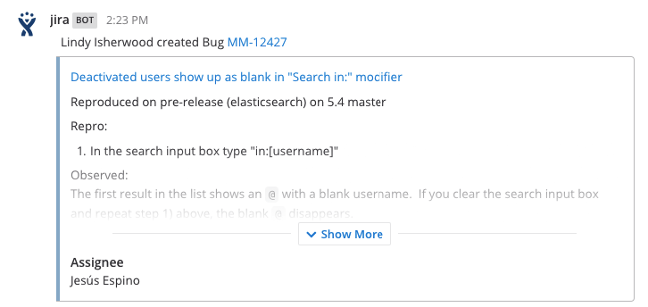
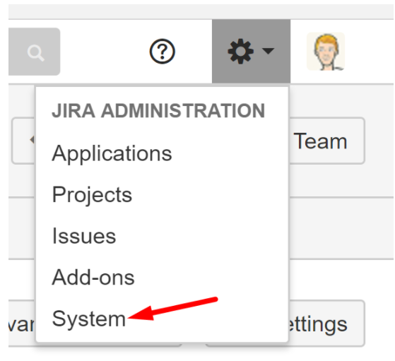
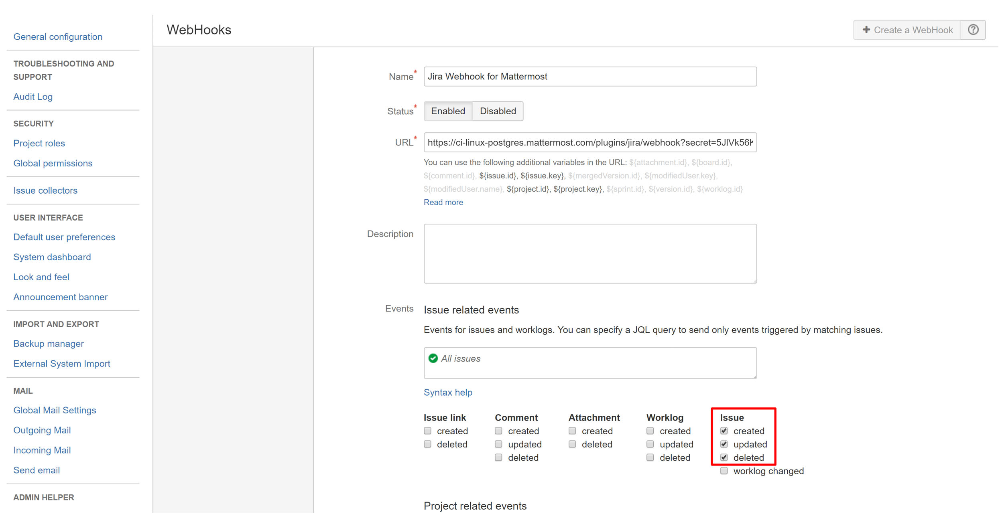

.. _jira:

JIRA Plugin 
================================

Set up a JIRA integration for your Mattermost instance within minutes using a pre-packaged JIRA webhook plugin.

**Usage**

Once enabled, JIRA posts notifications to a Mattermost channel when an issue is created, updated or deleted.

This plugin allows you to connect your JIRA projects with multiple channels across your teams. The following JIRA events are supported:

  - Issue: Created - when an issue is created.
  - Issue: Updated - when an issue is reopened, and when the issue is resolved or closed.
  - Issue: Deleted - when an open issue is deleted. If the issue was already resolved, deleting it won't send a message to Mattermost.

If you'd like to see support for additional events, `let us know <https://mattermost.uservoice.com/forums/306457-general>`_.

.. toctree::
	:maxdepth: 2

JIRA Setup Guide
~~~~~~~~~~~~~~~~~

Enable JIRA on your Mattermost instance
.........................................

1 - (Optional) Create a new user account for your JIRA plugin, which can act as a bot account posting JIRA updates to Mattermost channels.

2 - Enable JIRA in **System Console > Plugins > JIRA**. 

3 - Select the username that this plugin is attached to. If you created an account in step 1, choose that username. Then hit **Save**.

.. image:: ../images/jira_system_console.png
  :width: 500 px

4 - Next, copy the webhook URL above the **Save** button, which is used to configure the plugin in your JIRA project.

.. note::
   Before pasting the webhook URL into JIRA, make sure to replace ``teamurl`` and ``channelurl`` with the Mattermost team URL and channel URL you want the JIRA events to post to. The values should be in lower case. 
   
   Moreover, replace ``siteurl`` with the `site URL of your Mattermost instance <https://docs.mattermost.com/administration/config-settings.html#site-url>`_, and ``webhooksecret`` with the secret generated in step 3. 
   
   For instance, if the team URL is ``contributors``, channel URL is ``town-square`` and site URL is ``https://ci-linux-postgres.mattermost.com``, then the final webhook URL on the above screenshot would be 
   
  .. code-block:: text
     
    https://ci-linux-postgres.mattermost.com/plugins/jira/webhook?secret=5JlVk56KPxX629ujeU3MOuxaiwsPzLwh&team=contributors&channel=town-square

Configure the webhook in your JIRA project
............................................

5 - Log in to your JIRA project as an administrator. Then click on **System** in the **Administration** menu.

6 - On the left-hand sidebar, go to **Advanced > WebHooks**. Then click the **Create a Webhook** button to display the webhook creation form. Choose a unique name and add the JIRA webhook URL from step 4 as the URL. 

7 - (Optional) Set a description and a custom JQL query to determine which types of tickets trigger events. For more information on JQL queries, refer to the `Atlassian help documentation <https://confluence.atlassian.com/jirasoftwarecloud/advanced-searching-764478330.html>`_.

8 - Finally, set which issue events send messages to Mattermost channels. The following are supported:

  - Issue: Created - when an issue is created.
  - Issue: Updated - when an issue is closed or reopened.
  - Issue: Deleted - when an open issue is deleted. If the issue was already closed, deleting it won't send a message to Mattermost.

9 - You're all set! JIRA issue events are now sent to your Mattermost channels. To create a second webhook, simply replace the team URL and channel URL in step 3.

Disabling JIRA Plugin
~~~~~~~~~~~~~~~~~~~~~~~~~~~

You can disable the JIRA plugin any time from **System Console > Plugins > JIRA**.

Frequently Asked Questions (FAQ)
~~~~~~~~~~~~~~~~~~~~~~~~~~~~~~~~~

Why is the Mattermost domain missing from my webhook URL?
..........................................................

This is because `Site URL <https://docs.mattermost.com/administration/config-settings.html#site-url>`_ hasn't been set. As a result, the webhook URL displayed in **System Console > Plugins > JIRA** is of the form ``/plugins/jira/...``.

To resolve it, set your Site URL in **System Console > General > Configuration**.

Why doesn't my JIRA webhook post any messages?
.....................................................

Try the following troubleshooting steps:

1. Confirm **User** field is set in **System Console > Plugins > JIRA**. The plugin needs to be attached to a user account for the webhook to post messages.
2. Confirm the team URL and channel URL you specified in the JIRA webhook URL is in lower case.
3. For issue updated events, only status changes when the ticket is reopened, or when resolved/closed are supported. If you'd like to see support for additional events, `let us know <https://mattermost.uservoice.com/forums/306457-general>`_.
4. If you specified a JQL query in your JIRA webhook page, paste the JQL to JIRA issue search and make sure it returns results. If it doesn't, the query may be incorrect. Refer to the `Atlassian documentation <https://confluence.atlassian.com/jirasoftwarecloud/advanced-searching-764478330.html>`_ for help.
5. Use a curl command to make a POST request to the webhook URL. If curl command completes with a ``200 OK`` response, the plugin is configured correctly. For instance, you can run the following command

   .. code-block:: text

     curl -v --insecure "https://<your-mattermost-url>/plugins/jira/webhook?secret=<your-secret>&team=<your-team>&channel=<your-channel>&user_id=admin&user_key=admin" --data '{"event":"some_jira_event"}'

   where ``<your-mattermost-url>``, ``<your-secret>``, ``<your-team-url>`` and ``<your-channel-url>`` depend on your setup when configuring the JIRA plugin.
   
   Note that the curl command won't result in an actual post in your channel.

If you are still having trouble with configuration, feel free to post in our `Troubleshooting forum <https://forum.mattermost.org/t/how-to-use-the-troubleshooting-forum/150>`_ and we'll be happy to help with issues during setup.

How do I disable the plugin quickly in an emergency?
.....................................................

Set **Enable JIRA** to ``false`` any time from **System Console > Plugins > JIRA**. Requests will stop immediately with an error code in **System Console > Logs**. No posts are created until the plugin is re-enabled.

Why do I get an error ``WebHooks can only use standard http and https ports (80 or 443).``?
............................................................................................

JIRA only allows webhooks to connect to the standard ports 80 and 443. If you are using a non-standard port, you will need to set up a proxy for the webhook URL, such as

.. code-block:: text

  https://32zanxm6u6.execute-api.us-east-1.amazonaws.com/dev/proxy?url=https%3A%2F%2F<your-mattermost-url>%3A<your-port>%2Fplugins%2Fjira%2Fwebhook%3Fsecret%<your-secret>%26team%3D<your-team-url>%26channel%3D<your-channel-url>
    
where ``<your-mattermost-url>``, ``<your-port>``, ``<your-secret>``, ``<your-team-url>`` and ``<your-channel-url>`` depend on your setup from the above steps.

How do I handle credential rotation?
......................................

You can generate a new secret in **System Console > Plugins > JIRA**, and paste the new webhook URL in your JIRA webhook configuration. 

This might result in downtime of the JIRA plugin, but it should only be a few minutes at most.
