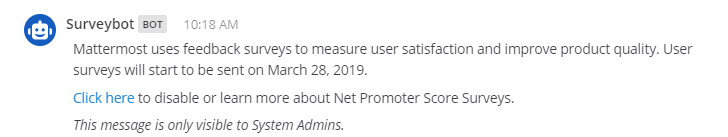
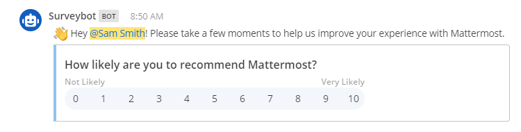

User Satisfaction Surveys
=========================

Mattermost introduced in-product feedback surveys from v5.12. Feedback is used to measure user satisfaction and improve product quality by hearing directly from users. Please refer to our `privacy policy <https://github.com/mattermost/mattermost-server/blob/master/build/PRIVACY_POLICY.md>`_ for more information on the collection and use of information received through our services.

.. contents::
  :depth: 2
  :local:
  :backlinks: entry

Administration
--------------

Is the survey enabled by default?
~~~~~~~~~~~~~~~~~~~~~~~~~~~~~~~~~

The user satisfaction survey is a pre-packaged plugin, and surveys are enabled by default on all servers. However, the plugin will not be activated on any servers that have `Error and Diagnostic Reporting <https://docs.mattermost.com/administration/telemetry.html>`_ disabled, meaning no surveys or data collection occurs.

How can surveys be disabled?
~~~~~~~~~~~~~~~~~~~~~~~~~~~~

Disabling the **User Satisfaction Surveys** plugin from **System Console > Plugins (Beta) > Plugin Management** will disable surveys and all data collection by the plugin. If surveys have been disabled from the plugin configuration in **System Console > Plugins (Beta) > User Satisfaction Surveys** but the plugin itself is still enabled, surveys will not be scheduled but users can still send written feedback by messaging Surveybot.

If the plugin or surveys in the plugin configuration are disabled, they will remain disabled for subsequent server upgrades.

When is the survey scheduled?
~~~~~~~~~~~~~~~~~~~~~~~~~~~~~

Users will receive surveys 21 days after every server upgrade, assuming the following conditions are true:

- User Satisfaction Surveys plugin is enabled in **System Console > Plugins (Beta) > Plugin Management**.
- Surveys are enabled in the plugin configuration in **System Console > Plugins (Beta) > User Satisfaction Surveys**.
- User account is greater than 21 days old.
- User has not completed a survey in the last 90 days.
- User has not been sent a survey in the last 90 days.
- Current server version is greater than the server version of the last survey, excluding dot releases.

The above conditions mean that at maximum frequency a user will receive a survey every 90 days, assuming the server is upgraded within that time period.

How will I be notified when a survey is scheduled?
~~~~~~~~~~~~~~~~~~~~~~~~~~~~~~~~~~~~~~~~~~~~~~~~~~

System Admins will receive an email notification and in-product Direct Message from "Surveybot" mentioning the scheduled date the survey will be triggered.

Survey Data
-----------

How is the survey received?
~~~~~~~~~~~~~~~~~~~~~~~~~~~

Once the survey is triggered on the server, all users will receive an in-product Direct Messages from "Surveybot" on their next login or page refresh in Mattermost.

Users can optionally select a 0-10 score on how likely they are to recommend Mattermost and then provide written feedback about their experience. Selecting a score and providing feedback are optional, and the survey can be ignored without interrupting usage of Mattermost.

What data is collected?
~~~~~~~~~~~~~~~~~~~~~~~

Data is only collected when a user selects a score or provides written feedback in response to survey questions. Please refer to our `privacy policy <https://github.com/mattermost/mattermost-server/blob/master/build/PRIVACY_POLICY.md>`_ for more information on the collection and use of information received through our services. The following **non-personally identifiable information** is collected:

- Survey information:
   - Score (0-10) submitted by the user
   - Written feedback submitted by the user (if applicable)
   - Timestamp of the survey submission
- Server information:
   - Server/Web App version the survey was submitted on
   - Installation date of the server
   - Diagnostic ID used for error and diagnostics reporting
   - License ID used for error and diagnostics reporting (if applicable)
   - E10 or E20 (if applicable)
- User information:
   - User role (System Admin, Team Admin, or member)
   - Account creation timestamp
   - User ID of the surveyed user

Will this data be sent through my firewall?
~~~~~~~~~~~~~~~~~~~~~~~~~~~~~~~~~~~~~~~~~~~

If Mattermost is hosted in a private network with firewall then data from the User Satisfaction Surveys plugin is not sent unless outbound connections are allowed or specifically configured for this plugin.
