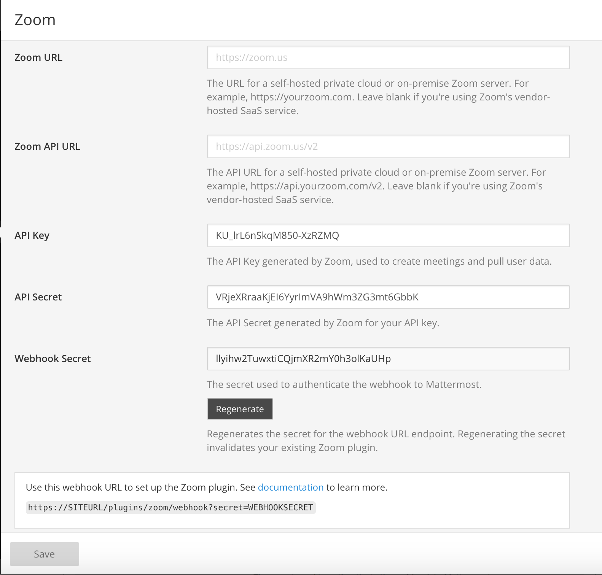
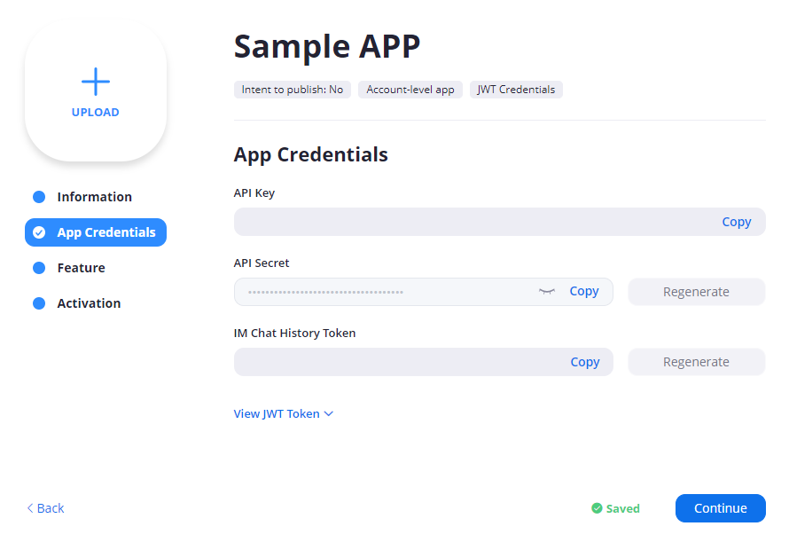
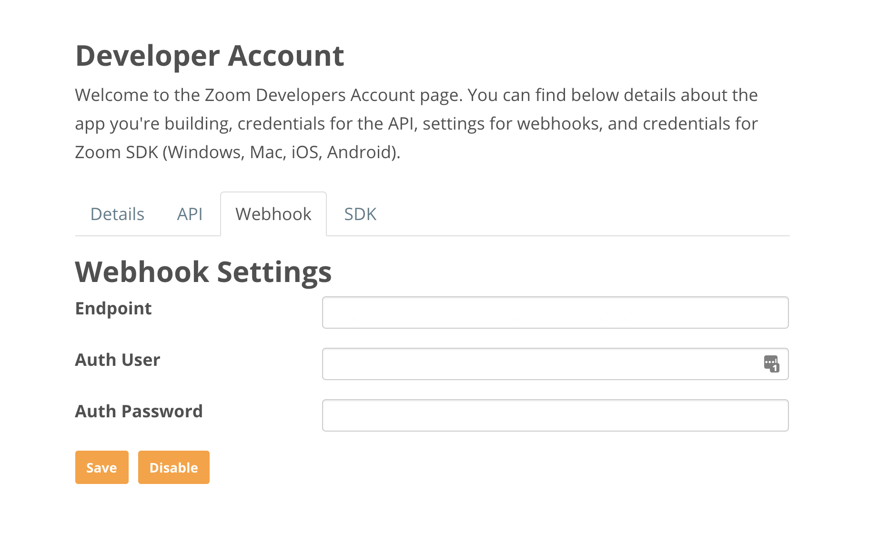
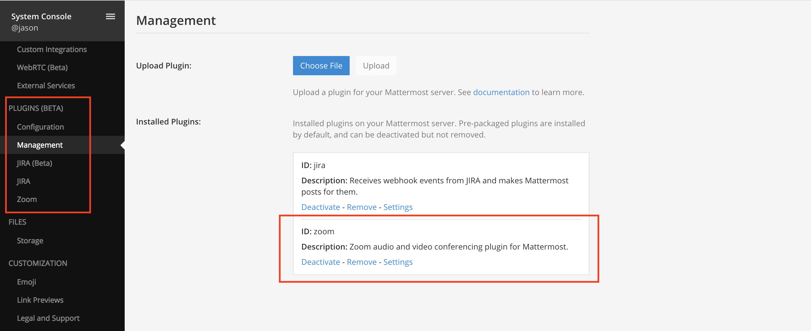

Zoom Plugin 
================================

Mattermost's open source `Zoom plugin <https://github.com/mattermost/mattermost-plugin-zoom>`_ enables users to start and join voice, video and screensharing meetings using either `Zoom <https://zoom.us/>`_'s self-hosted private cloud or on-prem solutions, or its vendor-hosted SaaS solution.

The plugin is installed by default and can be quickly activated. 

**Usage**

Once enabled, clicking a video icon in a Mattermost channel invites team members to join a Zoom call, hosted using the credentials of the user who initiated the call. 

.. image:: https://user-images.githubusercontent.com/177788/42196048-af54d2b8-7e30-11e8-80a0-5e160ae06f03.png

**Using other voice, video and screensharing services**
 
The `open source Zoom plugin <https://github.com/mattermost/mattermost-plugin-zoom>`_ can be extended to launch other voice, video and screensharing systems, including custom self-hosted services and vendor-hosted SaaS services such as Skype and Google Hangouts, depending on your needs. 

The following outlines the steps for enabling Zoom. 

Zoom Setup Guide
~~~~~~~~~~~~~~~~~

1. Go to **System Console > Plugins > Zoom** to configure the Zoom Plugin. 

2. If you're using a self-hosted private cloud or on-premise Zoom server, enter the **Zoom URL** and **Zoom API URL** for the Zoom server, for example ``https://yourzoom.com`` and ``https://api.yourzoom.com/v2`` respectively. Leave blank if you're using Zoom's vendor-hosted SaaS service.
3. Set the **API Key** and **API Secret** (see below). 

API Key and API Secret
.........................................

The **API Key** and **API Secret** are generated by Zoom and are used to create meetings and pull user data. To generate an **API Key** and **API Secret** requires a `Pro, Business, Education, or API Zoom plan <https://zoom.us/pricing>`_.

.. important::
  Only one paid account is required to generate an **API Key** and **API Secret**. The free Zoom plan can be used for other user accounts.

i. Go to https://developer.zoom.us/me/ and log in.
ii. Switch to the **API** tab and click **Enable**, if not already enabled.
iii. Switch back to the **API** tab and copy the **API Key** and **API Secret**.
iv. Paste the **API Key** and **API Secret** into the fields in the System Console.

Webhook Secret
.........................................

This is the Secret used to authenticate the webhook to Mattermost. Use the webhook URL to set up the 
Zoom webhook. Then hit **Save**.

5. The settings for `overriding usernames <https://docs.mattermost.com/administration/config-settings.html#enable-integrations-to-override-usernames>`_ and `profile picture icons <https://docs.mattermost.com/administration/config-settings.html#enable-integrations-to-override-profile-picture-icons>`_ need to be enabled.

6. Once these steps are done, activate the plugin at **System Console > Plugins > Management** by clicking **Activate**.

7. Once activated, you will see a video icon in the channel header. Clicking the icon will open a drop-down menu with three actions you can take: **Start Zoom Meeting Now**, **Start Zoom Meeting with Topic**, and **Share Zoom Meeting**.

.. image:: https://user-images.githubusercontent.com/177788/42196048-af54d2b8-7e30-11e8-80a0-5e160ae06f03.png

.. note::
   Users will need to sign-up for their own Zoom account using the same email address that they use for Mattermost. If the user attempts to start a Zoom meeting without a Zoom account, they will see the following error message: "We could not verify your Mattermost account in Zoom. Please ensure that your Mattermost email address matches your Zoom email address."
   In addition, the user must be added to the admin's Zoom account to quickly start a meeting without having to share a personal meeting ID.
  
