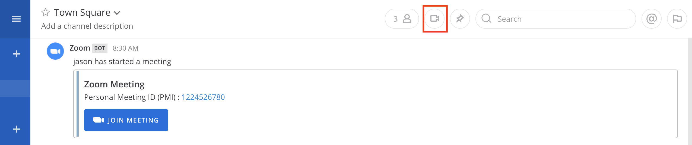

Zoom Plugin (Beta)
================================

With `Zoom integration <https://github.com/mattermost/mattermost-plugin-zoom>`_, Mattermost users can launch and join voice and video meetings without leaving 
the Mattermost interface. In addition to being able to customize Zoom, users can also extend the plugin 
to other video conferencing systems such as Skype and Google Hangouts.

`Zoom <https://zoom.us/>`_ is one of the world’s leading video and web conferencing services. This 
documentation includes instructions on how you can set up Zoom in Mattermost.

Zoom Setup Guide
~~~~~~~~~~~~~~~~~

1. The System Console settings live in **System Console > Plugins > Zoom**. This is where the admin can
configure Zoom for Mattermost.

.. image:: ../images/zoom_system_console.png

2. Set the Zoom API URL if you're using an on-premise Zoom server, for example, https://api.yourzoom.com/v2. Leave blank when not using an on-premise Zoom deployment.
3. Set the API Key and API Secret.

API Key and API Secret
.........................................

The API Key and API Secret are generated by Zoom and are used to create meetings and pull user data. To generate an API Key and API Secret:

.. important::
  Setting up the account in Zoom requires a Pro, Business, Education, or API Zoom plan.

i. Go to https://developer.zoom.us/me/ and login.
ii. Switch to the API tab and click **Enable**, if not already enabled.
iii. Switch back to the API tab and copy the API Key and API Secret.
iv. Paste the API Key and API Secret into the fields in the System Console.

.. image:: ../images/zoom_api_key.png

Webhook Secret
.........................................

This is the Secret used to authenticate the webhook to Mattermost. Use the webhook URL to set up the 
Zoom webhook. Then hit **Save**.

.. image:: ../images/zoom_webhook.png

4. The settings for `overriding usernames <https://docs.mattermost.com/administration/config-settings.html#enable-integrations-to-override-usernames>`_ and `profile picture icons <https://docs.mattermost.com/administration/config-settings.html#enable-integrations-to-override-profile-picture-icons>`_ need to be enabled.

5. Once these steps are done, activate the plugin at **System Console > Plugins > Management** by clicking **Activate**.

.. image:: ../images/zoom_system-console_management.png

6. Once activated, you will see a video icon in the channel header. Clicking the icon will open a drop-down menu with three actions you can take: **start meeting now**, **start meeting with topic**, and **share meeting**.

.. note::
   Users will need their own Zoom account with the associated email address matching their Mattermost email address if they wish to start a meeting. If the user attempts to start a Zoom meeting without a Zoom account, they will see the following error message: "We could not verify your Mattermost account in Zoom. Please ensure that your Mattermost email address matches your Zoom email address."
