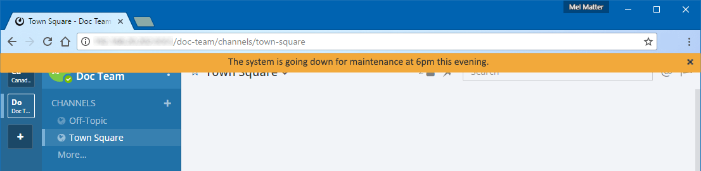

Announcement banner
===================

.. include:: ../_static/badges/ent-pro-cloud-selfhosted.rst
  :start-after: :nosearch:

*Available in legacy Mattermost Enterprise Edition E10 and E20*

System Admins can display a notice that's visible to all users on the system via an announcement banner. The announcement banner is disabled by default, so System Admins must first `enable this feature </configure/configuration-settings.html#enable-announcement-banner>`__ within the System Console or via the ``config.json`` file.

r or not users can dismiss the banner.

.. note::

   The announcement banner displays in Mattermost Channels, and is not visible in Playbooks, the Boards plugin, or other Mattermost integrations.

.. image:: ../images/announcement-banner.png
  :alt: System Admins can display an announcement banner at the top of the user's screen.

By default, users can dismiss the banner until they log in again or until you update the banner. You can `configure Mattermost to prevent users from dismissing the banner </configure/configuration-settings.html#allow-banner-dismissal>`__.

Update the banner by either changing the text of the banner or by re-enabling the banner after it's been disabled. You can also control the text color and the background color.

Configure an announcement banner
---------------------------------

1. Enable the announcement banner by going to **System Console > Site Configuration > Announcement Banner**, and setting **Enable Announcement Banner** to **true**.
2. In the **Banner Text** field, enter the text of the announcement that you want to make.
3. Specify the background and text colors for the banner.
4. To prevent users from dismissing the banner, set **Allow Banner Dismissal** to **false**.
5. Select **Save**.

To disable the banner, set **Enable Announcement Banner** to **false**.
