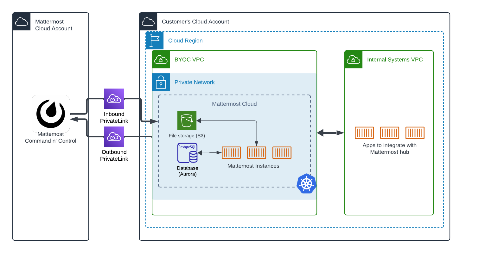

Cloud Dedicated Bring Your Own Key
===================================

.. include:: ../_static/badges/ent-cloud-dedicated.rst
   :start-after: :nosearch:

Bring Your Own Key (BYOK) provides Enterprise Cloud customers with autonomy over their encryption key life cycle. BYOK supports encryption at rest with custom KMS keys that the enterprise provides and maintains.

BYOK requires a subscription to Mattermost Cloud Enterprise Dedicated, which offers enhanced data security and compliance by ensuring that enterprises have full control over their data encryption processes.

In Mattermost Cloud Enterprise Dedicated, you can use KMS keys in 2 ways:

- One KMS key for all services; or,
- Per-service KMS keys (EBS, RDS, S3)
    - Keys do not need to be unique to each service.
    - All services must be encrypted at rest.
    - Selective enablement of this feature can be supported.
    - In cases where a global database is needed, we recommend providing 2 KMS keys (1 per region).

Why use BYOC?
--------------

Consider using BYOC with :doc:`Mattermost Cloud Dedicated </about/cloud-dedicated>` if you have specific business needs or project requirements. There are a few major reasons to use BYOC:

- **Compliance**: If you have strict regulatory requirements or special compliance requirements, BYOC may will be the best option for you.
- **Network auditing**: If you require the visibility of all traffic within any VPC you operate in, or need frequent auditing capabilities, BYOC is potentially a good fit.
- **Fine-grained network control**: BYOC only requires specific network access (non-internet accessible) for Mattermost (for example, service management or troubleshooting) to deploy and manage the Mattermost instance, otherwise allowing you to customize your network to meet any internal requirements or requirements of your customers.
- **Cost optimization**: Depending on your cloud provider, with BYOC you can use cost savings plans, committed use discounts, or other strategies to save on compute and storage infrastructure costs related to the Mattermost instance.

Who is eligible for BYOC?
-------------------------

To be eligible for BYOC, you must:

- Use Amazon Web Service (AWS) or Azure
- Have a committed deal with Mattermost
- Have at least Mattermost Enterprise Support

Standard BYOC architecture
--------------------------

The standard BYOC deployment requires the organization to create a Virtual Private Cloud (BYOC VPC) dedicated to Mattermost-managed instances within a cloud region they want to operate in. Mattermost accesses this VPC through VPC PrivateLink for inbound and outbound traffic or VPC peering in order to manage the Mattermost instance. Organizations can integrate with their services using standard VPC peering techniques.

Configure BYOK
---------------

1. Enterprise customer provides their AWS KMS ARN to the Mattermost Infrastructure SRE team.
2. Enterprise customer adds the following blocks to their KMS Policy for the AWS KMS ARN provided:

.. code-block:: JSON

    {
        "Sid": "Allow use of the key",
        "Effect": "Allow",
        "Principal": {
            "AWS": "arn:aws:iam::<MATTERMOST_AWS_ACCOUNT_ID>:user/mattermost-cloud-<environment>-provisioning-<VPC_ID>"
        },
        "Action": [
            "kms:Encrypt",
            "kms:Decrypt",
            "kms:ReEncrypt*",
            "kms:GenerateDataKey*",
            "kms:DescribeKey"
        ],
        "Resource": "<CUSTOM_CUSTOMER_KMS_ID>"
    },
    {
        "Sid": "Allow use of the key role nodes",
        "Effect": "Allow",
        "Principal": {
            "AWS": "arn:aws:iam::<MATTERMOST_AWS_ACCOUNT_ID>:role/nodes.<CLUSTER_ID>-kops.k8s.local"
        },
        "Action": [
            "kms:Encrypt",
            "kms:Decrypt",
            "kms:ReEncrypt*",
            "kms:GenerateDataKey*",
            "kms:DescribeKey"
        ],
        "Resource": "<CUSTOM_CUSTOMER_KMS_ID>"
    },

3. The Mattermost Infrastructure SRE team updates the kops cluster and S3, RDS resources after the KMS policy is updated on the customer's end.

Alternatively, the Enterprise customer can provide an external key (non-KMS) to the Mattermost Infrastructure SRE team that Mattermost maintains on behalf of the customer.
This path offers less control to customers but simplifies the setup process.

Requirements
~~~~~~~~~~~~~

- Customers must own their AWS Account. (In the alternative path mentioned above this is delegated to Mattermost.)
- Customers oversee the maintenance life cycle of their custom KMS key.
- A valid AWS KMS ARN for encrypting storage and databases should be provided to the Infrastructure SRE team.
- The customer should incorporate the provided policy blocks from the Infrastructure SRE team into their KMS key policy.

Considerations
~~~~~~~~~~~~~~~

- Changing the AWS KMS key in the database necessitates downtime due to AWS Aurora's encryption `limitations. <https://repost.aws/knowledge-center/update-encryption-key-rds>`_
- Proper communication is essential for setting expectations and scheduling changes.

Conclusion
-----------

If you are a large enterprise with compliance requirements, or are working in highly-regulated industries, using Mattermost Cloud Dedicated with BYOK ensures full data control.

For any further assistance or queries, talk to a `Mattermost Expert <https://mattermost.com/contact-sales/>`_
