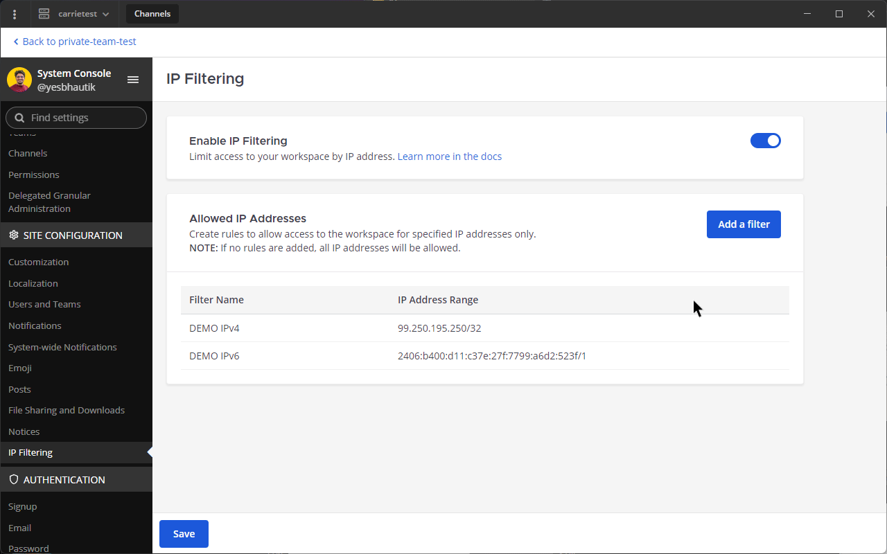

Cloud IP Filtering
========================

.. include:: ../_static/badges/ent-cloud-only.rst
   :start-after: :nosearch:

IP filtering is a powerful security feature that allows system admins to control access to their workspace by defining approved IP ranges. Only users within these specified IP ranges can access the workspace, ensuring enhanced security for your workspace. IP filtering requires a subscription to Mattermost Cloud Enterprise.

Configure IP filtering
------------------------

1. **Log in as System Admin**: Access the System Console of your workspace, ensuring your user is a system admin.
2. **Go to Site Configuration**: Once logged in, go to the **Site Configuration** section.
3. **Access IP Filtering Settings**: Under **Site Configuration**, select **IP Filtering** to access the IP Filtering settings.

   .. image:: ../images/system-console-ip-filtering.png
      :alt: An example of the System Console interface where admins can configure IP filtering.

About CIDR notation
----------------------------

CIDR (Classless Inter-Domain Routing) notation is used to specify a range of IP addresses. It consists of an IP address followed by a forward slash and a number indicating the network's prefix length. For example:

- ``192.168.0.0/24`` represents the IP range from ``192.168.0.0`` to ``192.168.0.255``.
- The ``/24`` signifies that the first 24 bits are the network address, leaving 8 bits for host addresses.

.. tip::

   For a more in-depth explanation of CIDR notation, refer to `this article </https://aws.amazon.com/what-is/cidr/>`__.

Configure IP filters
------------------------

Enable/disable IP filtering
~~~~~~~~~~~~~~~~~~~~~~~~~~~~~~~~

System admins have the option to enable or disable IP filtering:

- **Enable:** To activate IP filtering, ensure at least one IP range is added to the whitelist.
- **Disable:** Temporarily disable IP filtering by removing all IP ranges from the whitelist, or by flipping the global IP Filtering toggle in the System Console.

Add an IP range
~~~~~~~~~~~~~~~~~~~~~~~

To add an IP range to the whitelist, follow these steps:

1. Select the **Add Filter** button within the IP Filtering settings page in the System Console.
2. Enter the IP range using CIDR notation. For example, ``192.168.1.0/24``.
3. Provide a descriptive name or label for the IP range to ease identification in the future.
4. Save the changes.

.. note::

   The System Console will restrict you from saving changes if the IP address you are accessing your workspace on is not within the ranges you have specified at the time you save your changes.

   .. image:: ../images/ip-address-not-in-filters.png
      :alt: An example of the Mattermost System Console blocking changes to IP filtering.

Edit or remove an existing IP range
~~~~~~~~~~~~~~~~~~~~~~~~~~~~~~~~~~~~

To edit or remove an existing IP range from the whitelist:

1. Locate the IP range you want to modify within the **IP Filtering** settings.
2. Hover over the rule you'd like to edit or delete, and select the respective edit or delete option beside the IP range.
3. Make necessary changes or confirm the removal of the IP range.
4. Save your changes by selecting **Save**.

Unable to access your workspace?
~~~~~~~~~~~~~~~~~~~~~~~~~~~~~~~~

If you are unable to access your workspace due to previously set IP filters, and you need to regain access to your workspace, your workspace owner can:

1. Log in to the `Mattermost Customer Portal <https://customers.mattermost.com/>`__.
2. Select the **IP Filtering** menu item in the left hand side bar.
3. Select **Disable IP Filtering**.

.. note::

   Going through this process will disable **all** existing rules applied to your workspace. This means that any IP address will now be able to access it.

Conclusion
--------------

By configuring IP filters using CIDR notation, system admins can effectively manage access to the workspace, enhancing security by allowing access only from specified IP ranges.

For any further assistance or queries, `contact our support team </https://mattermost.com/support/>`__.
