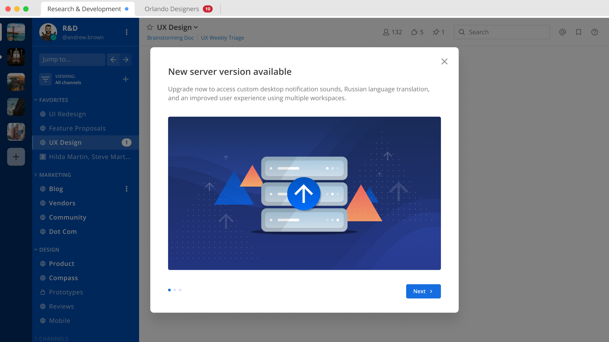
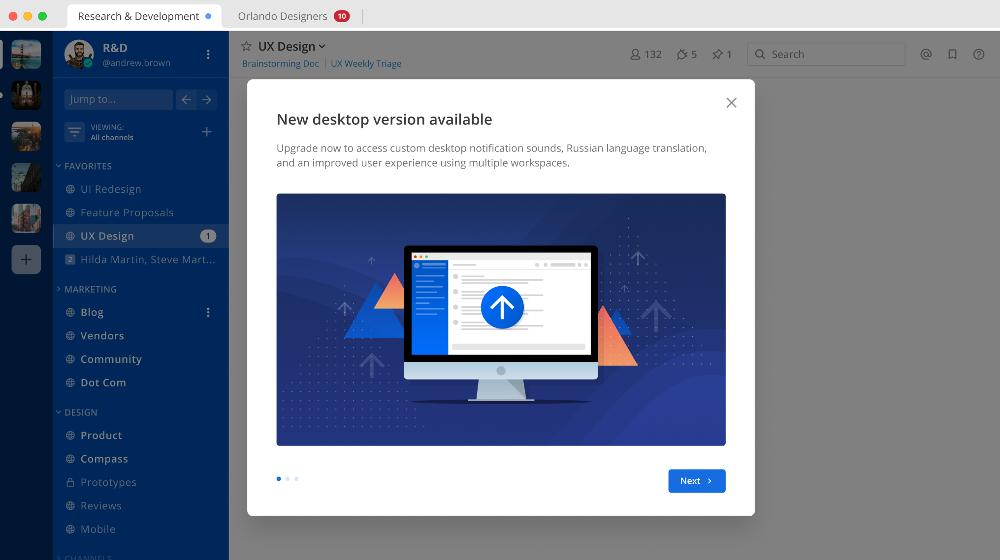
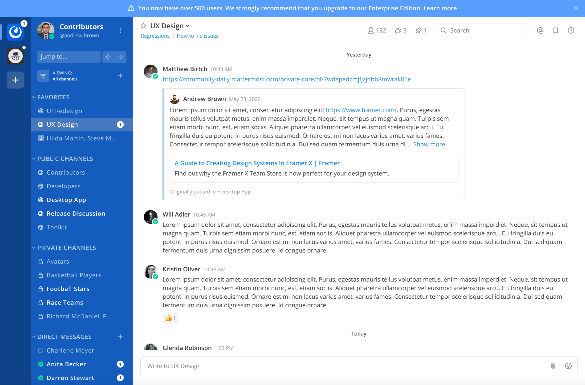
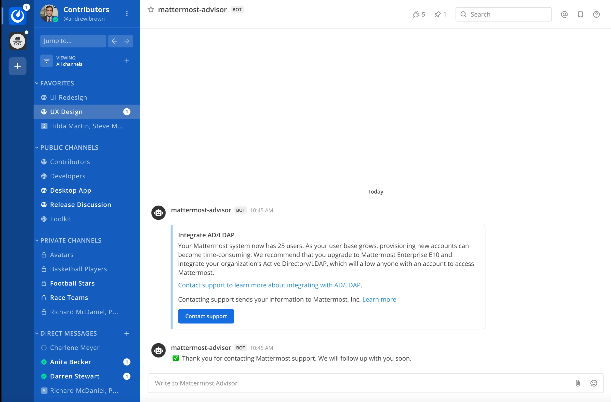

In-Product Notices
==================

Mattermost in-product notices keep users and administrators informed of the newest product improvements, features, and releases.

.. contents::
  :local:

Administrator notices
---------------------

Administrator notices inform System Admins when a new server version is available, when external dependencies are being deprecated, or when server upgrades are recommended due to ending support life cycles. System Admins may also receive notices about recommended server configuration options to optimize the user experience of their deployment.

Administrator notices can be disabled in the **System Console > Notices** page.

End user notices
----------------

End user notices are used to inform users and Admins of new feature enhancements and when new desktop versions are available. They can be disabled in **System Console > Notices**.

Frequently Asked Questions (FAQs)
~~~~~~~~~~~~~~~~~~~~~~~~~~~~~~~~~

Are notices enabled by default?
^^^^^^^^^^^^^^^^^^^^^^^^^^^^^^^

Notices are enabled by default for all Mattermost users. System Admins may choose to disable administrator or end user notices in **System Console > Notices**.

Will I still receive notices if my server is air-gapped?
^^^^^^^^^^^^^^^^^^^^^^^^^^^^^^^^^^^^^^^^^^^^^^^^^^^^^^^^

No, the Mattermost server requires a connection to the internet to receive notices.

How often will users receive notices?
^^^^^^^^^^^^^^^^^^^^^^^^^^^^^^^^^^^^^

Notices will be used to raise awareness of new features as part of our monthly release cadence. Users will only receive notices that specifically apply to them. For example, if a user is already running the latest Desktop App version, they will not receive an upgrade notice.

Admin Advisor notices
---------------------

Admin Advisor notices are designed to provide guidance and assist in choosing features to support your deployment as it scales.

.. note::
  Admin Advisor notices are disabled in v5.35 and later.

When these notices are triggered, System Admins receive a bot message notification and, for larger instances, a dismissable daily banner with quick access to contact support. The notices are triggered based on usage, such as the number of registered users, posts, or channels in your deployment reaching a predefined threshold.

System Admins can optionally contact support for additional assistance. There are also links to useful resources for user management and provisioning to support large systems.

Managing Admin Advisor notices
~~~~~~~~~~~~~~~~~~~~~~~~~~~~~~

The Admin Advisor notices are run on a schedule based on specific triggers.

- Selecting **Contact us** in the Admin Advisor banner dismisses the banner notification. In addition, contact information such as the email address and name associated with your Mattermost account is sent to us, so we can contact you as requested and to help us better understand your needs. The number of registered users on your system, the site URL, and a Mattermost diagnostic server ID number are also sent to us to better understand your environment and hence provide more tailored support.
- Selecting **Acknowledge** in the Admin Advisor banner closes the advisory and does not send your details to Mattermost.
- Closing the notification bot removes the conversation from your Direct Messages list.

We welcome your feedback on this feature. Please visit `our forum <https://forum.mattermost.org/t/new-admin-advisor-notifications-in-mattermost-v5-26/10263/6>`_ if you have any questions or feedback.
