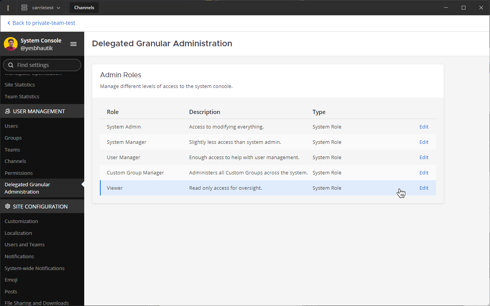

Statistics
==========

Statistics on users, posts, and channels are tracked for each system and team. Enterprise Editions have access to advanced system statistics.

.. note::

  To maximize performance for large Enterprise deployments, statistics for total posts, total hashtag posts, total file posts, posts per day, and active users with posts per day are disabled. You can re-enable them by changing the ``MaxUsersForStatistics`` value `in config.json <https://docs.mattermost.com/configure/configuration-settings.html#maximum-users-for-statistics>`__.

For advanced metrics for Enterprise deployments, `see performance monitoring documentation to learn more <https://docs.mattermost.com/scale/performance-monitoring.html>`__.

Site Statistics
---------------

|all-plans| |self-hosted|

.. |all-plans| image:: ../images/all-plans-badge.png
  :scale: 30
  :target: https://mattermost.com/pricing
  :alt: Available in Mattermost Free and Starter subscription plans.

.. |self-hosted| image:: ../images/self-hosted-badge.png
  :scale: 30
  :target: https://mattermost.com/deploy
  :alt: Available for Mattermost Self-Hosted deployments.

System statistics are viewable under **System Console > Reporting**. The data shown here is a cumulative sum across all teams on the system.

Total Users
    The total number of active accounts created on your system. Excludes deactivated accounts.

Total Teams
    The total number of teams created on your system.

Total Channels
    The total number of public channels and private channels created in all the teams on your system, including deleted channels. Doesn't include direct message channels.

Total Posts
    The total number of posts made in all the teams on your system, including deleted posts and posts made using automation.

Daily Active Users
  The total number of users who viewed the Mattermost site in the last 24 hours. Excludes bot users as of v5.14.

Monthly Active Users
  The total number of users who viewed the Mattermost site in the last 30 days. Excludes bot users as of v5.14.

Total Posts (graph)
    The total number of posts made on a certain day in all the teams on your system, including deleted posts and posts made using automation.

Total Posts from Bots (graph)
    The total number of posts made by a `bot account <https://developers.mattermost.com/integrate/admin-guide/admin-bot-accounts/>`_ on a certain day in all the teams on your system, including deleted posts and posts made using automation.

Active Users with Posts (graph)
    Users who made a post on a certain day in all the teams on your system, including system messages posted from the user's account.

Advanced system statistics
~~~~~~~~~~~~~~~~~~~~~~~~~~

|enterprise| |self-hosted|

.. |enterprise| image:: ../images/enterprise-badge.png
  :scale: 30
  :target: https://mattermost.com/pricing
  :alt: Available in the Mattermost Enterprise subscription plan.

.. |self-hosted| image:: ../images/self-hosted-badge.png
  :scale: 30
  :target: https://mattermost.com/deploy
  :alt: Available for Mattermost Self-Hosted deployments.

Mattermost Enterprise includes additional system statistics.

Total Sessions
    The number of active user sessions connected to your system. Expired sessions are not counted.

Total Commands
    The number of active slash commands currently set up on your system. Slash commands that are created and then removed in the **Integrations** menu are not counted.

Incoming Webhooks
    The number of active incoming webhooks currently setup on your system. Incoming webhooks that are created and then removed in the **Integrations** menu are not counted.

Outgoing Webhooks
    The number of active outgoing webhooks currently set up on your system. Outgoing webhooks that are created and then removed in the **Integrations** menu are not counted.

WebSocket Conns
    The number of active WebSocket connections currently on your server.

Master DB Conns
    The number of active connections currently on your master database.

Replica DB Conns
    The number of active connections currently on one or more of `your read replica databases <https://docs.mattermost.com/scale/high-availability-cluster.html#database-configuration>`__.

Channel Types
    This chart displays the number of public channels and private channels in a visual format, including channels that might have been deleted.

Posts, Files and Hashtags
    This chart displays the number of posts containing files, hashtags, or only text. Posts containing both files and hashtags are counted in both categories, and deleted posts are included.

Team Statistics
---------------

|all-plans| |self-hosted|

.. |all-plans| image:: ../images/all-plans-badge.png
  :scale: 30
  :target: https://mattermost.com/pricing
  :alt: Available in Mattermost Free and Starter subscription plans.

.. |self-hosted| image:: ../images/self-hosted-badge.png
  :scale: 30
  :target: https://mattermost.com/deploy
  :alt: Available for Mattermost Self-Hosted deployments.

Team Statistics are viewable under **System Console > Team Statistics**. The data shown here is a cumulative sum across this team only, and excludes posts made in Direct Message channels, which are not tied to a team.

Total Users
    The total number of active accounts on this team. Excludes deactivated accounts.

Public Channels
    The number of public channels created in this team. Excludes deleted channels.

Private Channels
    The number of private channels created in this team. Excludes deleted channels.

Total Posts
    The total number of posts made in this team, including deleted posts and posts made using automation. Excludes posts made in Direct Message channels, which are not tied to a team.

Total Posts (graph)
    The total number of posts made on a certain day in this team, including deleted posts and posts made using automation.

Active Users with Posts (graph)
    Users who made a post on a certain day in this team, including system messages posted from the user's account.

Recent Active Users
    Twenty most recent users who have logged in and had recent browser activity in Mattermost.

Newly Created Users
    Most recent users who have joined the team.

Troubleshooting/FAQ
-------------------

I see an error: "Not enough data for a meaningful representation"
~~~~~~~~~~~~~~~~~~~~~~~~~~~~~~~~~~~~~~~~~~~~~~~~~~~~~~~~~~~~~~~~~

If the statistics page is loading endlessly and you get an error message saying "Not enough data for a meaningful representation", check whether you're using an ad blocker. An ad blocker can prevent this page from loading data. To test this, temporarily disable your ad blocker, or view the page in a browser without an ad blocker installed.

Can Team Admins review their own team's statistics?
~~~~~~~~~~~~~~~~~~~~~~~~~~~~~~~~~~~~~~~~~~~~~~~~~~~

|enterprise| |self-hosted|

.. |enterprise| image:: ../images/enterprise-badge.png
  :scale: 30
  :target: https://mattermost.com/pricing
  :alt: Available in the Mattermost Enterprise subscription plan.

.. |self-hosted| image:: ../images/self-hosted-badge.png
  :scale: 30
  :target: https://mattermost.com/deploy
  :alt: Available for Mattermost Self-Hosted deployments.

Yes. In Mattermost Enterprise, you can enable Team Admins to see their team's statistics by modifying available System Admin roles. Learn more about System Admin roles, including how to manage privileges and assign roles, in the `Additional System Admin Roles <https://docs.mattermost.com/onboard/system-admin-roles.html>`__ documentation.

To enable Team Admins to access their team's statistics:

1. Go to **System Console > User Management > System Roles**, then edit the **Viewer** System Admin role. 

2. Under **Privileges**, expand the **Reporting** section, set **Team Statistics** to **Read only**, then set **Site Statistics** and **Server Logs** to **No access**.

3. Set all other privileges to **No access** to restrict all users with the **Viewer** role to access only the **Team Statistics** page in the System Console.   

4. Under **Assigned People**, select **Add People** to assign Team Admins to the **Viewer** role, and enable them to access their team's statistics.

5. Select **Save**.

.. note::

    System Admins must manually add people to or remove people from the **Viewer** System Admin role to address Team Admin changes, such as promotions or demotions.
