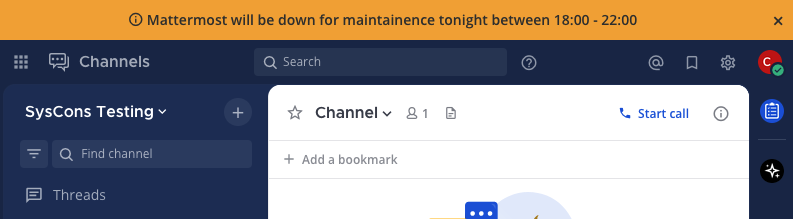

System-wide notifications
=========================

.. include:: ../_static/badges/ent-pro-cloud-selfhosted.rst
  :start-after: :nosearch:

.. raw:: html

 
Also available in legacy Mattermost Enterprise Edition E10 or E20

System admins can make system-wide notifications visible to all users across all teams that displays at the top of the Mattermost interface. System-wide notifications are disabled by default, so admins must first :ref:`enable this feature <configure/site-configuration-settings:enable system-wide notifications>` within the System Console or via the ``config.json`` file.

.. image:: ../images/announcement-banner-1106x272.png
  :width: 1106
  :height: 272
  :alt: An example of system-wide notification in Mattermost that tells all users that the system will be going down for maintenance later that evening. System admins enable the banner and customize the text to display, as well as configure whether or not users can dismiss the banner.

.. note::

   The announcement banner displays in Mattermost Channels, but isn't visible in collaborative playbooks, boards, or Mattermost integrations.

By default, users can dismiss the banner until they log in again or until you update the banner. Admins can :ref:`configure Mattermost to prevent users from dismissing the banner <configure/site-configuration-settings:allow banner dismissal>`.

Update the banner by either changing the text of the banner or by re-enabling the banner after it's been disabled. You can also control the text color and the background color.

Configure system-wide notifications
------------------------------------

1. Enable system-wide notifications by going to **System Console > Site Configuration > System-wide notifications**, and setting **Enable system-wide notifications** to **true**.
2. In the **Banner Text** field, enter the text of the notification that you want to share with all users.
3. Specify the background and text colors for the banner.
4. To prevent users from dismissing the banner, set **Allow Banner Dismissal** to **false**.
5. Select **Save**.

To disable the banner, set **Enable Announcement Banner** to **false**.
