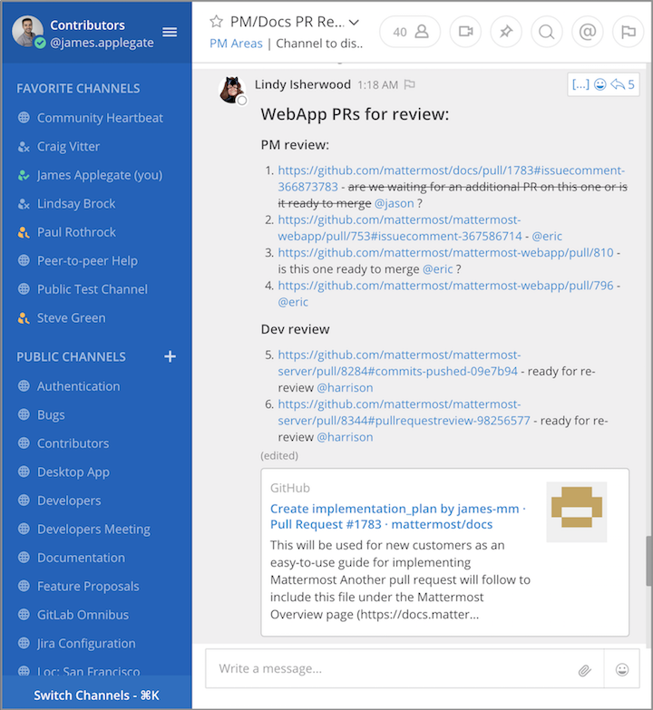
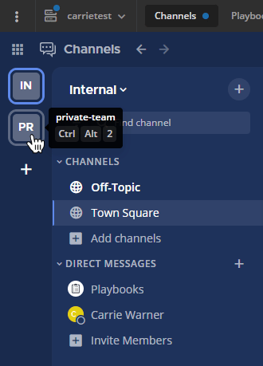
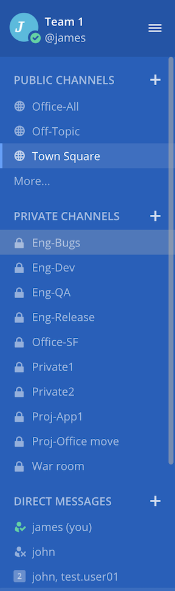
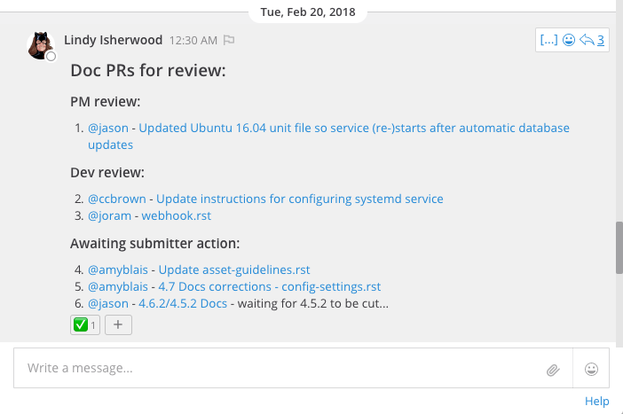

About Teams, Channels, and Messages
===================================

This is a what a typical Mattermost workspace looks like: 

To understand how Mattermost works, here are the three main parts of Mattermost:

- Teams
- Channels
- Messages

Teams
-----

A team is a digital workspace where you and your teammates can collaborate in Mattermost. Depending on how Mattermost is set up in your organization, you can belong to one team or multiple teams.

You have the ability to switch back and forth between teams on the Team Sidebar, located on the upper left side of the app.

Channels
--------

Channels are used to organize conversations across different topics. They are located on the left-hand panel of Mattermost. 

There are three types of channels: Public Channels, Private Channels, and Direct Messages.

Public Channels
~~~~~~~~~~~~~~~

Public Channels are open to everyone on a team. New team members are automatically added to two Public Channels when they sign up: Town Square and Off-Topic.

Public Channels are identified with a **globe icon**.

Select the **More...** button at the bottom of the Public Channels section to explore more channels to join!

Private Channels
~~~~~~~~~~~~~~~~

Private Channels are for sensitive topics and are only visible to selected team members. Any member of a Private Channel can add additional members. Channel members can choose to leave at any time, and any member of a Private Channel can remove other members from the channel. 

Private Channels are identified with a **lock icon**.

Direct and Group Messages
~~~~~~~~~~~~~~~~~~~~~~~~~

Direct Messages (DMs) are for conversations between two people. Group Messages (GMs) are Direct Messages that have conversations among three or more people. Both are visible only to the people involved.

See `Organizing conversations <https://docs.mattermost.com/help/getting-started/organizing-conversations.html>`__ for more information on Channels and how to manage them. 

Messages
--------

Sending messages and replying to messages are important ways to keep conversations active with your team. You can edit and delete messages after you have sent them. You can also share links to any message in Mattermost.

In this example, a release manager is notifying teams about an upcoming release and confirming outstanding tasks:

Since messaging is at the core of your Mattermost application, below are other examples of what you can do:

- `Mention teammates so they get notified <https://docs.mattermost.com/help/messaging/mentioning-teammates.html>`__
- `Formatting text (styling, emojis, code, and so on) <https://docs.mattermost.com/help/messaging/formatting-text.html>`__
- `Share files <https://docs.mattermost.com/help/messaging/attaching-files.html>`__
- `Execute commands <https://docs.mattermost.com/help/messaging/executing-commands.html>`__
- `Save <https://docs.mattermost.com/help/messaging/flagging-messages.html>`__ and `pin <https://docs.mattermost.com/help/messaging/pinning-messages.html>`__ messages
- `Keyboard shortcuts <https://docs.mattermost.com/help/messaging/keyboard-shortcuts.html>`__

See `Messaging <https://docs.mattermost.com/guides/user.html#messaging>`__ for a complete list of messaging basics with instructions.