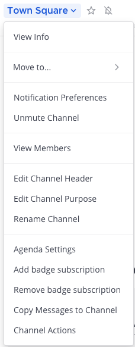
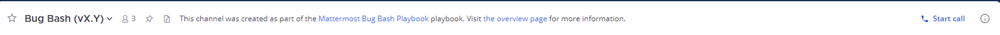
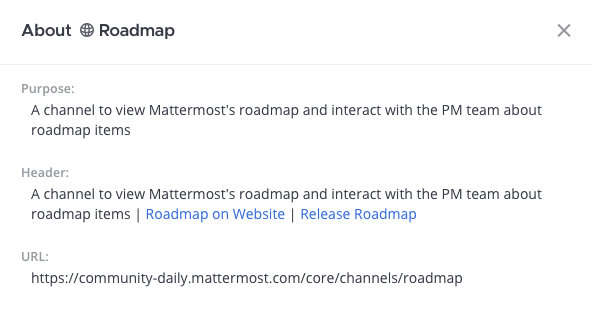

Set Channel Preferences
=======================

|all-plans| |cloud| |self-hosted|

.. |all-plans| image:: ../images/all-plans-badge.png
  :scale: 30
  :target: https://mattermost.com/pricing
  :alt: Available in Mattermost Free and Starter subscription plans.

.. |cloud| image:: ../images/cloud-badge.png
  :scale: 30
  :target: https://mattermost.com/download
  :alt: Available for Mattermost Cloud deployments.

.. |self-hosted| image:: ../images/self-hosted-badge.png
  :scale: 30
  :target: https://mattermost.com/deploy
  :alt: Available for Mattermost Self-Hosted deployments.

For each channel you belong to, you can set notification preferences as well as the channel's header, purpose, and name. Select the channel name at the top of the screen to access channel-specific settings.

Channel notification preferences
--------------------------------

Change the following channel notification settings by selecting **Notification Preferences**.

Mute channel
~~~~~~~~~~~~~

Muting turns off desktop, email, and push notifications for a channel, and the channel will only be marked as unread in the channel sidebar if you're mentioned. To mute the current channel and disable notifications, select **Mute Channel** from the channel name at the top of the screen. By default, all channels are unmuted.

.. tip::

  Quickly mute or unmute any channel any time by selecting **Mute Channel** or **Unmute Channel** from the channel name at the top of the screen, or by selecting **More Options** for a channel in the Channel Sidebar.

Ignore mentions for @channel, @here and @all
~~~~~~~~~~~~~~~~~~~~~~~~~~~~~~~~~~~~~~~~~~~~

By default, you'll receive mention notifications every time someone on your team `mentions an entire channel <https://docs.mattermost.com/messaging/mentioning-teammates.html>`__ using ``@channel``, ``@all``, or ``@here``. 

To stop receiving mention notifications, enable the **Ignore mentions for @channel, @here and @all** option, then select **Save**. When enabled, mention notifications for channel-wide mentions are ignored, but the channel is marked as unread unless the channel is muted. 

Send desktop notifications
~~~~~~~~~~~~~~~~~~~~~~~~~~

By default, your `desktop notification preferences <https://docs.mattermost.com/messaging/manage-channels-settings.html#desktop-notifications>`__ configured in **Settings** apply to all channels. Desktop notifications are available on Edge, Firefox, Safari, Chrome, and `Mattermost Desktop Apps <https://mattermost.com/download/#mattermostApps>`__.

To customize desktop notifications per channel, edit **Send desktop notifications**, choose one of the following options, then select **Save**:

+---------------------------+--------------------------------------------------------------------------------------------------------------------------------------------------------------------------------------------------------------------------------------------------+
| **Notification Option**   | **You'll receive...**                                                                                                                                                                                                                            |
+===========================+==================================================================================================================================================================================================================================================+
| **Global default (None)** | Desktop notifications based on your `Settings <https://docs.mattermost.com/messaging/manage-channels-settings.html>`__ configuration.                                                                                                            |
+---------------------------+--------------------------------------------------------------------------------------------------------------------------------------------------------------------------------------------------------------------------------------------------+
| **For all activity**      | Desktop notifications for every new message.                                                                                                                                                                                                     |
+---------------------------+--------------------------------------------------------------------------------------------------------------------------------------------------------------------------------------------------------------------------------------------------+
| **Only for mentions**     | - Desktop notifications for @mentions only.                                                                                                                                                                                                      |
|                           | - When you've `enabled Collapsed Reply Threads <https://docs.mattermost.com/messaging/manage-channels-settings.html#collapsed-reply-threads-beta>`__, receive reply thread notifications by enabling **Notify me about threads I'm following**.  |
+---------------------------+--------------------------------------------------------------------------------------------------------------------------------------------------------------------------------------------------------------------------------------------------+
| **Never**                 | No desktop notifications.                                                                                                                                                                                                                        |
+---------------------------+--------------------------------------------------------------------------------------------------------------------------------------------------------------------------------------------------------------------------------------------------+

Send mobile push notifications
~~~~~~~~~~~~~~~~~~~~~~~~~~~~~~

Mattermost push notifications `must be enabled <https://docs.mattermost.com/configure/configuration-settings.html#enable-push-notifications>`__ by a System Admin. Once enabled, your `mobile push notification preferences <https://docs.mattermost.com/messaging/manage-channels-settings.html#mobile-push-notifications>`__ configured in **Settings** apply to all channels by default.

To customize mobile push notifications per channel, edit **Send mobile push notifications**, choose one of the following options, then select **Save**:

+------------------------------+--------------------------------------------------------------------------------------------------------------------------------------------------------------------------------------------------------------------------------------------------+
| **Notification option**      | **You'll receive...**                                                                                                                                                                                                                            |
+==============================+==================================================================================================================================================================================================================================================+
| **Global default (Mention)** | Mobile notifications based on your `Settings <https://docs.mattermost.com/messaging/manage-channels-settings.html>`__ configuration.                                                                                                             |
+------------------------------+--------------------------------------------------------------------------------------------------------------------------------------------------------------------------------------------------------------------------------------------------+
| **For all activity**         | Mobile notifications for every new message.                                                                                                                                                                                                      |
+------------------------------+--------------------------------------------------------------------------------------------------------------------------------------------------------------------------------------------------------------------------------------------------+
| **Only for mentions**        | - Mobile notifications for @mentions only.                                                                                                                                                                                                       |
|                              | - When you've `enabled Collapsed Reply Threads <https://docs.mattermost.com/messaging/manage-channels-settings.html#collapsed-reply-threads-beta>`__, receive reply thread notifications by enabling **Notify me about threads I'm following**.  |
+------------------------------+--------------------------------------------------------------------------------------------------------------------------------------------------------------------------------------------------------------------------------------------------+
| **Never**                    | No desktop notifications.                                                                                                                                                                                                                        |
+------------------------------+--------------------------------------------------------------------------------------------------------------------------------------------------------------------------------------------------------------------------------------------------+

Channel header
--------------

A channel header refers to text that displays under a channel name at the top of the screen. A channel header can be up to 1024 characters in length and is often used to summarize the channel's focus or to provide links to frequently accessed documents, tools, or websites. 

Change the channel header by selecting **Edit Channel Header**. You can use Markdown to `format channel header text <https://docs.mattermost.com/messaging/formatting-text.html>`__ using the same Markdown for messages. Any channel member can change a channel header, unless the System Admin has `restricted permissions to do so <https://docs.mattermost.com/configure/configuration-settings.html#enable-public-channel-renaming-for>`__.

Channel purpose
---------------

A channel purpose refers to text that displays when users select **View Info** for a channel. A channel purpose can be up to 250 characters in length and is often used to help users decide whether to join the channel. 

Change the channel purpose by selecting **Edit Channel Purpose**. Any channel member can change a channel purpose, unless the System Admin has `restricted permissions to do so <https://docs.mattermost.com/configure/configuration-settings.html#enable-public-channel-renaming-for>`__.

Channel name
------------

A channel name must be at least two characters, and can be up to 64 characters in length. `Some unicode characters <https://www.w3.org/TR/unicode-xml/#Charlist>`_ aren't supported.

Change the channel name by selecting **Rename Channel**. Changing the name of the channel also changes the channel URL. Any channel member can change a channel name, unless the System Admin has `restricted permissions to do so <https://docs.mattermost.com/configure/configuration-settings.html#enable-public-channel-renaming-for>`__.