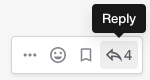

Channels Basics
================

|all-plans| |cloud| |self-hosted|

.. |all-plans| image:: ../images/all-plans-badge.png
  :scale: 30
  :target: https://mattermost.com/pricing
  :alt: Available in Mattermost Free and Starter subscription plans.

.. |cloud| image:: ../images/cloud-badge.png
  :scale: 30
  :target: https://mattermost.com/deploy
  :alt: Available for Mattermost Cloud deployments.

.. |self-hosted| image:: ../images/self-hosted-badge.png
  :scale: 30
  :target: https://mattermost.com/deploy
  :alt: Available for Mattermost Self-Hosted deployments.

**Write messages** using the text input box at the bottom of the screen. Press ENTER to send a message. Use SHIFT+ENTER to create a new line without sending a message. To send messages on CTRL+ENTER and use ENTER to insert new lines go to **Settings > Advanced > Send messages on CTRL/CMD+ENTER**.

**Reply to messages** by clicking the reply arrow next to the message text.

**Notify teammates** when they are needed by typing ``@username``.

**Format your messages** using Markdown that supports text styling, headings, links, emojis, code blocks, block quotes, tables, lists, and in-line images.

You can use either ``_`` or ``*`` for italics and bold text. See the table below for examples.

.. image:: ../images/messagesTable1.png
   :alt: Formatting markdown controls the look and feel of text messages.

**Quickly add emojis** by typing ":" followed by two characters, which will open an emoji autocomplete. If the existing emojis don't cover what you want to express, you can also create your own `Custom Emoji <https://docs.mattermost.com/messaging/using-emoji.html#creating-custom-emojis>`__.

**Attach files** by dragging and dropping them into Channels, or by selecting the **Attachment** icon within the text input box.

**Save messages for follow up** using the **Save** icon next to the message.

.. figure:: ../images/save-message.png
   :alt: Save messages for later follow up.

Learn more about:

* `Composing Messages and Replies <https://docs.mattermost.com/messaging/sending-receiving-messages.html>`__
* `Mentioning Teammates <https://docs.mattermost.com/messaging/mentioning-teammates.html>`__
* `Formatting Messages using Markdown <https://docs.mattermost.com/messaging/formatting-text.html>`__
* `Sharing Files <https://docs.mattermost.com/messaging/sharing-files.html>`__
* `Executing Commands <https://docs.mattermost.com/messaging/executing-slash-commands.html>`__
