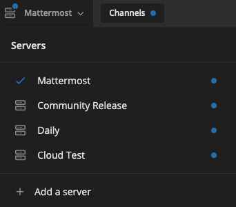

In Mattermost v6.0, we’ve introduced changes in how to navigate Mattermost with the introduction of the Global Header. Whether you're new to Mattermost, or a long-time user, this document will help you start using these new Global Header features as well as introduce you to some new ways of navigating the product.

The Global Header introduces a new way of navigating and using Mattermost, and offers shared functionality available across the Mattermost platform in a single place. If you’ve recently installed or upgraded to v6.0, you’ll notice that Account Settings options have been split up, the Search bar is now front and center, and we’ve introduced a Product Menu button for easy navigation between Channels, Boards, and Playbooks. You'll notice that going forward, when you open Playbooks and Boards, they display as tabs in the window header for easier access.

We've also changed how you access multiple servers. Previously, multiple servers were displayed in tabs across the top of Mattermost. They're now folded into a single menu which supports drag and drop for reordering. Notifications across servers work the same way as before, so you won't miss any important conversations.

Where is everything?
--------------------

While Channels, Boards, and Playbooks feature unique functionality within the Global Header, the following features are shared across all three products:

* Account Settings
* Status and Availability
* Product menu

In addition to this documentation, take a look at the Mattermost onboarding tips/tutorials available immediately after installation/upgrade. Note that once the tips/tutorials are dismissed, you won't be able to access them again.

Account Settings
----------------

The Account Settings menu has been split into Account Settings and Settings.

Your **Profile** and **Security** settings can be found in Account Settings, while **Notifications**, **Display**, **Sidebar**, and **Advanced** settings are in the settings menu.

To open Account Settings, select your avatar in the top-right corner of Mattermost, then choose Account Settings. The Settings menu is located to the left of your avatar

Status and availability
-----------------------

Let your team know your online status using `custom status and availability settings <https://docs.mattermost.com/messaging/setting-your-status-availability.html#>`_, which include emojis. Select your avatar in the top-right corner to change your status and availability.

Product menu
------------

In the top-left corner of the Global Header, select the Product menu button to open the tool switcher to switch between Channels, Playbooks, and Boards.

Depending on permissions set for your Mattermost, this is also where you would also find Mattermost Integrations, System Console, and Marketplace menu links. You’ll always be able to view the version information of your Mattermost workspace in this menu.

History arrows
--------------

Use the arrows to the right of the tool switcher to show the last channel/next channel.

Server list
-----------

If you're using multiple servers (e.g., you're running community, community-release, and a Cloud test server) the Mattermost menu is where your servers are located. To change servers, select the menu and then select the server you want to use.

What else has changed?
----------------------

Some other menu items have moved around. For example:

* Plugins are listed in the Product menu, in the top-left corner of Mattermost.
* System Console is listed in the Product menu, in the top-left corner of Mattermost.
* Managing custom emojis can be accessed from the emoji picker now.
