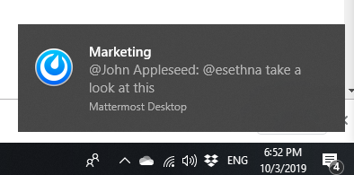
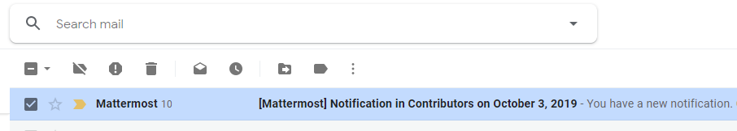
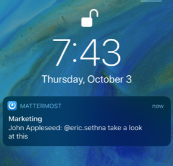
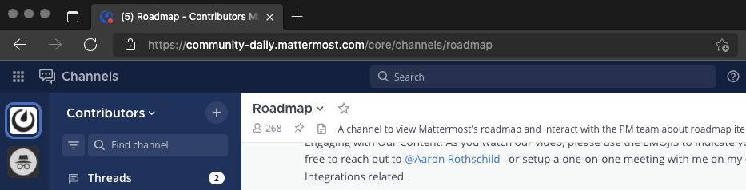

Configuring Notifications
=========================

Notifications in Mattermost alert you to unread messages and mentions. Desktop, email, and mobile push notifications notify you of activity in Mattermost. 

You can configure your Mattermost account for how and when you want to be notified of Mattermost activity. When you join a team, Mattermost will notify you of messages directed at you, including when someone:

- Mentions you specifically with `@username`
- Sends you a Direct Message
- Mentions your username or first name in a channel
- Notifies a channel you're in using @channel or @all
- Responds to a thread you're following
- Uses any `keywords you've configured <https://docs.mattermost.com/help/settings/account-settings.html#words-that-trigger-mentions>`_ 

Desktop Notifications
----------------------

Desktop notifications are pop-ups that appear in the corner of your main monitor when using Chrome, Edge, Firefox, and Safari, or the `Mattermost Desktop Apps <https://mattermost.com/download/#mattermostApps>`_. You can change the default preference to trigger desktop notifications for all messages sent in channels you're a member of, or turn them off entirely. You can also choose what sound plays when a desktop notification is triggered on supported browsers and the Mattermost Desktop Apps.

.. tabs::

 .. tab:: v6.0 onwards

      In Mattermost v6.0, **Desktop Notifications** have moved. Access **Notifications** by selecting the **Gear** |gear-icon| icon in the Global Header.
      
      - Configure desktop notifications in **Notifications > Desktop Notifications > Send desktop notifications**, then choose your sound preference.
      - By default, all channels use the global setting configured in **Notifications**.

  .. tab:: v5.39 and earlier

      In Mattermost versions up to 5.39, access **Account Settings** from the **Main Menu** by selecting the three horizontal lines (also known as a hambuger menu) at the top of the channel sidebar.
      
      - Configure desktop notifications in **Account Settings > Notifications > Desktop Notifications > Send desktop notifications**, then choose your sound preference.
      - By default, all channels use the global setting configured in **Account Settings**.
  
Configure desktop notifications in specific channels in the channel menu via **Notification Preferences > Send desktop notifications**.

**Not getting a desktop notification?** See our `FAQ to view the desktop notification flow chart <https://docs.mattermost.com/overview/faq.html?#what-determines-if-a-desktop-notification-should-be-triggered>`_ and see what other factors influence if a notification should be triggered.

Email Notifications
-------------------

By default, you'll get email notifications if you're not actively using Mattermost. You can change the default preference for email notifications to turn them off entirely.

.. tabs::

  .. tab:: v6.0 onwards

      In Mattermost v6.0, **Desktop Notifications** have moved. Access **Notifications** by selecting the **Gear** |gear-icon| icon in the global header.
      
      - Configure email notifications in **Notifications > Email Notifications > Send desktop notifications**, then choose your sound preference.
      - By default, all channels use the global setting configured in **Notifications**.

  .. tab:: v5.39 and earlier

      In Mattermost versions up to 5.39: 
      
      -  Configure email notifications in **Account Settings > Notifications > Email notifications**.
      -  Configure the email address where notifications are sent in **Account Settings > General > Email**.

Messages in email notifications can be opened in the Mattermost Desktop App, Mobile App, or in your browser:

.. image:: ../images/deep_linking.png

**Not getting an email notification?** See our `FAQ to view the email notification flow chart <https://docs.mattermost.com/overview/faq.html?#what-determines-if-an-email-notification-should-be-triggered>`_ and see what other factors influence if a notification should be triggered.

Mobile Push Notifications
-------------------------

Mobile push notifications appear on the lock screen of your mobile device if the Mattermost Android or iOS app is installed. By default, these notifications are triggered when you're not actively using Mattermost, but this is configurable. You can also change the default preference to trigger push notifications for all messages sent in channels you're a member of, or turn them off entirely.

.. tabs::

  .. tab:: v6.0 onwards

      In Mattermost v6.0, **Mobile Push Notifications** have moved. Access **Notifications** by selecting the **Gear** |gear-icon| icon in the Global Header.
      
      - Configure push notifications in **Notifications > Mobile Push Notifications > Send mobile push notifications**.
      - Configure when push notifications are sent depending on your availability in **Notifications > Mobile Push Notifications > Trigger push notifications when**.
      
  .. tab:: v5.39 and earlier

      In Mattermost versions up to 5.39: 
      
      -  Configure push notifications in **Account Settings > Notifications > Mobile Push Notifications > Send mobile push notifications**.
      -  Configure when push notifications are sent depending on your availability in **Account Settings > Notifications > Mobile push notifications > Trigger push notifications when**.
  
**Not getting a push notification?** See our `FAQ to view the email notification flow chart <https://docs.mattermost.com/overview/faq.html?#what-determines-if-a-mobile-push-notification-should-be-triggered>`_ and see what other factors influence if a notification should be triggered.   

.. tip::

  Learn more about how Mattermost detects your `availability <https://docs.mattermost.com/help/getting-started/setting-your-status-availability.html>`__ as **Online**, **Away** or **Offline**.

Browser Tab Notifications
-------------------------

If Mattermost is open in a browser tab, the favicon updates to notify you of unread messages (\*) and a count of mentions or Direct Messages. Browser tab notifications are available on Chrome, Edge, Firefox, Safari.

Muting a Channel
----------------

Channels in the sidebar are **bold** when there are unread messages in the channel and show a badge count if you are mentioned specifically. 

When you mute a channel, you do not receive any notifications (desktop, email, or push) for any mentions (whether they are channel-wide or directed at you). However, if you are mentioned while the channel is muted, the mention badge will be displayed in the sidebar with the channel displaying at reduced opacity.

To mute a channel, click on the channel name and select **Mute Channel**. To unmute it, click on the channel name and select **Unmute Channel**.

.. tip:: 

  Mentions are triggered by `selected keywords <https://docs.mattermost.com/help/settings/account-settings.html#words-that-trigger-mentions>`__. Learn more about `mentioning teammates <https://docs.mattermost.com/help/messaging/mentioning-teammates.html>`__.

Ignoring Mentions
-----------------

To turn off notifications for channel-wide mentions for @channel, @here, and @all, navigate to:

**Notification Preferences > Ignore mentions for @channel, @here and @all**. Choose **Edit**, select **On**, and then select **Save**. 

When this setting is on you will still receive notifications for direct mentions. 

**Note:** If you have muted a channel and also enabled **Ignore mentions for @channel, @here and @all** then you will not receive any notifications (whether they're direct or channel-wide). However, if you are directly mentioned in the muted channel a badge counter will be displayed in the sidebar. 

You can also view the `notifications flow charts <https://docs.mattermost.com/overview/faq.html?#notifications>`_ for more information about notification behavior in Mattermost.  
