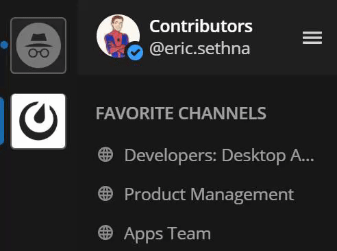

Creating Teams
==============

|all-plans| |cloud| |self-hosted|

.. |all-plans| image:: ../images/all-plans-badge.png
  :scale: 30
  :target: https://mattermost.com/pricing
  :alt: Available in Mattermost Free and Starter subscription plans.

.. |cloud| image:: ../images/cloud-badge.png
  :scale: 30
  :target: https://mattermost.com/deploy
  :alt: Available for Mattermost Cloud deployments.

.. |self-hosted| image:: ../images/self-hosted-badge.png
  :scale: 30
  :target: https://mattermost.com/deploy
  :alt: Available for Mattermost Self-Hosted deployments.

A team is a digital workspace where you and your teammates can collaborate in Mattermost. Depending on how Mattermost is set up in your organization, you can belong to one team or multiple teams.

New teams can be created if the System Admin sets **Enable Team Creation** to **true** in the System Console.

Methods to Create a Team
------------------------

If team creation is enabled by the System Admin, teams can be created from the team sidebar or Main Menu. The person who creates a team will automatically be assigned the Team Admin role for that team.

Team sidebar
~~~~~~~~~~~~

If you belong to more than one team, a team sidebar will appear to the left of your channel list. You can drag teams to reorder them in the sidebar. You can also use `keyboard shortcuts <https://docs.mattermost.com/help/messaging/keyboard-shortcuts.html>`_ to switch teams.

If you have appropriate permissions, select the "+" icon at the bottom of the team sidebar, then select **Create a New Team** on the team selection page, which guides you through the rest of the team creation steps. If this option is not visible on the web page, then the System Admin has disabled team creation.

If you have no other teams to join, selecting the "+" icon brings you directly to the team creation page if team creation is enabled.

Team menu
~~~~~~~~~

From your current Mattermost team, select your team name and then select **Create a Team**. If this option is not visible in the menu, then the System Admin has disabled team creation.

Team name and URL selection
---------------------------

There are a few details and restrictions to consider when selecting a team name and team URL.

Team name
~~~~~~~~~

This is the display name of your team that appears in menus and headings.

-  It can contain any letters, numbers or symbols.
-  It is case sensitive.
-  It must be 2–15 characters in length.

Team URL
~~~~~~~~

The team URL is part of the web address that navigates to your team on
the system domain, ``https://domain.com/teamurl/``.

-  Teams may contain only lowercase letters, numbers and dashes.
-  Teams must start with a letter and cannot end in a dash.
-  Teams must be 2–15 characters in length.
-  Team names cannot start with the following restricted words: ``admin``, ``api``, ``channel``, ``claim``, ``error``, ``files``, ``help``, ``landing``, ``login``, ``mfa``, ``oauth``, ``plug``, ``plugins``, ``post``, ``signup``, ``playbooks``, or ``boards``.
   
Best practices for using a single team vs. multiple teams
---------------------------------------------------------

Mattermost can be deployed both to a single team and to multiple teams.

Currently, we recommend deploying to a single team for the following reasons:

* Single team deployments promote communication across the organization. When you add multiple teams, groups can become isolated. 
* We don’t yet support search or channels across teams, which can impact the cross-team user experience. This includes general searches, saved posts, and recent mentions.
* Integrations (e.g., webhooks and slash commands) are only persistent across single team deployments.

However, some Mattermost customers prefer multiple team deployments for the following reasons:

* Teams are useful when there is a purpose for each of them. For example, one team is used for staff members and another team for external users.
* Performance is better when users are scattered across multiple teams instead of all in the same one. With multiple teams, there is less content to load per team or channel switch and database queries are faster.
* Creating a shared team for all users, and using `advanced permissions <https://docs.mattermost.com/deployment/advanced-permissions.html#recipes>`__ to control who can create channels and add members to the shared team, improves cross-team collaboration when using multiple teams. Additionally, an `annoucement banner <https://docs.mattermost.com/administration/announcement-banner.html>`__ can be used to provide system wide announcements.
