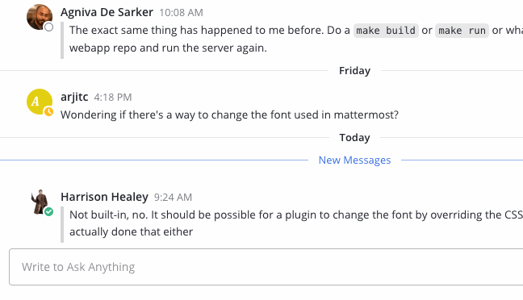

Executing Slash Commands
========================

|all-plans| |cloud| |self-hosted|

.. |all-plans| image:: ../images/all-plans-badge.png
  :scale: 30
  :target: https://mattermost.com/pricing
  :alt: Available in Mattermost Free and Starter subscription plans.

.. |cloud| image:: ../images/cloud-badge.png
  :scale: 30
  :target: https://mattermost.com/deploy
  :alt: Available for Mattermost Cloud deployments.

.. |self-hosted| image:: ../images/self-hosted-badge.png
  :scale: 30
  :target: https://mattermost.com/deploy
  :alt: Available for Mattermost Self-Hosted deployments.

Slash commands perform operations in Mattermost by typing into the text input box. Enter a ``/`` followed by a command and some arguments to perform actions.

Built-in slash commands come with all Mattermost installations and custom slash commands are configurable to interact with external applications. Learn about configuring custom slash commands on the `developer slash command documentation page <../../developer/slash-commands.html>`__.

Built-in Commands
-----------------

The following slash commands are available on all Mattermost installations:

.. csv-table::
    :header: "Command", "Description", "Example"

    "/away", "Set your availability to away", "/away"
    "/offline", "Set your availability to offline", "/offline"
    "/online", "Set your availability to online", "/online"
    "/dnd", "Set your availability to Do Not Disturb", "/dnd"
    "/code *{text}*", "Display text as a code block", "/code File bugs"
    "/collapse", "Turn on auto-collapsing of image previews, image attachments, as well as `in-line images <https://docs.mattermost.com/help/messaging/formatting-text.html#in-line-images>`__ over 100px in height", "/collapse"
    "/expand", "Turn off auto-collapsing of image previews, image attachments, as well as `in-line images <https://docs.mattermost.com/help/messaging/formatting-text.html#in-line-images>`__ over 100px in height", "/expand"
    "/echo *{message}* *{delay in seconds}*", "Echo back text from your account", "/echo Hello World 5"
    "/header *{text}*", "Edit the channel header", "/header File bugs here"
    "/invite *@{user}* *~{channel-name}*", "Invite user to the channel","/invite @john ~sampleChannel"
    "/purpose *{text}*", "Edit the channel purpose", "/purpose A channel to discuss bugs"
    "/rename *{text}*", "Rename the channel", "/rename Developers"
    "/help", "Open the Mattermost help page", "/help"
    "/invite_people *{name@domain.com ...}*", "Send an email invite to your Mattermost team","/invite_people john@example.com"
    "/kick *{@username}*", "Remove a member from a public or private channel", "/kick @alice"
    "/remove *{@username}*", "Remove a member from a public or private channel", "/remove @alice"
    "/join *{channel-name}*", "Join the open channel", "/join off-topic"
    "/open *{channel-name}*", "Join the open channel", "/open off-topic"
    "/leave", "Leave the current channel", "/leave"
    "/mute", "Turns off desktop, email and push notifications for the current channel or the [channel] specified", "/mute ~[channel]"
    "/logout", "Log out of Mattermost", "/logout"
    "/me *{message}*", "Do an action", "/me Hello World"
    "/msg *{@username}* *{message}*", "Send a Direct Message to a user", "/msg @alice hello"
    "/groupmsg *{@username1, @username2, ...}* *{message}*", "Sends a Group Message to the specified users", "/groupmsg @alice, @bob hello"
    "/search *{text}*", "Search text in messages", "/search meeting"
    "/settings", "Open the Account Settings dialog", "/settings"
    "/shortcuts", "Display a list of keyboard shortcuts", "/shortcuts"
    "/shrug *{message}*", "Add ``¯\_(ツ)_/¯`` to your message", "/shrug oh well"
    "/status *{emoji_name}* *{descriptive status_message}* *", Set a custom status that includes an optional emoji and a descriptive status message, "/status sick Feeling unwell and taking time off to recover" 
    "/status clear * ", Clear the current status, "/status clear" 

Begin by typing `/` and a list of slash command options appears above the text input box. The autocomplete suggestions help by providing a format example in black text and a short description of the slash command in grey text.

.. note::
  Custom status slash commands marked with an asterisk (*) in the table above will be available in the Mattermost Mobile App in a future release.

Custom Commands
---------------

Custom slash commands integrate with external applications. For example, a team might configure a custom slash command to check internal health records with `/patient joe smith` or check the weekly weather forecast in a city with `/weather toronto week`. Check with your System Admin or open the autocomplete list by typing `/` to determine if your team configured any custom slash commands.

Custom slash commands are disabled by default and can be enabled by the System Admin by going to **System Console** > **Integrations** > **Integration Management**. Learn about configuring custom slash commands on the `developer slash command documentation page <../../developer/slash-commands.html>`__.
