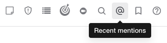

.. _mentioning-teammates:

Mentioning Teammates
====================

@Mentions
---------

|all-plans| |cloud| |self-hosted|

.. |all-plans| image:: ../images/all-plans-badge.png
  :scale: 30
  :target: https://mattermost.com/pricing
  :alt: Available in Mattermost Free and Starter subscription plans.
  
.. |enterprise| image:: ../images/enterprise-badge.png
  :scale: 30
  :target: https://mattermost.com/pricing
  :alt: Available in the Mattermost Enterprise subscription plan.

.. |cloud| image:: ../images/cloud-badge.png
  :scale: 30
  :target: https://mattermost.com/download
  :alt: Available for Mattermost Cloud deployments.

.. |self-hosted| image:: ../images/self-hosted-badge.png
  :scale: 30
  :target: https://mattermost.com/deploy
  :alt: Available for Mattermost Self-Hosted deployments.

Use @mentions to get the attention of specific team members.

.. note::

  Editing an existing message does not trigger new @mention notifications, desktop notifications, or notification sounds.

@username
~~~~~~~~~

|all-plans| |cloud| |self-hosted|

You can mention a teammate by using the *@* symbol plus their username to send them a mention notification.

Type *@* to bring up a list of team members who can be mentioned. To filter the list, type the first few letters of any username, first name, last name, or nickname. Use the UP and DOWN arrow keys to scroll through entries in the list, and then press ENTER to select the person to mention. When selected, the username replaces the full name or nickname.

The following example sends a special mention notification to Alice, whose username is **alice**. The notification alerts her of the channel and message where she was mentioned. If Alice is away from Mattermost and has email notifications turned on, she'll receive an email alert of her mention along with the message text.

.. code-block:: none

  @alice how did your interview go with the new candidate?

If the person you mentioned does not belong to the channel, a System Message is posted to let you know. This is a temporary message, and you are the only one who can see it. To add the mentioned person to the channel, open the dropdown menu next to the channel name and select **Add Members**.

@channel and @all
~~~~~~~~~~~~~~~~~

|all-plans| |cloud| |self-hosted|

You can mention an entire channel by typing ``@channel`` or ``@all``. All members of the channel receive a mention notification that behaves the same way as if the members had been mentioned personally. If used in Town Square, it notifies all members of your team.

You can ignore channel-wide mentions in specific channels in the **Channel Menu > Notification Preferences > Ignore mentions for @channel, @here and @all**.

.. code-block:: none

  @channel great work on interviews this week. I think we found some excellent potential candidates!

If a channel has five or more members, you're prompted to confirm that you want notifications sent to everyone in the channel.

@here
~~~~~

|all-plans| |cloud| |self-hosted|

You can mention everyone who is online in a channel by typing ``@here``. This sends a desktop notification and push notification to members of the channel who are online. It's counted as a mention in the sidebar. Members who are offline don't receive a notification. When they return to Mattermost they won't see a mention counted in the channel sidebar. Members who are away receive a desktop notification only if they have notifications set to **For all activity**, and they won't see a mention counted in the sidebar.

.. code-block:: none

  @here can someone do a quick review of this?
  
You can ignore channel-wide mentions in specific channels in the **Channel Menu > Notification Preferences > Ignore mentions for @channel, @here and @all**.
  
@groupname (Beta)
~~~~~~~~~~~~~~~~~

|enterprise| |cloud| |self-hosted|

System Admins can enable mentions for `LDAP synced groups <https://docs.mattermost.com/onboard/ad-ldap-groups-synchronization.html>`__ via the Group Configuration page. This is supported on the mobile app (from v1.34) if the AD/LDAP Groups feature is enabled. The mobile app supports auto-suggesting groups, highlights group member mentions, and also provides a warning dialog when a mention will notify more than five users.

Once enabled for a specific group, users can mention and notify the entire group in a channel (similar to ``@channel`` or ``@all``). Members of the group in that channel will receive a notification. If members of the group mentioned are not members of the channel, the user who posted the mention is prompted to invite them.

Group mention identifiers (slugs) use the LDAP group name by default. To customize/rename the slug:

1. Open **System Console > User Management > Groups**.
2. Select **Edit** next to the group you want to edit.
3. In **Group Profile > Group Mention** enter the new slug.
4. Select **Save**.

As with ``@username`` mentions, use *@* to bring up a list of groups that can be mentioned. To filter the list, type the first few letters of any group. Use the UP and DOWN arrow keys to scroll through entries in the list, and then press ENTER to select the group you want to mention.

.. code-block:: none

  @dev-managers great work hitting all of our code coverage goals this quarter!

Words that trigger mentions
---------------------------

|all-plans| |cloud| |self-hosted|

You can customize words that trigger mention notifications in **Settings > Notifications > Words That Trigger Mentions**. By default, you receive mention notifications for your username and for ``@channel``, ``@all`` and ``@here``. You can choose to have your first name be a word that triggers mentions.

You can add a list of customized words to get mention notifications for by typing them into the input box, separated by commas. This is useful if you want to be notified of all posts on certain topics, such as "interviewing" or "marketing".

Recent mentions
---------------

|all-plans| |cloud| |self-hosted|

Select **@** next to the **Search** box to query for your most recent @mentions and words that trigger mentions (excluding LDAP group mentions). 

Select **Jump** next to a search result in the right-hand sidebar to jump the center pane to the channel and location of the message with the mention.

Confirmation dialog warnings
----------------------------

|all-plans| |cloud| |self-hosted|

For any mention that will trigger notifications for more than five users, the user posting the mention must confirm the action before sending the notifications.

This confirmation dialog only appears when ``TeamSettings.EnableConfirmNotificationsToChannel`` in ``config.json`` is enabled. This is supported on the mobile app (from v1.34) if the AD/LDAP Groups feature is enabled.

Highlighting
------------

|all-plans| |cloud| |self-hosted|

Valid mentions will have highlighted font text with some exceptions, for example if mentions are disabled at the channel level. The highlighted text becomes a hyperlink when a username is displayed. When the username is selected, the profile popover is displayed.

When mentions trigger a notification, the user being notified will see highlighted font text and highlighted font background. This functions as an identifier of which mentions in the post triggered a notification for the user.
