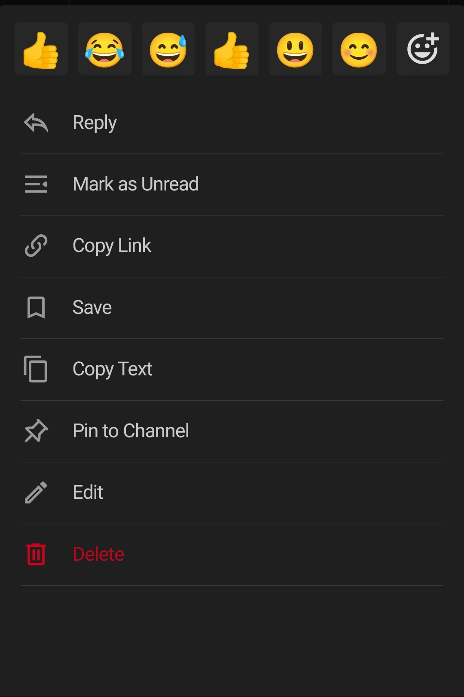

Messaging on Mobile Basics (iOS or Android)
====================================

**Write messages** using the text input field at the bottom of the screen (like in other messengers). Tap the paper airplane to send the message. Tap on the return key on the symbols menu to create a new line without sending the message.

**Reply to messages** by long pressing on a message and then tapping `Reply`

**Notify teammates** when they are needed by typing ``@username``.

**Format your messages** using Markdown that supports text styling, headings, links, emojis, code blocks, block quotes, tables, lists, and in-line images.

You can use either ``_`` or ``*`` for italics and bold text. See the table below for examples.

**Quickly add emojis** by typing ":" followed by two characters, which will open an emoji autocomplete. If the existing emojis don't cover what you want to express, you can also create your own `Custom Emoji <https://docs.mattermost.com/help/settings/custom-emoji.html>`__.
You can also just use the native emojis on your device.

**Attach files** by clicking the attachment icon under the text input box.

**Save messages for follow up** by long pressing on the desired message and then tapping on `Save`.

**React to messages** by long pressing on the desired message and then chossing an emoji to react with.

The actions mentioned above can be achieved by long pressing a message. One is then faced with the following menu:

   Learn more about:

   * `Composing Messages and Replies <https://docs.mattermost.com/help/messaging/sending-messages.html>`__
   * `Mentioning Teammates <https://docs.mattermost.com/help/messaging/mentioning-teammates.html>`__
   * `Formatting Messages using Markdown <https://docs.mattermost.com/help/messaging/formatting-text.html>`__
   * `Sharing Files <https://docs.mattermost.com/help/messaging/attaching-files.html>`__
   * `Executing Commands <https://docs.mattermost.com/help/messaging/executing-commands.html>`__
