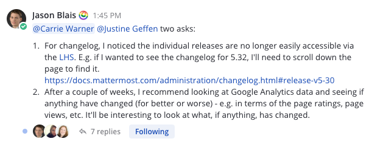
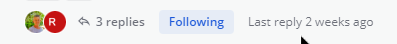
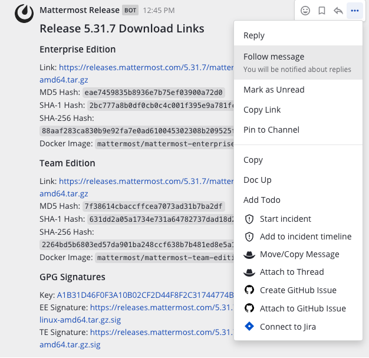
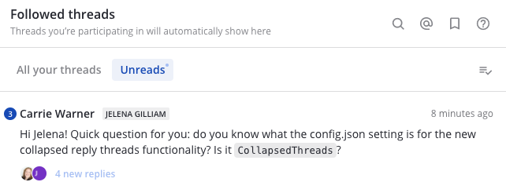

Organizing Conversations using Collapsed Reply Threads (Beta)
=============================================================

|all-plans| |cloud| |self-hosted|

.. |all-plans| image:: ../images/all-plans-badge.png
  :scale: 30
  :target: https://mattermost.com/pricing
  :alt: Available in Mattermost Free and Starter subscription plans.

.. |cloud| image:: ../images/cloud-badge.png
  :scale: 30
  :target: https://mattermost.com/download
  :alt: Available for Mattermost Cloud deployments.

.. |self-hosted| image:: ../images/self-hosted-badge.png
  :scale: 30
  :target: https://mattermost.com/deploy
  :alt: Available for Mattermost Self-Hosted deployments.

Threads are a key part of the messaging experience in Mattermost Channels. They're used to organize conversations and enable users to discuss topics without adding noise to channels or Direct Messages.

Collapsed Reply Threads (Beta) offers an enhanced experience for users communicating in threads and replying to messages. Our goal is to improve users’ ability to process channel content, find, follow, and resume conversations more easily, and keep threaded conversations focused.

.. image:: ../images/collapsed-reply-threads.gif
  :alt: Organize conversations using Collapsed Reply Threads.
  
Enable Collapsed Reply Threads
------------------------------

Your System Admin must enable the Collapsed Reply Threads feature in the System Console. See our `Configuration Settings <https://docs.mattermost.com/configure/configuration-settings.html#collapsed-reply-threads-beta>`__ documentation for details. 

Once this feature is enabled in the System Console, you can `enable this feature for your Mattermost Channels account <https://docs.mattermost.com/messaging/managing-account-settings.html#collapsed-reply-threads-beta>`__ by going to **Settings > Display > Collapsed Reply Threads (Beta)**.

Known issues
------------

.. important::

    Collapsed Reply Threads are available as an early beta in Mattermost Cloud and Mattermost Server v5.37 and later. It's expected that you may experience bugs as we stabilize the feature. In particular, please be aware of these known issues:
    
    - When enabling Collapsed Reply Threads for the first time, you may see channels or threads you’ve seen before appear as unread. To resolve this:
      
      - View any unread channels or use ALT+SHIFT+UP/DOWN to navigate to unread channels with the keyboard. Work in-progress ticket: `MM-35494 <https://mattermost.atlassian.net/browse/MM-35494>`__
      - Use the **Mark all as read** button in the **Threads** view to mark your threads as read. Work in-progress ticket: `MM-35345 <https://mattermost.atlassian.net/browse/MM-35345>`__

    - You may experience lag in your desktop or web client if you're following many threads or opening threads with many replies. Work in-progress tickets: `MM-36696 <https://mattermost.atlassian.net/browse/MM-36696>`__, `MM-36697 <https://mattermost.atlassian.net/browse/MM-36697>`__, `MM-36698 <https://mattermost.atlassian.net/browse/MM-36698>`__
    - Server performance for instances with many users and posts may be impacted. Work in-progress tickets: `MM-39114 <https://mattermost.atlassian.net/browse/MM-39114>`__
    - For a comprehensive list of known issues, and to see our work queue in priority order, check out our `Kanban board <https://mattermost.atlassian.net/secure/RapidBoard.jspa?rapidView=91&quickFilter=499>`__.

Start or reply to threads
-------------------------

Replies are collapsed under the first message of a thread. To reply to a thread, select the **Reply** icon, or select the reply count if a thread already exists.

.. tip:: 
    
    - Select anywhere on a message in a channel in the center pane to view it, or reply to it, on the right-hand side.
    - In channels, a dot next to the thread participants indicates there are unread replies. You'll only see unreads for threads you're following.

Follow threads and messages
---------------------------

You can follow particular messages and threads so that any reply activity triggers `notifications <https://docs.mattermost.com/messaging/managing-account-settings.html#notifications>`__. Follow or unfollow any thread, at any time, by toggling the thread’s **Follow/Following** indicator, or by accessing the **More Actions** menu.

You'll automatically follow every thread you participate or are mentioned in. If you’re no longer interested in a or message thread, you can unfollow it to stop receiving notifications. Viewing a thread without responding to it doesn’t automatically follow that thread.

   
.. tip::
  Follow messages with no replies from the **More Actions** menu to be notified if someone replies to the message later based on your notification preferences.

View all threads
----------------

Select **Threads** at the top of the channel sidebar to see all your followed threads on the currently selected team. Threads with the most recent replies display at the top of the list. 

Select **Unreads** to filter your followed threads by only those with unread replies.

Tutorial video
---------------

For additional details about working with the Beta release of Collapsed Reply Threads, see our `tutorial video on YouTube <https://www.youtube.com/watch?v=hnD0Zj-mIbs>`_. 

.. raw:: html

   

      <iframe src="https://www.youtube.com/embed/hnD0Zj-mIbs" frameborder="0" allowfullscreen style="position: absolute; top: 0; left: 0; width: 100%; height: 95%;"></iframe>
   

