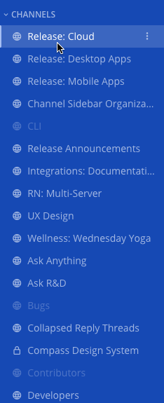

Organizing Your Sidebar
=======================

|all-plans| |cloud| |self-hosted|

.. |all-plans| image:: ../images/all-plans-badge.png
  :scale: 30
  :target: https://mattermost.com/pricing
  :alt: Available in Mattermost Free and Starter subscription plans.

.. |cloud| image:: ../images/cloud-badge.png
  :scale: 30
  :target: https://mattermost.com/deploy
  :alt: Available for Mattermost Cloud deployments.

.. |self-hosted| image:: ../images/self-hosted-badge.png
  :scale: 30
  :target: https://mattermost.com/deploy
  :alt: Available for Mattermost Self-Hosted deployments.

Conversations in Mattermost are crucial to company productivity and success. Keeping conversations organized in the sidebar creates an efficient workplace.

Channel types
-------------

Public channels
~~~~~~~~~~~~~~~

Public channels are open to everyone on a team. New team members are automatically added to two Public channels when they sign up: ``Town Square`` and ``Off-Topic``.

Private channels
~~~~~~~~~~~~~~~~

Private channels are for sensitive topics and are only visible to select team members. In Team Edition, any member of a Private channel can add or remove other members from Private channels, but in Enterprise Edition `these permissions can be restricted to the Channel Admins and System Admins <https://docs.mattermost.com/help/getting-started/managing-members.html#user-roles>`__.

Direct Messages and Group Messages
~~~~~~~~~~~~~~~~~~~~~~~~~~~~~~~~~~

Use a Direct Message when you want a private conversation with one person. Use a Group Message when you want to set up a private conversation with up to seven other participants. If you want to communicate with more than seven people, you must create a Private channel. Direct and Group Messages are visible only to the people involved.

If your System Admin has allowed it, you can start a Direct Message or a Group Message with people on other teams.

Customizing your sidebar
------------------------

You can customize your sidebar based on how you use Mattermost. Customizations you make are only visible to you and won't affect what your teammates see in their sidebars.

Here’s how your sidebar is set up by default:

- All Public and Private Channels you've joined are listed in the **Channels** category, sorted alphabetically.
- All your Direct Messages and Group Messages are listed in the **Direct Messages** category, sorted by recent activity.

What can you customize?
~~~~~~~~~~~~~~~~~~~~~~~

You can customize your sidebar in the following ways:

- `Create custom categories <https://docs.mattermost.com/help/getting-started/organizing-your-sidebar.html#creating-custom-categories>`_.
- `Group and order channels into your categories <https://docs.mattermost.com/help/getting-started/organizing-your-sidebar.html#organizing-channels-in-categories>`_.
- `Mute and unmute entire categories <https://docs.mattermost.com/help/getting-started/organizing-your-sidebar.html#muting-and-unmuting-categories>`_.
- `Sort channels in each category <https://docs.mattermost.com/help/getting-started/organizing-your-sidebar.html#sorting-channels-in-categories>`_ manually, alphabetically, or by recent activity.
- `Filter your sidebar to view unread channels only <https://docs.mattermost.com/help/getting-started/organizing-your-sidebar.html#group-unread-channels-separately>`_, or choose to group unread messages into an **Unreads** category.
- `Manage your Direct Messages <https://docs.mattermost.com/help/getting-started/organizing-your-sidebar.html#managing-direct-messages>`_ by sorting them alphabetically or by recent activity, and by setting how many to display in your sidebar.

  .. image:: ../images/channel_sidebar_updates.gif

Creating custom categories
--------------------------

Create custom categories to group channels together for quicker and easier navigation. For example, you can create a category called "Design" or "Marketing".

To create categories, select the **+** symbol at the top of the sidebar. Or, select the **More options...** icon in the sidebar on any category header, then select **Create New Category**.

Next, type a category name, select **Create**, then drag any channels or Direct Messages into this new category. You can also multi-select channels and Direct Messages to drag them together as a group using CTRL/CMD+Select or SHIFT+Select. See **Dragging and dropping selections** below for details.

Making categories work for you
~~~~~~~~~~~~~~~~~~~~~~~~~~~~~~~

**Categories are collapsible**

- When collapsed, only unread channels display to reduce unnecessary scrolling.
- When expanded, all channels in the category display, including channels with unread messages.

**You can reorder categories**

- Drag to reorder entire categories to prioritize important conversations. 

**Categories can contain Direct Message conversations**

- Select and drag Direct Messages into any category. You can also multi-select Direct Messages to drag them together as a group.

Renaming categories
^^^^^^^^^^^^^^^^^^^

1. Select the **Category options** icon in the sidebar, then select **Rename Category**.
2. Type a new category name, then select **Rename**.

Deleting categories
^^^^^^^^^^^^^^^^^^^

1. Select the **Category options** icon in the sidebar, then select **Delete Category**.
2. Select **Delete** to confirm or select **X** to cancel.

All channels and Direct Message conversations in the deleted category move back to their default **Channels** and **Direct Messages** categories. Deleting a category never removes you from channels you have joined. 

Organizing channels in categories
---------------------------------

Once you've created categories, you can move channels within them to organize your sidebar.

Dragging and dropping selections
~~~~~~~~~~~~~~~~~~~~~~~~~~~~~~~~

To select multiple channels:

- Select sequential channels and/or Direct Messages by pressing and holding SHIFT+Select. 
- Select non-sequential channels and/or Direct Messages by pressing and holding CMD+Select (for Mac) or CTRL+Select (for Windows/Linux). 
- Press ESC to clear channel or Direct Message selections.

Using the Mattermost Web or Desktop App, drag selected channels and/or Direct Messages between or within categories. 

.. tip::

  Multi-selected channels and Direct Messages move together as a group in the order they originally appeared. 

Moving selections
~~~~~~~~~~~~~~~~~

In addition to selecting and dragging, you can also specify a destination for selected channels and/or Direct Messages using the **Move to** option under the **Channel options** icon in the sidebar.  

    .. image:: ../images/multi-select-move.gif

Muting and unmuting categories
------------------------------

When you mute or unmute a category, all channels within that category are also muted or unmuted. You can still selectively unmute specific channels within a muted category.

Select the **Category options** icon in the sidebar, then select **Mute Category**.

Once a category is muted:

- Email, desktop, and push notifications are disabled for all channels in the category.
- A mute icon displays next to each channel name in the category.
- The category and all of its channels appear at reduced opacity in the left-hand sidebar. Channels in the category aren't marked as unread unless you’re mentioned directly.

To unmute the category, select the **Category options** icon in the sidebar, then select **Unmute Category**.

    .. image:: ../images/mute-categories.gif

Sorting channels in categories
------------------------------

Select the **Category options** icon in the sidebar, then select **Sort** and choose from **Alphabetically**, **Recent Activity**, or **Manually**.

    .. image:: ../images/sort-categories.gif

Group unread channels separately
--------------------------------

By default, Mattermost provides a one-click **Unreads** filter to only show channels with unread activity. Alternatively, you may choose to automatically group unread channels in their own category at the top of your sidebar.

Go to **Settings > Sidebar**, set **Group unread channels separately** to **On**, then select **Save**.

- When this setting is enabled, all unread messages appear only in the **Unreads** category, sorted with mentions first.
- When this setting is disabled, all unread messages appear within their respective categories and channels. You can use the **Unread filter** to focus on only unread channels in the sidebar.

When enabled, unread channels with mentions will sort to the top of the category.

    .. image:: ../images/unreads.gif

.. tip::
  
  If you prefer to see only unread channels in their respective categories, we recommend collapsing your custom categories and disabling **Group unread channels separately** under **Settings > Sidebar**.

Managing Direct Messages
------------------------

To sort your Direct Messages, select the **Channel options** icon in the sidebar, then select **Sort** and choose from **Alphabetically** or **Recent Activity**.

How many Direct Messages to display?
~~~~~~~~~~~~~~~~~~~~~~~~~~~~~~~~~~~~

Control how many Direct Message conversations display in the **Direct Messages** category to keep your conversations manageable. You can choose to show all messages or a fixed number of messages.

To configure the number of Direct Messages to display, go to **Settings > Sidebar**, then set **Number of direct messages to show**. Or select the **Channel options** icon in the sidebar, then select **Show**.

Choose from **All direct messages**, or choose to show **10**, **15**, **20**, or **40** messages. Once you exceed the number of Direct Messages configured, older messages are hidden from the **Direct Messages** category. You can always increase the number of conversations displayed to see older Direct Messages.

  .. image:: ../images/dm-display.gif

.. note::
  Direct Message conversations that you add to custom categories don't count against the maximum number of conversations shown in the **Direct Messages** category.
