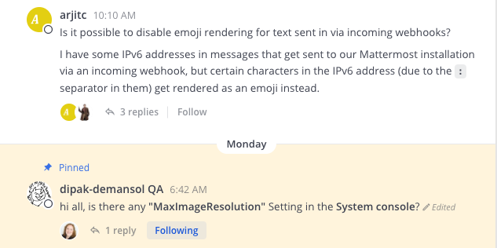
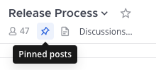
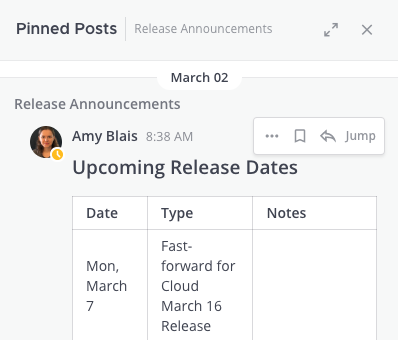

.. _pinning-messages:

Pinning Messages
================

|all-plans| |cloud| |self-hosted|

.. |all-plans| image:: ../images/all-plans-badge.png
  :scale: 30
  :target: https://mattermost.com/pricing
  :alt: Available in Mattermost Free and Starter subscription plans.

.. |cloud| image:: ../images/cloud-badge.png
  :scale: 30
  :target: https://mattermost.com/deploy
  :alt: Available for Mattermost Cloud deployments.

.. |self-hosted| image:: ../images/self-hosted-badge.png
  :scale: 30
  :target: https://mattermost.com/deploy
  :alt: Available for Mattermost Self-Hosted deployments.

All members of a channel can pin important or useful messages to that channel. The list of pinned messages is visible to all channel members. There is no limit to the number of pinned posts in a channel.

Pinned messages are marked with the pinned icon. For example:

**To view the list of pinned messages:**

To view the complete list of pinned messages, select the Pin icon in the channel header. 

The right-hand sidebar opens to show the list of pinned messages. For example:

Pin a Message
-------------

1. Mouse over the message that you want to pin. The [...] link appears.
2. Select **[...] > Pin to channel**

Unpin a Message
---------------

1. Mouse over the message that you want to unpin. The [...] link appears.
2. Select **[...] > Unpin from channel**
