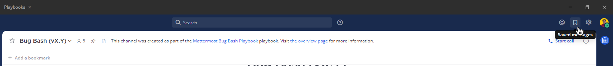
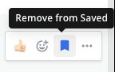

Saving Messages
===============

|all-plans| |cloud| |self-hosted|

.. |all-plans| image:: ../images/all-plans-badge.png
  :scale: 30
  :target: https://mattermost.com/pricing
  :alt: Available in Mattermost Free and Starter subscription plans.

.. |cloud| image:: ../images/cloud-badge.png
  :scale: 30
  :target: https://mattermost.com/download
  :alt: Available for Mattermost Cloud deployments.

.. |self-hosted| image:: ../images/self-hosted-badge.png
  :scale: 30
  :target: https://mattermost.com/deploy
  :alt: Available for Mattermost Self-Hosted deployments.

Saving a message helps you mark messages for follow up. Your saved messages are personal, and can't be seen by other users. There's no limit to the number of posts you can save.

One way to use saved messages is to mark messages you want to respond to later. You can save the post in the list of **Saved Posts**, refer back to it later, and once complete, you can remove it from the list.

Saving a Message
----------------

To try it out, hover over a message to show the **Save** icon. Click the icon to save the message for follow up.

.. image:: ../images/save-message.png

Viewing Saved Messages
----------------------

To view a list of your **Saved Posts**, select the **Save** icon at the top of the channel.

Unsaving Messages
-----------------

To remove an item from the **Saved Posts** list, select the **Save** icon next to message to clear it.

   
