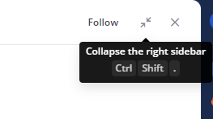

.. _sending-messages:

Sending and Receiving Messages
==============================
 
|all-plans| |cloud| |self-hosted|

.. |all-plans| image:: ../images/all-plans-badge.png
  :scale: 30
  :target: https://mattermost.com/pricing
  :alt: Available in Mattermost Free and Starter subscription plans.

.. |cloud| image:: ../images/cloud-badge.png
  :scale: 30
  :target: https://mattermost.com/deploy
  :alt: Available for Mattermost Cloud deployments.

.. |self-hosted| image:: ../images/self-hosted-badge.png
  :scale: 30
  :target: https://mattermost.com/deploy
  :alt: Available for Mattermost Self-Hosted deployments.

Sending messages and replying to messages are important ways to keep conversations active with your team. You can edit and delete messages after you have sent them. You can also share links to any message with other Mattermost users.

.. note::
  
  Your System Admin may restrict Messaging actions, such as editing or deleting messages, by configuring `Advanced Permissions <https://docs.mattermost.com/onboard/advanced-permissions.html>`__, available in `Mattermost Enterprise Edition E10 or later <https://docs.mattermost.com/about/product.html#mattermost-enterprise-edition-e10>`__.

Send a Message
---------------

Write a message by typing into the text input box, then press ENTER to send it. Use SHIFT+ENTER to create a new line without sending a message. To send messages by pressing CTRL+ENTER, go to **Main Menu > Account Settings > Advanced > Send Messages on CTRL/CMD+ENTER > Edit**.

.. tip::
  
  Mattermost can automatically detect and display messages written using right-to-left scripts, such as Arabic, Hebrew, or Persian. Your System Admin must install the `RTL Plugin <https://github.com/QueraTeam/mattermost-rtl>`__ to enable this functionality.

Reply to Messages
-----------------

.. tip::

   An early access beta of Collapsed Reply Threads is available for Mattermost Cloud and Mattermost self-hosted customers from v5.37 offering a new way to organize conversations within channels. See our `Organizing Conversations using Collapsed Reply Threads (Beta) <https://docs.mattermost.com/messaging/organizing-conversations.html>`__ documentation to learn more.

You can reply to a message by hovering over a message and selecting the **Reply** link to organize the conversation into a thread.

.. image:: ../images/reply-to-message.png
   :alt: Reply to Mattermost messages

Threaded conversations are easy to follow and allow multiple parallel conversations to occur at the same time without confusion. Replies are indented slightly in the center pane to indicate that they are child messages of a parent message.

Selecting the reply link opens a sidebar in the right-hand sidebar. To expand the right-hand sidebar to its full width, select the **Expand** icon with two arrows at the top of the sidebar.

.. image:: ../images/expand-sidebar.png
   :alt: Expand right-hand sidebar to its full width

To shrink the right-hand sidebar to its original width, select the same **Collapse** icon.

Edit or Delete Messages
-----------------------

Select the **More Actions** link next to a message that you've sent.

.. image:: ../images/more-actions.png
   :alt: More actions you can take with your messages

Select **Edit** to edit your own messages. Message edits do not trigger new @mention notifications, desktop notifications, or notification sounds.

Select **Delete** to delete your own messages. Select **Delete** again to confirm.

Link to Messages
-----------------

Select the **More Actions** link next to a message, then select **Copy Link**. Paste the link into a message.

If the link is to a message in a Public Channel, any member of the team can see the message. If the link is to a message in a Private Channel, only members in that channel can see the message.

.. tip::
   The timestamp next to the username of any message also functionas as a permanent link to that conversation.

Mark Messages as Unread
-----------------------

Marking a message as unread bolds the channel in your sidebar, and adds the new messages line above the marked message. This can be a useful reminder to follow-up on the message later if you don't have time to address it when the message was read.

Select the **More Actions** link next to a message, then select **Mark as Unread**.
