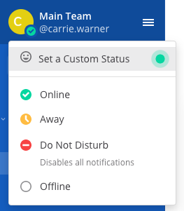
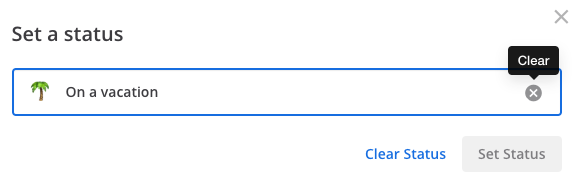
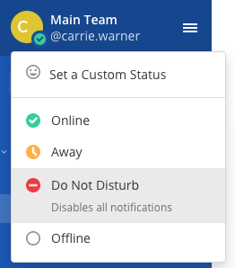

Setting Your Status and Availability
====================================

Let your team know whether you're available by setting a custom status and your availability in Mattermost.

Setting a Custom Status
-----------------------

Set a custom status to add an optional emoji to a descriptive status message. Other members can see your status anywhere they can see your name, such as the channel sidebar and in conversations. 

1. To set a custom status, select your avatar at the top of the channel sidebar, then select **Set a Custom Status**.

2. Choose from a list of suggested statuses, reuse a recent status, or enter a new emoji and status, then select **Set Status**. The Speech bubble emoji 💬  is used by default if you don't specify an emoji. A custom status can be a maximum of 100 characters in length.

.. image:: ../images/Custom-Status-Marketing-Animation.gif
  :alt: Set a custom status that includes an optional emoji and a descriptive message.

.. note::

  - If custom statuses aren't available, you can request your System Admin to enable this feature in **System Console > Site Configuration > Users and Teams > Enable Custom Statuses**.
  - Custom statuses will be available in the Mattermost Mobile App in a future release. 

Clearing a Custom Status
------------------------

To clear a custom status, select your avatar at the top of the channel sidebar, then select **Clear Status**, or select the **Clear** option next to your current status.

Setting Your Availability
-------------------------

To set your availability, select your avatar, then specify your availability as  **Online**, **Away**, **Do Not Disturb**, or **Offline**.

When you set your availability, an availability icon displays next to your name. Setting your availability as **Do Not Disturb** automatically disables desktop, email, and push notifications.

Other members can see your availability anywhere they can see your name, such as the channel sidebar, within conversations, and within Direct Messages. 

How Mattermost Determines Your Availability
~~~~~~~~~~~~~~~~~~~~~~~~~~~~~~~~~~~~~~~~~~~

.. csv-table::
    :header: "Client", "**Online**", "**Away**", "**Offline**"

    "**Desktop App**", "You're interacting with your computer", "You're inactive on your computer for 5 minutes", "You close Mattermost, sleep, or lock your computer"
    "**Web Browser**", "You're interacting with Mattermost in a browser", "
    - You have not typed or switched channels for 5 minutes
    - The tab is unfocused for 5 minutes
    - The browser is in the background or minimized for 5 minutes", "You close the Mattermost browser window"
    "**Mobile App**", "Mattermost is open", "Mattermost is open with 5 minutes of inactivity", "You switch apps, close Mattermost, or lock your screen" 
    
